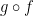

# 1. 圏: 合成の本質

圏は**対象** (object) の集まりと**射** (arrow, morphism) の集まりからなります。射は、対象から対象へのなんらかの操作です。

例えば、Scala を圏として考えてみると、対象は `Int`、 `String`、 `List[A]` などの型を表し，射は `f: Int -> String` のように関数を表します。

他にも、対象を自然数の集まり `{0, 1, 2, ..., n, ...}` のみと考えてみると、射は自然数の間の操作を表します。射の例として加算、乗算、減算、除算や、自然数を+1した値を返すインクリメンタなどがあります。

圏の本質は合成であり、合成の本質は圏であると言われます。本章では、射の合成、プログラムの合成について考えていきます。

## 1.1 関数としての射

> 圏は対象の集まりと射の集まりからなる。

の説明から想像がつくように、圏は抽象的な概念です。高校の授業で、集合を「ものの集まり」と習ったのを懐かしく感じます。

射について、もう少し具体的に掘り下げてみましょう。入力に対して出力を返す関数は、射の例です。ここでは、関数の合成について見ます。

対象の例として、以下の3つのクラスを考えます。

```scala
scala> case class A(value: Int)
defined class A

scala> case class B(value: Int)
defined class B

scala> case class C(value: Int)
defined class C
```

これらの対象の間の射として、関数 `f:A => B`、`g: B => C` を考えます。 `f` は `A` の値をインクリメントしたものを `B` に変換する関数で、 `g` は `B` の値を2倍したものを `C` に変換する関数です。

```scala
scala> val f = (a: A) => B(a.value + 1)
f: A => B = $Lambda$6756/1477788485@40987409

scala> val g = (b: B) => C(b.value * 2)
g: B => C = $Lambda$6757/1606691516@2e7629b0

scala> val a = A(1)
a: A = A(1)

scala> val b = f(a)
b: B = B(2)

scala> val c1 = g(b)
c1: C = C(4)
```

`f` の返り値は `g` の引数として渡すことによって、これらの関数を合成することができます。

```scala
scala> val c2 = g(f(a))
c2: C = C(4)
```

このような関数の**合成** (composition) によって、 `A` の値を受け取り `C` を返す新しい関数を定義することができます。数学的には



と書きます。なお、合成された射は**合成射** (composite arrow) といいます。

2つの関数 `f: A => B`、 `g: B => C` を合成するためには、 `f` の返り値の型と `g` の入力の型が一致する必要があります。この例の場合は `B` で一致しており、`f` の返り値を `g` の引数で渡すように合成することができます。一方で、 `g` の返り値を `f` の引数で渡すように合成することはできません。

scala では、関数の合成には `compose` を用います。

```scala
scala> g compose f
res2: A => C = scala.Function1$$Lambda$6733/1101289403@5799784c

scala> g (f(a)) == (g compose f) (a)
res1: Boolean = true
```

## 1.2 合成の性質

圏は対象の集まりと射の集まりからなるものと説明しましたが、圏にはもう少し厳密な定義があります。それは

1. 射が合成できること
2. 射が結合律を満たすこと
3. 恒等射が定義されていること

です。合成については 1.1 節で見ましたので、ここでは 2 と 3 について説明していきます。

### 射の結合律

まずは、射の結合律についてです。結合律と言うと、足し算や掛け算の結合律や、論理演算の結合律が思い出されるのではないでしょうか。例えば

```
1 + 2 + 3 = (1 + 2) + 3 = 1 + (2 + 3)
```

```
1 ∨ 1 ∨ 0 = (1 ∨ 1) ∨ 0 = 1 ∨ (1 ∨ 0)
```

などです。

これと同様のことを射の合成について考えます。まず、射の結合律の説明をするために、もう一つクラスと関数を導入します。

```scala
scala> case class D(value: Int)
defined class D

scala> val h = (c: C) => D(c.value * 10)
h: C => D = $Lambda$6758/1811383728@1df4cd10
```

関数 `h` は、 `C` の値を10倍したものを `D` に変換する関数です。

`g` の返り値と `h` の引数の型が一致するため、関数 `f` と `g`、`h` を合成することができます。

```scala
// val a = A(1)
scala> h(g(f(a)))
res0: D = D(40)
```

結合律は、射 `f: A => B`, `g: B => C`, `h: C => D` に対して以下が成り立つことです。

```scala
h compose g compose f == h compose (g compose f) == (h compose g) compose f
```

要は `f` と `g` と `h` の合成と、`f` と `g` の合成と `h` を合成したものと、`g` と `h` の合成と `f` を合成したものは、同じになるという性質ですね。

実際に、確かめてみましょう。

```scala
scala> (h compose g compose f) (a)
res10: D = D(40)

scala> (h compose (g compose f)) (a)
res11: D = D(40)

scala> ((h compose g) compose f) (a)
res12: D = D(40)
```

すべての計算の結果は等しく、確かに結合律は成り立っています。

### 恒等射

次に、恒等射についてです。

**恒等射** (identity) は、何もしない操作を表す射です。射の合成の単位元 (unit) とも言います。つまり、ある関数 `f` と恒等射 `id` とを合成すると、その結果は `f` になります。

```scala
f compose id[A] == f
id[B] compose f == f
```

要は、入力と出力が等しい関数です。

何もしない操作が何に使えるのか、わかりづらいですよね。何もしないのなら使う場面もわからないし、定義になんて組み込む必要ないじゃん、と思うかもしれません。

では、何もしない操作についてもう少し考えてみましょう。

「何もしない」で最も典型的なものは 0 という数ではないでしょうか。0 は、加算という射における単位元です。これは、以下が成り立つことを意味します。

```
x + 0 = x
```

これは当然のように成り立ちますよね。

他に、乗算という射における単位元は 1 です。これは、以下が成り立つことを意味します。

```
x * 1 = x
```

単位元についてもう少し掘り下げてみます。

ある操作をしたあとにもう一つ操作をすると、単位元が得られる場合を考えます。すなわち、射 `f1` と射 `f2` を合成すると恒等射 `id` が得られたとします。

```scala
f2 compose f1 = id
```

このとき `f2` は、 `f1` と逆の操作をやった結果何もしない操作が得られたという意味から、 `f1` の**逆射** (inverse) であるといいます。

では、加算と乗算の逆射は何でしょうか。加算の単位元は 0、乗算の単位元は 1 なので、ある操作をしたあとにもう一つ操作をすると単位元が得られる、とは以下の状況を意味します。

```
x + (- x) = 0
x * (1 / x) = 1
```

加算 `+ x` に対して `- x` すると単位元 0 が得られ、乗算 `* x` に対して `* 1/x` すると単位元 1 が得られています。これらはそれぞれ減算、除算です。すなわち、加算の逆射は減算、乗算の逆射は除算ですね。

以上の通り、何もしない操作である恒等射は、ある操作とは逆の操作を行う逆射の存在を扱うのに必要な概念です。

対象 `A` から `B` への射に逆射が存在するとき、相互変換可能であるという意味で `A` と `B` は**同型** (isomorphic) であると言われます。また、射 `f` の逆射が存在することを `f` は**可逆** (invertible) であるといい、可逆な射を**同型射** (isomorphism) と呼びます。

## 1.3 合成はプログラミングの本質である

私たちは問題を解くとき、大きな問題をより小さな問題に分解します。もし小さくなった問題がまだ大きかったとしたら、さらに問題を分解します。そして、小さな問題をコードで解決したあと、大きな問題を解決するためにコードの断片を合成します。これはプログラミングの本質です。

この階層的な分解と合成のプロセスは、コンピュータによってやらされているわけではなく、人間の脳の限界を反映しています。人間は一度に小さな物事にしか取り組めません。そのため、大きな問題を分解して、小さな問題を1つ1つ解決してから、それらを合成して最終的な解決策を得ています。

綺麗に構造化されたコードを書く理由は、ただ見た目の美しさのためではなく、効率的に問題を解くためです。オブジェクトのごちゃまぜやスパゲッティコードなんかは脳が処理できません。

オブジェクト指向プログラミングでは、問題はオブジェクトのクラス宣言や抽象的なインタフェースに分解され、解かれたあと合成されます。関数型プログラミングでは、問題は関数の宣言単位に分解され、解かれたあと合成されます。

圏論は、オブジェクトや関数を合成するときに、その実装を見ることなく進められる、ということに関して非常に有用です。合成するときは、オブジェクトが他のどのオブジェクトと関連があるか、つまり射によってどうつながっているかを知ってさえいれば良いです。オブジェクト指向プログラミングにおいて、対象は抽象的なインタフェースであって、メソッドが射の役割を担います。

もし他オブジェクトと合成するためにオブジェクトの実装を見に行く必要があるならば、オブジェクト指向型や関数型などのプログラミングパラダイムの利点を失っているかもしれません。

## まとめ

- 圏の定義: 圏は対象の集まりと射の集まりから構成され、以下の条件を満たすシステムである。

  1. 射 `f: A => B` と射 `g: B => C` に対して、合成射 `g compose f: A => C` が定義される。
  2. 射の合成について、結合律が成り立つ。
  3. 任意の対象について、恒等射が存在する。

- ある射 `f: A => B` に対して、 `g compose f == id[A]` かつ`f compose g == id[B]` を満たす射 `g: B => A` を `f` の逆射と呼ぶ。
- 射 `f` の逆射が存在するとき、 `f` は可逆であると呼ばれる。
- 可逆な射は同型射と呼ばれる。
- 対象 `A` から `B` への射が同型射であるとき、 `A` と `B` は同型であると呼ばれる。
