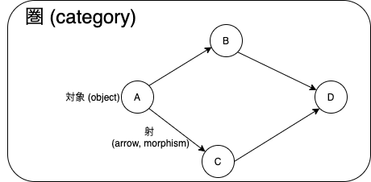
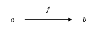
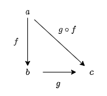

本章では、hamcat ライブラリの以下の import を利用します。

```scala mdoc
import hamcat.util.Eq.===
```

<!-- omit in toc -->
# 1. 圏とは

圏は、**対象** (object) の集まりと、対象から対象へのなんらかの操作を表す**射** (arrow, morphism) の集まりからなります。



例えば、Scala を圏として考えてみると、対象は `Int`、 `String`、 `List[A]` などの型を表し，射は `f: Int -> String` のように関数を表します。

他にも、対象を自然数の集まり `{0, 1, 2, ..., n, ...}` のみと考えてみると、射は自然数の間の操作を表します。射の例として加算、乗算、減算、除算や、自然数を+1した値を返すインクリメンタなどがあります。

圏の例は[3章](./03_Categories_great_and_small.md)で紹介します。本章では、圏とは何かについて学んでいきます。圏の構成要素 (対象、射) と、圏が満たすべき性質 (射の合成、合成の結合律、恒等射) について見ていきます。

<!-- omit in toc -->
# 目次

- [1.1 射について](#11-射について)
  - [1.1.1 射の例: 四則演算](#111-射の例-四則演算)
  - [1.1.2 射の例: Scala の関数](#112-射の例-scala-の関数)
  - [1.1.3 始域と終域](#113-始域と終域)
- [1.2 射の合成](#12-射の合成)
- [1.3 合成の性質](#13-合成の性質)
  - [1.3.1 射の結合律](#131-射の結合律)
  - [1.3.2 恒等射](#132-恒等射)
- [まとめ](#まとめ)

## 1.1 射について

射とは、圏の対象から対象へのなんらかの操作を表すようなものです。例えば、自然数を対象とすれば、自然数の間の操作、つまり加算や減算のような操作が射とみなせます。プログラミングにおいては、ある型をある型に変換する関数は射とみなせます。

### 1.1.1 射の例: 四則演算

射の例として、自然数間の四則演算を考えてみましょう。

対象 1 から対象 2 への射としては「1を足す操作」「2倍する操作」などがあり、対象 2 から対象 1 への射としては「1を引く操作」「2で割る操作」などがありますね。それぞれを `add1`, `double`, `minus1`, `div2` と命名すれば、以下のように表現できます。

```
add1:   1 -> 2
double: 1 -> 2
minus1: 2 -> 1
div2:   2 -> 1
```

### 1.1.2 射の例: Scala の関数

Scala の関数も射とみなせます。

数をインクリメントする (つまり1を足す) 関数 `increment: Int => Int` は、型 `Int` から型 `Int` への関数です。圏論の言葉にすると、`Int` 型という対象から `Int` 型という対象への射です。

```scala mdoc
def increment: Int => Int = _ + 1
```

```scala mdoc
increment(1)
increment(3)
```

### 1.1.3 始域と終域

次に、射を議論する際によく使われる概念を定義しておきます。

射はある対象からある対象への操作を表します。それは、対象から対象への矢印のようなものと考えられます。

```
f: a -> b
```



このとき、矢印が出ている方の対象のことを**始域**あるいは**域** (domain) と呼び、矢印の先の対象のことを**終域**あるいは**余域** (codomain) と呼びます。個人的には、始集合・終集合との関連で始域と終域の方が好きです。

しばしば、射 `f` の始域のことを `dom(f)` 、終域のことを `cod(f)` と表します。

```
dom(f) は a
cod(f) は b
```

## 1.2 射の合成

圏に関する最も重要な性質は、**射の合成**です。圏の本質は合成であり、合成の本質は圏であると言われたりします。射の合成について考えてみましょう。


入力に対して出力を返す「関数」は、射の例です。型  `A` の値を受け取って `B` の値を返す関数 `f` と、型 `B` の値を受け取って `C` の値を返す関数 `g` があるとしましょう。

```scala mdoc
def f[A, B]: A => B = ???
def g[B, C]: B => C = ???
```

`f` の返り値を `g` に渡すことによって、関数を合成できますね。そうすると、型 `A` から `C` への新しい関数 `fg` を定義できます。

```scala mdoc
def fg[A, C]: A => C = a => g(f(a))
```

また、Scala において、関数の合成は `compose` や `andThen` メソッドで書くことができます。

```scala mdoc
def fg2[A, C]: A => C = g.compose(f)
def fg3[A, C]: A => C = f.andThen(g)
```

実際に関数を合成してみましょう。例として、以下のような `String` から `Int` への関数 `length` と、`Int` から `Boolean` への関数 `isEven` を考えてみます。

```scala mdoc
// 文字列の長さを求める関数
def length: String => Int = _.length
length("abcdefg")

// 数が偶数かどうかを判定する関数
def isEven: Int => Boolean = _ % 2 == 0
isEven(3)
isEven(8)
```

`length` は文字列の長さを返す関数で、 `isEven` は数が偶数かどうかを判定する関数です。この2つの関数を合成してみると、以下のようになります。

```scala mdoc
// 関数合成によって新しい関数を定義する
def isLengthEven1: String => Boolean = isEven.compose(length)
isLengthEven1("abcdefg")

def isLengthEven2: String => Boolean = length.andThen(isEven)
isLengthEven2("abcdefg")

def isLengthEven3: String => Boolean = str => isEven(length(str))
isLengthEven3("abcdefg")
```

これら `isLengthEven` 関数は、文字列に `length` 関数を適用したあと、その返り値に `isEven` 関数を適用するような新しい関数です。合成によって作られた関数は、しばしば**合成関数**と呼ばれます。

このように、射の例である関数は合成することができます。一般に、圏における射も合成することができます。ただし、2つの射の合成の結果は一意でなければなりません。すなわち、射の合成は以下のように定義されます。

---

2つの射 `f` と `g` について、`cod(f) = dom(g)` であれば `dom(f)` から `cod(g)` への一意の射が存在します。そのような射を `f` と `g` の**合成** (composition) と呼び、`g . f` と書きます。



---

## 1.3 合成の性質

圏は対象の集まりと射の集まりからなるものと説明しましたが、圏にはもう少し厳密な定義があります。それは

1. **射が合成できること**
2. **射が結合律を満たすこと**
3. **恒等射が定義されていること**

です。合成については 1.2 節で見ましたので、ここでは 2 と 3 について説明していきます。

### 1.3.1 射の結合律

まずは、射の結合律についてです。結合律と言うと、足し算や掛け算の結合律や、論理演算の結合律が思い出されるのではないでしょうか。例えば

```
1 + 2 + 3 = (1 + 2) + 3 = 1 + (2 + 3)
```

```
1 ∨ 1 ∨ 0 = (1 ∨ 1) ∨ 0 = 1 ∨ (1 ∨ 0)
```

などです。

全くこの通りというわけではないのですが、射の結合律とは、以下のように定義されます。

---

合成可能な3つの射 `f`, `g`, `h` があるとき、以下が成り立つならば射は結合律を満たすと言います。

```
h . (g . f) = (h . g) . f = h . g. f
```

---

結合律は、Scala で書くと以下のようになります（`===` は Hamcat で用意している「等しくあるべきものを主張するための文法」です）。

```scala mdoc
// f, g は先ほど定義したものを使います
def h[C, D]: C => D = ???

// h . (g . f) = (h . g) . f
def associativeLaw1 = h.compose(g.compose(f)) === (h.compose(g)).compose(f)

// h . (g . f) = h . g . f
def associativeLaw2 = h.compose(g.compose(f)) === h.compose(g).compose(f)

// (h . g) . f = h . g. f
def associativeLaw3 = (h.compose(g)).compose(f) === h.compose(g).compose(f)
```
具体的な関数で確かめてみましょう。

`length` 関数, `isEven` 関数に加えて、次の関数を使います。

```scala mdoc
def negate: Boolean => Boolean = b => !b
```

3つの関数を合成して、"abcdefg" という文字列を入力してみます。

```scala mdoc
// h . (g . f)
(negate.compose((isEven.compose(length))))("abcdefg")
// (h . g) . f
((negate.compose(isEven)).compose(length))("abcdefg")
// h . g . f
(negate.compose(isEven).compose(length))("abcdefg")
```

すべての計算の結果は等しく、確かに結合律は成り立っています。

### 1.3.2 恒等射

次に、恒等射についてです。あるシステムが圏であるためには、任意の対象について恒等射が存在しなければいけません。この条件を**単位律**と呼びます。

**恒等射** (identity) は、他の射と合成するとその射そのものになるような射です。射の合成の**単位元** (unit) とも言います。つまり、ある関数 `f` と恒等射 `id` とを合成すると、その結果は `f` になります。

```
f . id[A] = f
id[B] . f = f
```

Scala:

```scala mdoc
def identityLaw1[A] = (f.compose(identity[A])) === f
def identityLaw2[B] = (identity[B].compose(f)) === f
```

要は、入力と出力が等しい関数です。かなり噛み砕いて言うと、何もしない操作とも捉えることができるかもしれません。
Scala において、恒等射を表す identity 関数は以下のように定義されています。

```scala mdoc
def identity[A]: A => A = a => a
```

何もしない操作が何に使えるのか、わかりづらいですよね。何もしないのなら使う場面もわからないし、定義になんて組み込む必要ないじゃん、と思うかもしれません。

では、何もしない操作についてもう少し考えてみましょう。

「何もしない」で最も典型的なものは 0 という数ではないでしょうか。0 は、加算という射における単位元です。これは、以下が成り立つことを意味します。

```
x + 0 = x
```

これは当然のように成り立ちますよね。

他に、乗算という射における単位元は 1 です。これは、以下が成り立つことを意味します。

```
x * 1 = x
```

単位元についてもう少し掘り下げてみます。

ある操作をしたあとにもう一つ操作をすると、単位元が得られる場合を考えます。すなわち、射 `f` と射 `g` を合成すると恒等射 `id` が得られたとします。

```
g . f = id
```

このとき `g` は、 `f` と逆の操作をやった結果何もしない操作が得られたという意味から、 `f` の**逆射** (inverse) であるといわれます。

では、加算と乗算の逆射は何でしょうか。加算の単位元は 0、乗算の単位元は 1 なので、ある操作をしたあとにもう一つ操作をすると単位元が得られる、とは以下の状況を意味します。

```
x + (- x) = 0
x * (1 / x) = 1
```

加算 `+ x` に対して `- x` すると単位元 0 が得られ、乗算 `* x` に対して `* 1/x` すると単位元 1 が得られています。これらはそれぞれ減算、除算です。すなわち、加算の逆射は減算、乗算の逆射は除算ですね。

以上の通り、何もしない操作である恒等射は、ある操作とは逆の操作を行う逆射の存在を扱うのにも必要な概念です。

対象 `A` から `B` への射に逆射が存在するとき、相互変換可能であるという意味で `A` と `B` は**同型** (isomorphic) であると言われます。また、射 `f` の逆射が存在することを `f` は**可逆** (invertible) であるといい、可逆な射を**同型射** (isomorphism) と呼びます。

## まとめ

- 圏の定義: 圏は対象の集まりと射の集まりから構成され、以下の条件を満たすシステムである。

  1. 射 `f: a -> b` と射 `g: b -> c` に対して、合成射 `g . f: a -> c` が定義される。Scala においては `compose` メソッド。
  2. 射の合成について、結合律が成り立つ。
  3. 任意の対象について、恒等射が存在する。

- ある射 `f: a -> b` に対して、 `g . f = id[A]` かつ`f . g = id[B]` を満たす射 `g: b -> a` を `f` の逆射と呼ぶ。
- 射 `f` の逆射が存在するとき、 `f` は可逆であると呼ばれる。
- 可逆な射は同型射と呼ばれる。
- 対象 `a` から `b` への射が同型射であるとき、 `a` と `b` は同型であると呼ばれる。