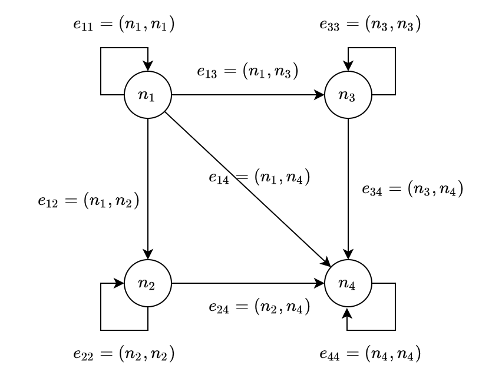
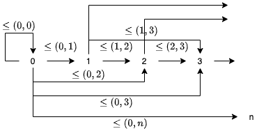
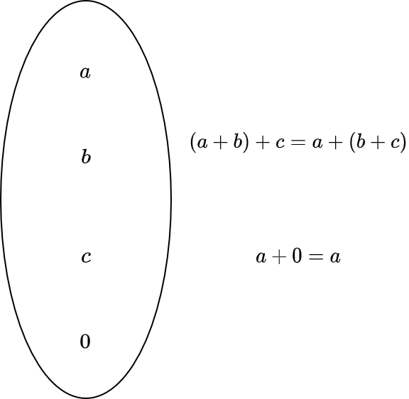

<!-- omit in toc -->
# 3. いろいろな圏

ここまで、圏とは何かについて述べ、Scala の型と関数を圏として捉えることができることを述べました。

しかし、まだ圏のイメージがつかない方が少なくないはず。本章では、具体的な圏の例を通して、圏の理解を深めていきます。

<!-- omit in toc -->
# 目次

- [3.1 空圏](#31-空圏)
- [3.2 単純なグラフ](#32-単純なグラフ)
- [3.3 自由圏](#33-自由圏)
- [3.4 順序集合](#34-順序集合)
- [3.5 モノイド](#35-モノイド)
- [まとめ](#まとめ)

## 3.1 空圏

空圏は、対象が1つもない圏のことです。つまり、対象がないということは射もありません。

なぜ対象が1つもないものが圏と言えるのかについて、考えてみましょう。

まず、圏は対象の集まりと射の集まりからなります。この「集まり」は集合と捉えることもできますが、集合でない場合もあります。

対象が1つもない場合、対象の集まりは集合と捉えることができて、それは空集合になります。また、射の集まりも空集合です。

射の合成は任意の射について定義されていればよく、射が存在しない場合では射の結合律は満たされていると言えます。

そして、恒等射は任意の対象に対して存在していればよく、対象が存在しない場合では単位律が満たされていると言えます。

したがって、空圏は圏と言えます。

## 3.2 単純なグラフ

状態遷移図のように単純なグラフは、圏とみなせます。一般に、そのような単純なグラフは頂点の集合 `N` と辺の集合 `E` とのペア `(N, E)` からなります。

グラフを圏と解釈すると、頂点を対象として、辺を射として捉えることができます。



## 3.3 自由圏

対象を矢で接続するだけで、圏を作ることができます。まず各対象に恒等射を追加します。次に、終点が他の始点と一致するような2つの矢に対して新しい矢を追加し、合成射を追加する。これを繰り返していくことによって、圏を作りあげることができます。

このプロセスは、グラフ `(N, E)` を入力に圏を作っていくプロセスのように見えます。一般的に、このように作られる圏は、与えられたグラフによって生成される**自由圏** (free category) と呼ばれます。

今後、自由モノイド、自由モナドとして、具体的な例を見ていくことになるでしょう。

## 3.4 順序集合

ある集合 `A` とその集合上の関係 `R` とのペア `(A, R)` である順序集合もまた、圏の例です。

例えば、自然数全体の集合 `N = { 0, 1, ..., n, ... }` と関係 `<=` (〇〇以下である) の順序集合 `(N, <=)` は、圏として以下のように図式化されます。



自然数全体の集合と関係 `<=` の順序集合では、自然数が対象、自然数間の関係、例えば `0 <= 1` `1 <= 3` などが射になります。

## 3.5 モノイド 

**モノイド** (Monoid) は、単純な構造ではありますが、非常に強力な概念です。

加算と乗算のどちらの計算にも、このモノイドという概念が密接に関わっています。

モノイドは群論における概念ですが、圏の一例でもあります。コンピュータサイエンスでは、情報理論の分野にも現れることがあると思います。プログラミングにおいても、文字列やリスト、畳み込み可能なデータ構造、Future などとして現れます。

さて、モノイドの定義についてですが、モノイドは、二項演算を備えた集合として定義されます。この二項演算が満たすべき性質は、結合律と、単位元が存在することのみです。

単位元は、加算における 0、乗算における 1 のことを表します。結合律は、加算の場合だと

```
(a + b) + c = a + (b + c)
```


が満たされることです。



二項演算とその単位元を備えた型クラス `Monoid` は、以下のように定義されます。

```scala mdoc
trait Monoid[A]:
  def combine(v1: A, v2: A): A
  def empty: A
```

`combine` が二項演算で、`empty` がその二項演算の単位元を表します。

`combine` が結合律を満たすかどうか、また単位元の存在の保証は実装によります。したがって、 `Monoid` のインスタンスを定義するときは、モノイドの性質を満たすように実装しなければなりません。

`Int` 型に対しての加算に関するモノイドのインスタンスを定義してみると、以下のようになります。

```scala mdoc
given Monoid[Int] with
  def combine(v1: Int, v2: Int): Int = v1 + v2
  def empty: Int = 0
```

```scala mdoc
val intMonoid = summon[Monoid[Int]]

// 結合律の確認
// (1 + 10) + 100
intMonoid.combine(intMonoid.combine(1, 10), 100)

// 1 + (10 + 100)
intMonoid.combine(1, intMonoid.combine(10, 100))

// 単位律の確認
// 100 + 0
intMonoid.combine(100, intMonoid.empty)
```

余談ですが、以下のように拡張メソッドを定義することにより、モノイドを利用しやすくなります。

```scala mdoc
extension [A](v1: A)
  def |+|(v2: A)(using Monoid[A]): A =
    summon[Monoid[A]].combine(v1, v2)
```

```scala mdoc
(1 |+| 10) |+| 100

1 |+| (10 |+| 100)

100 |+| summon[Monoid[Int]].empty
```

`Int` 型だと恩恵は薄いですが、`Option` 型に対してモノイドのインスタンスを定義すると便利に感じられるかもしれません。

```scala mdoc
given [A](using m: Monoid[A]): Monoid[Option[A]] with
  def combine(v1: Option[A], v2: Option[A]): Option[A] =
    (v1, v2) match
      case (Some(a), Some(b)) => Some(m.combine(a, b))
      case (Some(a), None) => Some(a)
      case (None, Some(b)) => Some(b)
      case (None, None) => None
  def empty: Option[A] = None
```

```scala mdoc
Option(1) |+| Option(3)

Option(1) |+| None

None |+| Option(3)

val none: Option[Int] = None
none |+| none
```

## まとめ

- 対象が1つもない圏も、また圏である。
- 単純なグラフは、圏とみなせる。
- 順序集合は圏の例である。
- モノイドとは、ある集合における関数の合成が結合律を満たし、関数に対する単位元が存在するような系のことである。
  - 例
    - モノイド (Int, add)
    - 加算 add(n1, n2) は結合律を満たす
    - 加算 add の単位元は 0
