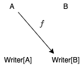

<!-- omit in toc -->
# 4. Kleisli 圏

ここまでで、型と純粋関数を圏としてモデル化する方法をみてきました。その際に計算効果を持つ非純粋な関数をモデル化するための概念として、モナドが出てきましたね。

ここでは、計算効果の例として、実行内容のログ、トレースを行うことについて考えていきます。モナドの1つの例である Writer、そして Writer の一般化である Kleisli について見ていきましょう。

<!-- omit in toc -->
# 目次

- [4.1 ロギング関数の合成](#41-ロギング関数の合成)
- [4.2 Writer 圏](#42-writer-圏)
  - [4.2.1 Writer 圏の対象と射](#421-writer-圏の対象と射)
  - [4.2.2 Writer 圏における射の合成](#422-writer-圏における射の合成)
  - [4.2.3 Writer 圏は圏の公理を満たすか](#423-writer-圏は圏の公理を満たすか)
  - [4.2.4 Writer 圏のより一般的な定義](#424-writer-圏のより一般的な定義)
- [4.3 Kleisli 圏](#43-kleisli-圏)
- [まとめ](#まとめ)

## 4.1 ロギング関数の合成

計算効果の例として、プログラムの実行をロギングする関数について考えます。

命令型のように書くと、グローバルな状態にログを記録することが多いかなと思います。

```scala mdoc
// 副作用が生じる例
var logger: String = ""

// ログを出力する関数 (純粋関数ではない)
def negateUnpure(b: Boolean): Boolean =
  logger += s"negate is called with parameter $b"
  !b
```

この関数には副作用があります。並列実行されるときのことを考えると、このようなコードは好ましくありませんね。

この関数を純粋関数にするにはどうしたら良いでしょうか。幸い、出力されるログを出力に加えるだけでなんとかなりそうです。

```scala mdoc
def negatePure(b: Boolean, logger: String): (Boolean, String) =
  (!b, logger + s"negate is called with parameter $b")
```

この関数は副作用がなく、純粋です。同じ引数で呼び出されると全く同じ出力を返します。

```scala mdoc
negatePure(true, "hoge: ")
negatePure(true, "fuga: ")
```

この関数は純粋ですが、入力に `logger: String` を渡さないといけないのがインタフェースとして不便ですね。そこで次のような型を導入してみましょう。

```scala mdoc
case class Writer[A](run: (String, A))
```

この `Writer` クラスは、任意の型 `A` になんらかの文字列の値を付与した構造を持ちます。このクラスを用いると、 `negate` 関数は以下のように書くことができます。

```scala mdoc
def negate(b: Boolean): Writer[Boolean] =
  Writer(
    s"negate is called with parameter $b. " ->
    !b
  )

negate(true)
```

純粋ではありますが、`Writer` にこれまでのログの情報を渡して集約しなければいけません。どうしたら良いでしょうか。

試しに、ある Writer `Writer[A]` に対して、別の Writer を生成するような計算 `A => Writer[B]` を合成する関数 `flatMap` について考えてみます。

```scala mdoc
extension [A](v: Writer[A])
  def flatMap[B](f: A => Writer[B]): Writer[B] =
    val (logA, resA) = v.run
    val (logB, resB) = f(resA).run
    Writer((logA + logB, resB))
```

```scala mdoc
Writer("initial log. " -> true).flatMap(negate)
```

flatMap ですので、map を定義すれば for 糖衣構文を利用することができます。

```scala mdoc
extension [A](v: Writer[A])
  def map[B](f: A => B): Writer[B] =
    val (logA, resA) = v.run
    Writer(logA, f(resA))

def isEven(n: Int): Writer[Boolean] =
  Writer(
    s"isEven is called with parameter $n. ",
    n % 2 == 0
  )

def isOdd(n: Int): Writer[Boolean] =
  for
    isEvenRes <- isEven(n)
    negateRes <- negate(isEvenRes)
  yield negateRes

isOdd(1)
isOdd(2)
Writer("initial log. " -> 3).flatMap(isOdd)
```

これで、通常のロジック (この簡単な例では、奇数か偶数か判定するプログラム) からログの合成については考えなくて良くなりました。各関数は、純粋関数として自分たちのログを出力に入れるだけで良いですね。

実は、今考えたような構造は Writer 圏と呼ばれます。次の節では Writer 圏を定式化していきます。

## 4.2 Writer 圏

先ほど見たロギング関数の合成の例を圏論の言葉に落とし込むと、Writer 圏というものを考えることができます。

### 4.2.1 Writer 圏の対象と射

Writer 圏では、先ほど定義したデータ型 `Writer` を利用します。

この圏では、対象として型を採用し、対象 `A` から `B` への射として以下のようにラップされた関数を採用します：

```scala mdoc
// Writer 圏における射
def f[A, B]: A => Writer[B] = ???
```



つまり、Writer 圏においては、関数 `g: A => B` は射ではありません。

2つの関数 `negate: Boolean => Writer[Boolean]` と `isEven: Int => Writer[Boolean]` は、Writer 圏における射です。


### 4.2.2 Writer 圏における射の合成

Writer 圏における射の合成は、先ほど定義した `flatMap` と似たようなものになります。関数 `f: A => Writer[B]`、関数 `g: B => Writer[C]` を合成した関数 `f >=> g: A => Writer[C]` を定義してみましょう。

```scala mdoc
object Writer:
  def >=>[A, B, C]: (A => Writer[B]) => (B => Writer[C]) => (A => Writer[C]) = f => g => a =>
    val (logF, b) = f(a).run
    val (logG, c) = g(b).run
    Writer((logF + logG), c)

extension [A, B](f: A => Writer[B])
  def >=>[C](g: B => Writer[C]): A => Writer[C] =
    Writer.>=>(f)(g)
```

`>=>` 演算は fish 演算子と呼ばれるもので、 `andThen` や `compose` と同様、引数で受け取った2つの関数を合成した関数を返します。

```scala mdoc
def isOdd2 = isEven >=> negate

isOdd(3)
```


これで、Writer 圏における関数合成を定義できました！

### 4.2.3 Writer 圏は圏の公理を満たすか

ここで一度、圏が満たすべき性質に立ち戻ってみましょう。1つ目は関数の合成が結合律を満たすこと、2つ目は任意の対象に対して恒等射が存在することでした。

この合成 `>=>` は、結合律を満たすでしょうか？

タプル `(String, A)` の各要素に分解して考えてみましょう。1つ目の要素の合成は、 `String` の連結です。文字列の連結が結合律を満たすのは自明ですね。

2つ目の要素の合成は、標準的な関数合成です。これも結合律を満たしますね。

`>=>` の内部では文字列の連結と標準的な関数合成をしているだけなので、`>=>` は結合律を満たします。

恒等射の存在についてはどうでしょうか。実はこれまでの議論に恒等射は出ていないので、新しく定義します。

Writer 圏における恒等射の型は `A => Writer[A]` ですね。また、恒等射は、とある射と合成するとその射そのものになるような射でした。すなわち、関数 `f: A => Writer[B]` に対して、恒等射を `i: A => Writer[A]` とすると、以下の性質が成り立つはずです。

```scala mdoc
import hamcat.util.Eq.===

def i[A]: A => Writer[A] = ???
def identityLaw1[A, B] = (f[A, B] >=> i[B]) === f[A, B]
def identityLaw2[A, B] = (i[A] >=> f[A, B]) === f[A, B]
```
そのような関数を `pure: A => Writer[A]` として定義しましょう。単位律を満たすために、1つ目の要素であるログ文字列はそのまま返し、2つ目の要素である計算結果はそのまま返す関数として実装します。

```scala mdoc
def pure[A]: A => Writer[A] = a => Writer("" -> a)

pure(1)
pure(3)
```

Writer 圏における射 `negate` `isEven` と合成してみましょう。

```scala mdoc
negate(true)

(pure >=> negate)(true)

(negate >=> pure)(true)

isEven(3)

(pure >=> isEven)(3)

(isEven >=> pure)(3)
```

合成すると同じ値が返ってくることを確認できましたね。`pure` は任意の型 `A` に対して同じ挙動をするので、`pure` は恒等射です。したがって、Writer 圏は単位律を満たします。

以上のことから、ここで定義した Writer 圏は圏であるといえます (ただし、例で見ているので、厳密に証明していません)。Writer 圏についてまとめると、次の図のようになります。


### 4.2.4 Writer 圏のより一般的な定義

ここで定義した Writer 圏はもう少し抽象的にすることができます。Writer 圏が結合律と単位律を満たすためには、文字列の連結が結合律を満たし、文字列の連結に関する単位元 `""` が定義されている必要がありました。つまり、ログを表現する型がモノイド的な性質を満たしていれば、Writer 圏は圏として定義できるはずです。

したがって、型 `Writer` は、以下のように定義していたものを

```scala mdoc:reset
case class Writer[A](run: (String, A))
```

以下のようにパラメータ化して定義できます。

```scala mdoc:reset
case class Writer[L, A](run: (L, A))
```

ただし、型 `L` はモノイドであることが条件です。

これまでの議論を元に、`Writer` を以下のように定義できます。`Writer` のデータそのものはタプル `(L, A)` です。関数を合成するための `flatMap` メソッド (厳密には `>=>` ですが)、恒等射の `pure` メソッドを定義できます。

```scala mdoc:reset
// Semigroup (半群) は combine だけを持った型クラス
import hamcat.data.Semigroup
import hamcat.data.Monoid
import hamcat.syntax.Implicits.*

case class Writer[L, A](run: (L, A)):

  def flatMap[B](f: A => Writer[L, B])(using Semigroup[L]): Writer[L, B] =
    val (log, res) = run
    val (logF, resF) = f(res).run
    Writer((log |+| logF, resF))

object Writer:

  def pure[L, A](a: A)(using m: Monoid[L]): Writer[L, A] = Writer((m.empty, a))
```

## 4.3 Kleisli 圏

前節で議論した Writer 圏は、実は Kleisli 圏 (Kleisli category) と呼ばれるものの例です。Kleisli 圏はモナドに基づく圏ですので、厳密な定義はモナドを学んでから見ていきます。

Kleisli 圏では、対象を型、型 `A` から型 `B` への射を型 `F` に対して `A => F[B]` である関数とします。

```scala mdoc
case class Kleisli[F[_], A, B](run: A => F[B])
```

ここで `F` は自己関手という概念に対応することを後の章で見ていきます。`F` の例としては `List` や `Option` などがあります。それぞれの Kleisli 圏において、射の合成は独自の方法で実装されます。これはまさに1つの自由度であり、ロギングやエラーなどの計算効果に対して表示的意味論を与えることができます。

後の章で、モナドを使って Kleisli 圏を定義します。そのときにまた、本章で述べたことを思い出してもらえると幸いです。

## まとめ

- 関数 `f: A => F[B]` が圏の公理を満たすよう、射の合成を定義したものが Kleisli 圏である。
- Writer 圏は Kleisli 圏の例である。
- Writer 圏では、期待する出力 `B` の他にログ `L` を出力する関数 `f: A => Writer[L, B]` を射として考える。
  - `L` は、その射において結合律を満たし、射に関する単位元を持つ必要がある。すなわち、`L` はモノイドの性質を満たす必要がある。
- Writer 圏における射の合成は `>=>` 演算子として定義された。
