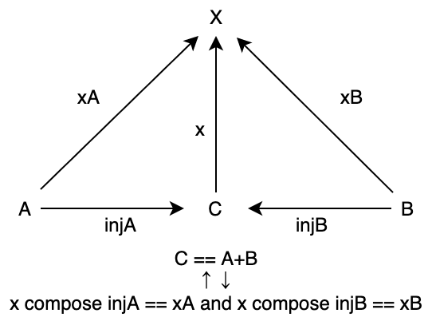
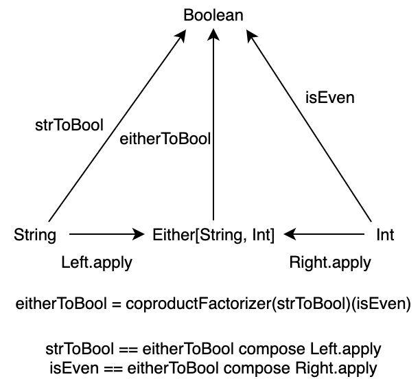

<!-- omit in toc -->
# 5. 積と余積

本章では、圏に関するいくつかの普遍的な構造について学んでいきます。圏論には**普遍的構成** (universal construction) と呼ばれる構成がよく現れ、対象をその関係の観点から定義することがあります。

普遍的構成として、順序集合における最小値に対応する始対象、最大値に対応する終対象、始対象と終対象との関連性である双対性、直積集合に対応する積、そして積と対をなす余積について定式化します。

始対象・終対象や積は、プログラミングにおいて重要な構造を定義するために必要な概念です。

積や余積は特に、代数的データ型と呼ばれるタプル、ケースクラス、トレイトの一般化です。

具体的な例を通して学んでいきましょう！

```scala mdoc
import hamcat.util.Eq.===
```

<!-- omit in toc -->
# 目次

- [5.1 始対象](#51-始対象)
  - [5.1.1 始対象の定義](#511-始対象の定義)
  - [5.1.2 始対象の例](#512-始対象の例)
  - [5.1.3 始対象の一意性](#513-始対象の一意性)
- [5.2 終対象](#52-終対象)
- [5.3 双対性](#53-双対性)
- [5.4 積](#54-積)
  - [5.4.1 積の定義](#541-積の定義)
  - [5.4.2 積の例](#542-積の例)
  - [5.4.4 モノイダル圏としての Scala 圏](#544-モノイダル圏としての-scala-圏)
- [5.5 余積](#55-余積)
  - [5.5.1 余積の定義](#551-余積の定義)
  - [5.5.2 余積の例](#552-余積の例)
  - [5.5.4 モノイダル圏としての Scala 圏](#554-モノイダル圏としての-scala-圏)
- [まとめ](#まとめ)
- [参考文献](#参考文献)

## 5.1 始対象

始対象は、順序集合における最小値に対応する構造です。例えば、自然数の集合 `{ 0, 1, 2, ..., n, ... }` に対して、順序 `<=` における最小値は 0 です。自然数の集合を対象として、順序 `<=` を射とする圏において、この 0 を始対象と言えるように始対象を定式化していきます。

### 5.1.1 始対象の定義

まず、自然数を対象として、射の集まりを以下のように定義してみます。ただし、`(a, b)` とは「a が b 以下である」を意味し、対象 a から対象 b への射が存在することを表すこととします。

```
<= := {
  (0, 0), (0, 1), (0, 2), (0, 3), ..., (0, n), ...
          (1, 1), (1, 2), (1, 3), ..., (1, n), ...
                  (2, 2), (2, 3), ..., (2, n), ...
                          ...
}
```

これを図式で書くと、以下のような圏とみなせます。


図式を見る通り、0 から任意の自然数 (対象) への順序 (射) が定義されており、一方で 0 への順序は `(0, 0)` のみであることがわかります。自然数の集合における 0 の性質を一般化すると、始対象を以下のように定義できます。

---

**始対象** (initial object) とは、圏において任意の対象への射をただ1つ持つような対象のことです。

---

### 5.1.2 始対象の例

集合と関数の圏 `Set` における始対象は、空集合 `φ` です。すなわち、任意の集合 `A` と空集合 `φ` に対して、 `φ` から `A` への射、すなわち関数がただ1つ存在します。

一般に、集合 `A` から `B` への関数は、`A` の任意の要素 `a` に対して、その出力 `b ∈ B` が一意に定まるような関係の集合として定義されます。例えば、集合 `A = { 1, 3 }` から集合 `B = { 2, 4, 6 }` への関数の例として「入力の値に +1 したものを出力する」ような関数 `f: A => B` を考えます。この関数は、以下のような集合として表現されます。

```
{ (1, 2), (3, 4) }
```

空集合 `φ` から集合 `A`、`B` への射はどうなるでしょうか。`φ` には要素がないので、`φ` から `A` への関数は、空集合になるはずです。

```
{ }
```

また、`φ` から `B` への関数も空集合になります。

```
{ }
```

これは、 `φ` から任意の集合への関数 (空集合) がただ1つ存在することを意味します。Scala においては、Nothing 型を引数にとる以下のような関数です。

```scala mdoc
def absurd[A]: Nothing => A = { case _ => ??? }
```


### 5.1.3 始対象の一意性

始対象には、存在するなら**同型を除いて一意である** (unique up to isomorphism) という性質があります。これは、ただ始対象が一意に存在するというわけではなく、始対象と同型の対象を除いて一意に存在するという性質です。

同型については1章で少し話しましたが、一度思い出してみましょう。対象 `A` から対象 `B` への射 `f` に逆射 `fInv` が存在するとき、またそのときに限って `A` と `B` は同型であると言われます。つまり、同型な対象の間は相互に変換可能であることを意味します。射 `f` の逆射 `fInv` とは、恒等射 `I` に対して以下が成り立つような射のことでした。

```scala mdoc
def f[A, B]: A => B = ???
def fInv[A, B]: B => A = ???

// 射 f の逆射 f について、以下が成り立つ
def assert1[A, B] = fInv[A, B].compose(f[A, B]) === identity[A]
def assert2[A, B] = f[A, B].compose(fInv[A, B]) === identity[B]
```

始対象が同型を除いて一意であるとは、任意の2つの始対象が同型であることを意味します。

具体的に、2つの始対象を `I1` と `I2` として考えてみましょう。

```scala mdoc
object InitialObject:
  opaque type I1 = Nothing
  opaque type I2 = Nothing

import InitialObject.{ I1, I2 }
```

`I1` は始対象なので、定義より任意の対象への射をただ1つ持っていて、`I1` から `I2` への一意の射 `f_12` が存在します。

```scala mdoc
// 一意の射
def f12: I1 => I2 = ???
```

一方で、`I2` は始対象なので、定義より `I2` から `I1` への一意の射 `f_21` が存在します。

```scala mdoc
// 一意の射
def f21: I2 => I1 = ???
```

この2つの射を合成して `f21 compose f12` を考えます。`f21 compose f12` は `I1` から `I1` への射です。しかし、`I1` から `I1` への射はただ1つであり、圏の公理よりそれは恒等射です。すなわち

```scala mdoc
def assert3 = f21.compose(f12) === identity[I1]
```

が成り立ちます。同様に `f12 compose f21` を考えると、これは `I2` から `I2` への射です。`I2` から `I2` への射もただ1つであって、圏の公理よりそれは恒等射になります。

```scala mdoc
def assert4 = f12.compose(f21) === identity[I2]
```

`f21` は `f12` の逆射であるため、2つの始対象 `I1` と `I2` は同型です。このような性質を、同型を除いて一意であると言います。

始対象が複数存在するのであれば、それらは同型であると示せます。

## 5.2 終対象

次に、終対象についてです。

終対象は始対象と対をなす概念で、順序集合における最大値に対応する構造です。始対象の定義と同じように、終対象は以下のように定義されます。

---

**終対象** (terminal object) とは、圏において任意の対象からの射がただ1つ存在するような対象のことです。

---

集合の圏 `Set` における終対象は、シングルトン集合です。任意の集合 `A` とシングルトン集合 `{ a }` に対して、`A` から `{ a }` への射がただ1つ存在します。例えば、`A = { 1, 2, 3}` のとき、`A` から `{ a }` への関数は以下1つだけです。

```
{ (1, a), (2, a), (3, a) }
```

シングルトン集合は `Unit` 型に対応するので、Scala 圏における終対象は `Unit` 型です。任意の型 `A` から `Unit` への関数 `unit` がただ1つ存在します。

```scala mdoc
def unit[A]: A => Unit = _ => ()

unit[Int](1)
unit[Int](100)
unit[String]("hoge")
```


終対象も始対象同様、同型を除いて一意です。2つの終対象を `T1` と `T2` として見てみましょう。

```scala mdoc
object TerminalObject:
  opaque type T1 = Unit
  object T1:
    def apply(): T1 = ()
  opaque type T2 = Unit
  object T2:
    def apply(): T2 = ()

import TerminalObject.{ T1, T2 }
```

`T1` は終対象なので、定義より任意の対象からの射がただ1つ存在して、`T2` から `T1` への一意の射 `g21` が一意に存在します。

```scala mdoc
def g21: T2 => T1 = { case t2 => T1() }
```

一方で、`T2` は終対象なので、定義より `T1` から `T2` への一意の射 `g12` が存在します。

```scala mdoc
def g12: T1 => T2 = { case t1 => T2() }
```

この2つの射を合成して `g12.compose(g21)` を考えます。`g12.compose(g21)` は `T2` から `T2` への射です。しかし、`T2` から `T2` への射はただ1つであり、圏の公理よりそれは恒等射です。すなわち

```scala mdoc
g12.compose(g21) == identity[T2]
```

が成り立ちます。同様に `g21.compose(g12)` を考えると、これは `T1` から `T1` への射です。`T1` から `T1` への射もただ1つであって、圏の公理よりそれは恒等射になります。

```scala mdoc
g21.compose(g12) == identity[T1]
```

したがって、2つの終対象 `T1` と `T2` の間には同型射が存在して、同型と言えます。

## 5.3 双対性

終対象について考えるとき、終対象は始対象の対をなす概念であると言いました。

実際、終対象の定義は、始対象の定義の射の向きを変えたようなものであると思ったのではないでしょうか。

一般に、任意の圏 `C` に対して、対象はそのままで、全ての射の矢印を反転させ射の合成を再定義することによって**双対圏** (opposite category) `Cop` を定義することができます。

例として、自然数の順序集合を考えます。自然数間の射 `<=` は、a が b 以下であるとき `a -> b` であるとします。この順序集合の双対圏を考えてみると、全ての矢印が反転するので、射 `<=op` は a が b 以下であるとき `a <- b` となります。言い換えると、a が b 以上であるとき `a -> b` となりますね。

ある圏の双対圏を考えることによって、圏の普遍的な構造を1つ構成したときその双対の構造も構成することができます。例えば、**ある圏における始対象はその双対圏における終対象**です。これから見る積の双対は余積です。

双対圏における構成には接頭辞 "余" ("co") がつけられることが多いです。積 (product) には余積 (coproduct) があり、モナド (monad) には余モナド (comonad) があり、極限 (limit) には余極限 (colimit) があります。ただし、矢印を2回反転させると元に戻るので、余余モナドなるものはありません。

## 5.4 積

さて、もう1つの普遍的構成として、**積** (product) について見ていきましょう。積は、直積とも呼ばれます。

簡単に言えば、積は2つの対象のタプルを表します。Scala において、積はタプルやケースクラスとして組み込まれています。

```scala mdoc
val intBoolTuple: (Int, Boolean) = (44, true)
```

```scala mdoc
case class Pair(a: Int, b: Boolean)

val intBoolPair = Pair(44, true)
```

Scala には [Product](https://github.com/scala/scala/blob/v2.13.14/src/library/scala/Product.scala) というトレイトがあり、これが積を表します。[Tuple](https://github.com/scala/scala3/blob/3.4.2/library/src/scala/Tuple.scala#L8) やケースクラスはすべて `Product` を継承しています。

```scala
// github.com/scala/scala より

/** Base trait for all products, which in the standard library include at
 *  least [[scala.Product1]] through [[scala.Product22]] and therefore also
 *  their subclasses [[scala.Tuple1]] through [[scala.Tuple22]].  In addition,
 *  all case classes implement `Product` with synthetically generated methods.
 */
trait Product extends Any with Equals
```

```scala
// github.com/scala/scala3 より

/** Tuple of arbitrary arity */
sealed trait Tuple extends Product
```

ケースクラスは、コンパイル時に自動的に `Product` をミックスインします。

### 5.4.1 積の定義

積は、圏論において以下のように定義されます。

---

圏の2つの対象 `A` と `B` に対して、対象 `C` とその射 `projA: C => A`、`projB: C => B` の三つ組 `<C, projA, projB>` が `A` と `B` の**積** (product) であるとは、任意の対象 `X` とその射 `xA: X => A`、`xB: X => B` の三つ組 `<X, xA, xB>` に対して `X` から `C` への一意の射 `m` が存在して `projA compose m == xA` `projB compose m == xB` が成り立つことを言います。このとき対象 `C` を `A x B` と書きます。


Scala で書くと以下のように表現できます。

```scala mdoc
// C with projA, projB: A x B
// 型 A, B, C, X に対して以下のような射が存在して
def projA[A, C]: C => A = ???
def projB[B, C]: C => B = ???
def xA[X, A]: X => A = ???
def xB[X, B]: X => B = ???
def m[X, C]: X => C = ???

// 以下が成り立つ
def assertProductA = projA.compose(m) === xA
def assertProductB = projB.compose(m) === xB
```

---

なお、積は存在するなら、同型を除いて一意です。

`Product2` を例に見ていきましょう。型 `A` と `B` のタプル `(A, B)` について、射影 `projA` と `projB` は以下のように定義されます。

```scala mdoc:reset
def projA[A, B, C <: Product2[A, B]](c: C): A = c._1
def projB[A, B, C <: Product2[A, B]](c: C): B = c._2

projA(("tuple", 1))
projB(("tuple", 2))
```

すなわち、Scala における `Product` の射影は `Tuple2#_1` メソッドと `Tuple2#_2` メソッドです。

そして、ある型 `X` とその射 `xA: X => A` `xB: X => B` に対して、`X` から `(A, B)` への一意の関数 `m` が存在します。

```scala mdoc
// C: (A, B)
def m1[X, A, B](xA: X => A)(xB: X => B)(x: X): (A, B) = (xA(x), xB(x))
// C: Pair(A, B)
case class Pair[A, B](a: A, b: B)
def m2[X, A, B](xA: X => A)(xB: X => B)(x: X): Pair[A, B] = Pair(xA(x), xB(x))

// C: (Int, String), X: Int
m1[Int, Int, String](identity[Int])(n => s"The number is $n")(3)

// C: Pair[Long, Boolean], X: String
m2[String, Long, Boolean](_.toLongOption.getOrElse(0))(_.toLongOption.nonEmpty)("12345")
```

### 5.4.2 積の例

積の例として、`A` を `String`、`B` を `Int` とし、`X` を `List[Int]` とします。

そして、`List[Int]` の `String` への射影と、`Int` への射影をそれぞれ以下のように定義します：

```scala mdoc
val listToString: List[Int] => String = _.toString

val listToInt: List[Int] => Int = _.length
```

このとき、`List[Int]` から積 `(A, B)` への一意の関数 `listToTuple` を構成できます：

```scala mdoc
val listToTuple: List[Int] => ((String, Int)) = m1(listToString)(listToInt)
```

この関数に対して `List(1, 2, 3, 4, 5)` を与えると、`String` への射影 `listToString` と `Int` への射影 `listToInt` をそれぞれ適用したタプルが得られます。

```scala mdoc
listToTuple(List(1, 2, 3, 4, 5))
```

したがって、積 `(A, B)` には、`A` の成分と `B` の成分とで分解して計算できる性質があることがわかります。この性質がまさに、積の定義となっています。

実際、以下の図式は可換になります。

```scala mdoc
val list = List(1, 2, 3, 4, 5)

projA.compose(listToTuple)(list) == listToString(list)
projB.compose(listToTuple)(list) == listToInt(list)
```


もう一つ、集合圏における積の例を見てみます [1]。集合 `A = { 7, 8, 9 }`、`B = { a, b, c }`、`X = { 1, 2, 3, 4 }` として、`X` から `A` および `B` への射影 `xA` と `xB` を以下のようにします。

```
xA = { (1, 7), (2, 8), (3, 9), (4, 7) }
xB = { (1, a), (2, b), (3, c), (4, c) }
```

そして、積 `AxB` から `A` および `B` への射影 `pA` と `pB` をそれぞれ、第1要素を取得する関数と第2要素を取得する関数として考えます。このとき、上の射影 `xA` と `xB` のペアは `X` から `AxB` への関数 `f` に一意に読み替えることができます。

```
f = { (1, (7, a)), (2, (8, b)), (3, (9, c)), (4, (7, c)) }
```

この例について、以下の図式は可換になります。


### 5.4.4 モノイダル圏としての Scala 圏

2つの対象 `A` と `B` の積 `AxB` は、見方を変えれば二項演算と考えることができます。

Scala 圏における積は二項演算として、数の乗算に対応します。二項演算としての性質を少し見ていきましょう。

まず、結合律について。3つの型 `A` `B` `C` の積は、タプルをネストさせることによって定義できます。

```
((A, B), C)
(A, (B, C))
```


これら2つのタプルは、同型です。同型射 (つまり、逆射を持つ射) は、以下のように定義できます。

```scala mdoc
def isomorTuple1[A, B, C]: (((A, B), C)) => ((A, (B, C))) = {
  case ((a, b), c) => (a, (b, c))
}

def isomorTuple2[A, B, C]: ((A, (B, C))) => (((A, B), C)) = {
  case (a, (b, c)) => ((a, b), c)
}

isomorTuple1(((44, "hoge"), true))
isomorTuple2((44, ("hoge", true)))
```

なお、これらと同型である3-タプル `(A, B, C)` も積です。

```scala mdoc
def isomorTuple3[A, B, C]: (((A, B), C)) => ((A, B, C)) = {
  case ((a, b), c) => (a, b, c)
}

def isomorTuple4[A, B, C]: ((A, B, C)) => (((A, B), C)) = {
  case (a, b, c) => ((a, b), c)
}
```

以上のように、積について結合律が満たされることを確認できました。

では次に、単位律について考えてみます。

二項演算としての積における単位律とは、単位元の型 `U` に対して型 `A` と `U` の積 `UxA` および `AxU` が、`A` と同型になることを言います。

型の積における単位元は、`Unit` 型です。以下のような同型射が存在するので、タプル `(Unit, A)` と `(A, Unit)` はどちらも `A` と同型です。

```scala mdoc
def isomorProduct1[A]: A => ((Unit, A)) = a => ((), a)
def isomorProduct2[A]: ((A, Unit)) => A = {
  case (a, ()) => a
}

def isomorProduct3[A]: A => ((A, Unit)) = a => (a, ())
def isomorProduct4[A]: ((A, Unit)) => A = {
  case (a, ()) => a
}
```

以上のことから、積はモノイドの性質を満たしていることがわかります。

このようなことから、Scala 圏はモノイダル圏であると言われます。※モノイダル圏の厳密な定義はここでは与えません。

## 5.5 余積

最後に、積の双対概念である余積についてです。

### 5.5.1 余積の定義

余積は、積の定義において射を反転させたものです。すなわち、以下のように定義されます。

---

圏の2つの対象 `A` と `B` に対して、対象 `C` と射 `injA: A => C`、`injB: B => C` の三つ組 `<C, injA, injB>` が `A` と `B` の**余積** (coproduct) であるとは、他の同様の三つ組、すなわち任意の対象 `X` と射 `xA: A => X`、`xB: B => X` の三つ組 `<X, xA, xB>` に対して `C` から `X` への一意の射 `x` が存在して

```
x compose injA == xA
x compose injB == xB
```

が成り立つことを言います。このとき対象 `C` を `A+B` と書きます。また、`injA: A => C` および `injB: B => C` を入射 (injection) と呼びます。



---

積は Scala においてタプルやケースクラスとして表すことができますが、余積は Scala において Either によって表すことができます。

型 `A` と `B` の余積 `Either[A, B]` について、射 `injA` と `injB` は以下のように定義されます。

```scala mdoc
def injA[A, B](a: A): Either[A, B] = Left(a)
def injB[A, B](b: B): Either[A, B] = Right(b)
```

すなわち、余積の入射は `Left.apply` メソッドと `Right.apply` メソッドです。そして、ある型 `X` に対して、`Either[A, B]` から `X` への一意の関数 `coproductFactorizer` が存在します。

```scala mdoc
def coproductFactorizer[X, A, B](xA: A => X)(xB: B => X): Either[A, B] => X = {
  case Left(a) => xA(a)
  case Right(b) => xB(b)
}
```

### 5.5.2 余積の例

余積の例として、対象 `A` を型 `String` とし、対象 `B` を型 `Int` とし、対象 `X` を型 `Boolean` とします。

そして、`String` から `Boolean` への入射と、`Int` からの入射をそれぞれ以下のように定義します：

```scala mdoc
val strToBool: String => Boolean = _.contains("a")
val isEven: Int => Boolean = _ % 2 == 0
```

このとき、余積 `Either[String, Int]` から型 `Boolean` への一意の関数 `eitherToBool` を構成できます。この関数は、`String` については文字列 `"a"` を含むかどうか判定し、`Int` が偶数かどうかを判定する関数です。

```scala mdoc
val eitherToBool: Either[String, Int] => Boolean = coproductFactorizer(strToBool)(isEven)
```

この関数に対して `String` および `Int` を与えると、それぞれに対して関数が適用されます：

```scala mdoc
eitherToBool(Left("abcdefg"))
eitherToBool(Right(3))
```

Either について、以下の図式は可換になります。



### 5.5.4 モノイダル圏としての Scala 圏

積は、乗算に対応する二項演算と考えることができました。

Scala 圏において、余積 `A+B` は加算に対応する二項演算と考えることができます。

余積における単位元は `Nothing` 型です。

```scala mdoc
def isomorCoproductLeft[A]: A => Either[A, Nothing] = a => Left(a)
def isomorCoproductLeftInv[A]: Either[A, Nothing] => A = {
  case Left(a)  => a
  case Right(_) => ??? // Right は Nothing なので来ない
}

isomorCoproductLeft("Oh my god!")
isomorCoproductLeftInv(Left("Oh my god!"))
```

```scala mdoc
def isomorCoproductRight[B]: B => Either[Nothing, B] = b => Right(b)
def isomorCoproductRightInv[B]: Either[Nothing, B] => B = {
  case Right(b) => b
  case Left(_)  => ??? // Left は Nothing なので来ない
}
isomorCoproductRight("Good")
isomorCoproductRightInv(Right("Good"))
```

## まとめ

- 始対象とは、圏において任意の対象への射をただ1つ持つような対象のことである。
  - 集合圏における始対象は空集合、Scala 圏における始対象は Nothing である。
  - 始対象は同型を除いて一意である。
- 終対象とは、圏において任意の対象からの射がただ1つ存在するような対象のことである。
  - 集合圏における終対象はシングルトン集合、Scala 圏における終対象は Unit である。
  - 終対象は同型を除いて一意である。
- ある圏の双対圏とは、その圏の対象はそのままに、射の向きを反転させた圏のことである。
  - ある圏の始対象はその双対圏の終対象であり、ある圏の終対象はその双対圏の始対象である。
- 2つの対象 `A` と `B` の積 `A x B` とは、`A` と `B` への射影を持つような対象を対象とするスパン圏における終対象である。
  - タプルやケースクラスが積の例である。
  - Unit を単位元する積について、Scala 圏はモノイダル圏となる。
- 2つの対象 `A` と `B` の余積 `A + B` とは、`A` と `B` からの入射を持つような対象を対象とする余スパン圏における始対象である。
  - Either が余積の例である。
  - 余積は積の双対概念である。

## 参考文献

[1] 雪田修一, 圏論入門 Haskell で計算する具体例から, 日本評論社, 2020.
