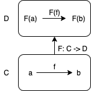
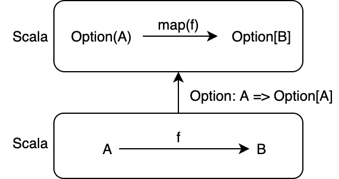

<!-- omit in toc -->
# 7. 関手

圏は対象の集まりと射の集まりからなりますが、これまでに何度か「対象を圏として圏を構成できるのではないか？」と思った人もいるのではないでしょうか。

その疑問に対する答えは「できる」です。今回定義する関手を使えば、圏の構造（つまり、圏の図式の形）を維持したまま別の圏に変換できるようになります。

関手は、非常に単純ですが強力な概念です。本章では、関手とは何かについて定義し、プログラミングにおける関手の例を示します。

<!-- omit in toc -->
# 目次

- [7.1 関手とは](#71-関手とは)
  - [7.1.1 対象関数](#711-対象関数)
  - [7.1.2 射関数](#712-射関数)
  - [7.1.3 関手の定義](#713-関手の定義)
- [7.2 プログラミングにおける関手](#72-プログラミングにおける関手)
  - [7.2.1 Functor 型クラス](#721-functor-型クラス)
  - [7.2.2 Option 関手](#722-option-関手)
  - [7.2.3 Reader 関手](#723-reader-関手)
- [7.3 関手の合成](#73-関手の合成)
- [まとめ](#まとめ)

## 7.1 関手とは

**関手** (functor) は、ある圏 **C** を別のある圏 **D** に変換する対応 F のことです。

関手の例としては Option 関手、List 関手、Writer 関手、モノイド準同型などがあります。モノイド準同型は、モノイド間の関手です。

Option 関手は、型 `A` の値を `Option` で包んで型 `Option[A]` に変換します。また、関数 `A => B` を関数 `Option[A] => Option[B]` に変換します。

同様に、List 関手は型 `A` を `List[A]` に変換し、関数 `A => B` を `List[A] => List[B]` に変換します。Writer 関手も型 `A` を `Writer[A]` に変換し、関数 `A => B` を `Writer[A] => Writer[B]` に変換します。

圏は対象と射から構成されるので、圏を変換するには対象と射それぞれに関する対応を定義する必要があります。



### 7.1.1 対象関数

関手において、ある圏の対象を別のある圏の対象に変換するような対応を対象関数といいます。一般に、圏 **C** から **D** への関手 F は、圏 **C** の対象 a を **D** の対象 F(a) に対応させます。

Option 関手の例で言うと、Option 関手は型 `A` を型 `Option[A]` に対応させています。

```scala mdoc
def objOptFunc[A]: A =>  Option[A] = Option(_)

objOptFunc(3)
objOptFunc("Hoge")
```

### 7.1.2 射関数

関手において、ある圏の射を別のある圏の射に変換するような対応を射関数といいます。一般に、圏 **C** から **D** への関手 F の射関数は、圏 **C** の射 f: a -> b を **D** の射 F(f): F(a) -> F(b) に対応させます。Hamcat において、射関数は `fmap` メソッドとして定義しています。

Option 関手は、例で言うと、射 `f: A => B` を `fmap(f): Option[A] => Option[B]` に対応させる必要があります。この対応は、標準ライブラリにある `Option#map` メソッドによって実現されます：

```scala mdoc
def isEven: Int => Boolean = n => n % 2 == 0
def negate: Boolean => Boolean = b => !b

Option(3).map(isEven)
Option(true).map(negate)
```



この射関数が満たすべき性質として、以下の2つがあります：

1. **C** の射 f, g の合成 `g compose f` について `fmap(g compose f) == fmap(g) compose fmap(f)` が成り立つこと。
2. C の任意の対象 A の恒等射 `identity[A]` について `fmap(identity[A]) === identity[F[A]]` が成り立つこと。

1つ目の性質は、関手が射の合成を保存することを意味します。

```scala mdoc
// hamcat における関手のデータ型、インスタンスをインポート
import hamcat.util.Eq.===

// Option 型に対する Functor のインスタンス
val optionFunctor = summon[Functor[Option]]

// f: isEven, g: negate とします
// fmap(g compose f)
def lifted1 = optionFunctor.fmap(negate.compose(isEven))

// fmap(g) compose fmap(f)
def lifted2 = optionFunctor.fmap(negate).compose(optionFunctor.fmap(isEven))

// 射の合成が保存されることの確認
lifted1 === lifted2
```

例えば、`Option(3)` に対して以下が成り立ちます。

```scala mdoc
optionFunctor.fmap(negate compose isEven)(Option(3)) == (optionFunctor.fmap(negate) compose optionFunctor.fmap(isEven))(Option(3))
```


2つ目の性質は、関手が恒等射を保存することを意味します。

```scala mdoc
// fmap(identity[A])
def lifted3 = optionFunctor.fmap(identity[Int])

// identity[F[A]]
def lifted4 = identity[Option[Int]]

lifted3 === lifted4
```

例えば、`Option(3)` に対して以下が成り立ちます。

```scala mdoc
optionFunctor.fmap(identity[Int])(Option(3)) == identity[Option[Int]](Option(3))
```

以上の性質は圏の構造を保存する対応を表す性質です。このような2つの性質を**関手性** (functor laws) と呼びます。

### 7.1.3 関手の定義

では、関手の定義を与えましょう。一般に、関手は以下のように定義されます。

---

圏 **C** から圏 **D** への**関手** (functor) `F` とは、以下を満たす対応のことです。

- **C** の射 f: a -> b を D の射 F(f): F(a) -> F(b) すなわち `fmap(f): F[A] => F[B]` に対応させること。
- **C** の射 f, g の合成 `g compose f` について `fmap(g compose f) == fmap(g) compose fmap(f)` が成り立つこと。
- **C** の任意の対象 A の恒等射 `identity[A]` について `fmap(identity[A]) == identity[F[A]]` が成り立つこと。

---

先ほどみたように、2 番目と 3 番目は関手性を表します。

なお、圏 **C** と **D** は同じであってもよく、特に圏 **C** から圏 **C** への関手は**自己関手** (endofunctor) と呼ばれます。Scala 圏における関手は全て、自己関手です。

## 7.2 プログラミングにおける関手

前節では、関手の定義を与えました。本節では、Scala プログラミングにおける関手を考えていきます。

### 7.2.1 Functor 型クラス

関手は Scala において、以下のような型クラス [Functor](https://github.com/taretmch/hamcat/blob/master/src/main/scala/data/Functor.scala) として実装できます。`Functor` 型クラスは、対象関数として型構築子 `F[_]` をもち、射関数として `fmap` メソッドを持ちます。

```scala mdoc
trait Functor[F[_]]:
  def fmap[A, B](f: A => B): F[A] => F[B]
```

`fmap` メソッドは関数を**引き上げる** (lift)、とも言われます。関数 `A => B` は `fmap` によって `F[_]` 上の関数 `F[A] => F[B]` に引き上げられます。

### 7.2.2 Option 関手

ある型 `F[_]` に対する `Functor` のインスタンスを実装してみましょう。ここでは、`Option` についての `Functor` のインスタンスを定義します。

Option 型に対する `Functor` のインスタンスは、以下のように実装できます。`Functor` に必要なパラメータは型構築子としての `Option` です。また、抽象メソッドである射関数 `fmap` を実装する必要があります。

```scala mdoc
given Functor[Option] = new Functor[Option]:
  def fmap[A, B](f: A => B): Option[A] => Option[B] = _.map(f)
```

Option 関手の `fmap` メソッドは `Option#map` メソッドと同じです。実装を見てわかる通り、`fmap` メソッドが関手性を満たすかどうか、つまり圏の構造を維持する対応かどうかは実装によります。定義だけでは `fmap` メソッドが必ず関手性を満たすとは言えませんが、関手性を満たすように `fmap` メソッドを実装しなければいけません。

実際にこのインスタンスを使ってみましょう。本リポジトリでは、型クラスのインスタンスは `hamcat.data.instance` パッケージ内においてあります。コンソールにおいて `hamcat.data.instance.Implicits.given` をインポートすれば、全てのインスタンスが使えるようになります。`fmap` に `Option(3)` と `isEven` (偶数かどうかを判定する関数) を与えると、`Option(3)` の中の値に `isEven` を適用した結果 (すなわち `Some(false)`) が出力されます。

```scala mdoc
// import hamcat.data.instance.Implicits.given 実行後
summon[Functor[Option]].fmap(isEven)(Option(3))
```

なお、毎回 `summon[Functor[Option]].fmap(...)` と書くのは面倒ですし、不便です。この場合、以下のように拡張メソッドを定義することによって `Option#fmap` メソッドとして呼び出せるようになります。

```scala mdoc
extension [F[_], A](fa: F[A])
  def fmap[B](f: A => B)(using functor: Functor[F]): F[B] =
    functor.fmap[A, B](f)(fa)
```

```scala mdoc
Option(3).fmap(isEven)
```

では、この Option 関手の `fmap` メソッドが関手性を満たすかどうかについて調べてみましょう。

関手性とは、以下が成り立つことでした。

- **C** の射 f, g の合成 `g compose f` について `fmap(g compose f) == fmap(g) compose fmap(f)` が成り立つこと。
- **C** の任意の対象 A の恒等射 `identity[A]` について `fmap(identity[A]) == identity[F[A]]` が成り立つこと。

### 7.2.3 Reader 関手

次の例として、型 `A` を受け取ったとき、任意の型 `X` を受け取って `A` を返すような関数 `X => A` に変換するような関手を考えます。この関手は Reader 関手と呼ばれます。

Reader 関手で重要なことは、関数も関手であるということです。関数が関手であれば、型 `R` を受け取って `A` を返すような関数 `R => A` があったとき、`A` を `B` に変換する関数 `f: A => B` を与えれば `R` から `B` の関数を取得することができます。

Reader 関手のインスタンスは、以下のように実装できます。対象関数として型構築子 `[X] =>> Function1[R, X]` を渡し、射関数 `fmap` を実装します。ここで、`Function1` は1変数関数を表す Scala 標準ライブラリの型です。`[X] =>> Function1[R, X]` は `R => X` を表します。

```scala mdoc
given [R]: Functor[[X] =>> Function1[R, X]] = new Functor[[X] =>> Function1[R, X]]:
  def fmap[A, B](f: A => B): (R => A) => (R => B) = fa =>
    f.compose(fa)
```

なお、`[X] =>> Function1[R, X]` という記法は Scala 3 の Type Lambda というものです。

`fmap` メソッドは、ただ2つの関数を合成しているだけです。関数 `R => A` があったとき、引数として関数 `A => B` を受け取ると関数 `R => B` が返されます。

これを使うと、例えば以下のようなことができます。

```scala mdoc
// 偶数かどうか判定する関数を奇数かどうか判定する関数に変換する
isEven.fmap(negate) (3)
```

`compose` が関手の射関数であるのですね。

## 7.3 関手の合成

圏を対象として関手を射とするような圏を考えるとき、射の合成、すなわち関手の合成を定義する必要があります。

Scala 圏における関手は全て自己関手なので、自己関手同士を合成することができるのかどうかについて考えてみましょう。

例えば、2つの関手 Option と List を合成してみるとどうなるでしょうか。まず、List 型の関手としての実装は以下のようになります。

```scala mdoc
given Functor[List] = new Functor[List]:
  def fmap[A, B](f: A => B): List[A] => List[B] = _.map(f)
```

対象関数は、型 `Int` を Option 関手によって `Option[Int]` に変換し、List 関手によって `List[Option[Int]]` に変換するものとします。
`Ǥfl
```scala mdoc
val intOptionList: List[Option[Int]] = List(Some(1), Some(3), None, Some(4))
```

次に、射関数は、List 関手の `fmap` メソッドと Option 関手の `fmap` メソッドの合成 `fmapC` と定義します。

```scala mdoc
val listFunctor = summon[Functor[List]]
def fmapL[A, B]: (A => B) => List[A] => List[B] = listFunctor.fmap
def fmapO[A, B]: (A => B) => Option[A] => Option[B] = optionFunctor.fmap

def fmapC[A, B]: (A => B) => List[Option[A]] => List[Option[B]] = fmapL.compose(fmapO[A, B])
```

この `fmapC` メソッドを用いると、2つの関手によって包まれた型 `Int` 上の関数

```scala mdoc
val increment: Int => Int = _ + 1
```

を `List[Option[Int]]` 上の関数として引き上げることができます。

```scala mdoc
fmapC(increment)(intOptionList)
```

これは、`fmap` メソッドを2回呼び出すことに等しいです。

```scala mdoc
intOptionList.fmap(_.fmap(increment))
```

外側の `fmap` は List 関手の射関数で、内側の `fmap` は Option 関手の射関数です。

関手の合成によって定義された射関数 `fmapC` は射の合成を保存しますし、恒等射を保存します。

```scala mdoc
// fmap(g compose f) == fmap(g) compose fmap(f)
fmapC(isEven compose increment)(intOptionList) == (fmapC(isEven) compose fmapC(increment))(intOptionList)

// fmap(identity[A]) == identity[F[A]]
fmapC(identity[Int])(intOptionList) == identity[List[Option[Int]]](intOptionList)
```

したがって、関手の合成もまた、関手であることがわかります。

自己関手の場合のみを取り上げましたが、自己関手でない一般の関手に関してもこれは成り立ちます。興味があれば証明してみてください。

## まとめ

- 関手は、ある圏を、構造を維持しながら別のある圏に変換する対応のこと。
  - 関手の例として、Option、List、Reader などがある。
  - 関手は、対象 A を対象 F[A] に対応させる。
  - 関手は、射 `f: A => B` を射 `fmap(f): F[A] => F[B]` に対応させる。
- 関手が満たす以下の性質のことを、関手性と呼ぶ。
  - 射 f, g の合成 g . f について `fmap(g compose f) == fmap(g) compose fmap(f)` が成り立つこと。
  - 恒等射 `identity[A]` について `fmap(identity[A]) == identity[F[A]]` が成り立つこと。
- Reader 関手は、ある型 `A` に対して、`A` を返す任意の関数 `Function1[*, A]` を対応させる関手である。
