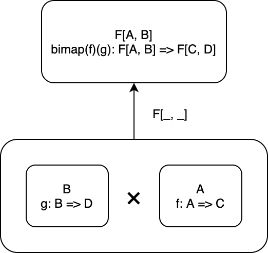

<!-- omit in toc -->
# 8. 関手性

前章では、圏と圏との間の対応である関手について定義し、いくつかのインスタンスを見ていきました。

本章では関手についてさらに深掘り、今後の議論の際に必要となるいくつかの関手について説明します。

まず、型構築子に2つの型パラメータを持つ関手である双関手について説明します。双関手の一般的な定義は直積圏を用いて与えられるので、直積圏についても説明します。双関手を用れば、積と余積を構成可能であることを示します。

次に、Reader 関手を2つの型パラメータを持つ型構築子 `Function1` として見たときの構造について説明します。Reader 関手は前章でも少し見まして、ある型を返すような関数を作る操作が関手であることが言えました。ここでは、Reader 関手に与える型パラメータを1つと固定する (返り値の型を指定する) のではなく、2つ指定する (引数と返り値の型を指定する) ことを考え、これと双関手の関係性について見ていきます。実は、2つの型パラメータをとる Reader 関手は、Profunctor と呼ばれる関手の1つであることがわかります。

最後に、Profunctor の具体例であって、圏論において重要な概念である Hom 関手について説明します。

少し難しいかもしれませんが、なるべくコードに落として学んでいければと思います！

<!-- omit in toc -->
# 目次

- [8.1 双関手](#81-双関手)
  - [8.1.1 直積圏を定義する](#811-直積圏を定義する)
  - [8.1.2 双関手の一般的な定義](#812-双関手の一般的な定義)
  - [8.1.3 Tuple2 は双関手](#813-tuple2-は双関手)
  - [8.1.4 Either もまた双関手](#814-either-もまた双関手)
- [8.2 Reader 関手](#82-reader-関手)
  - [8.2.1 Function1 は双関手か？](#821-function1-は双関手か)
  - [8.2.2 Function1 に対して first メソッドを定義する](#822-function1-に対して-first-メソッドを定義する)
  - [8.2.3 共変関手と反変関手](#823-共変関手と反変関手)
- [8.3 Profunctor](#83-profunctor)
- [8.4 Hom 関手](#84-hom-関手)
- [まとめ](#まとめ)

## 8.1 双関手

**双関手** (bifunctor) は、型構築子に2つの型パラメータを持つ関手です。

双関手において、対象関数 `F[_, _]` を、2つの型 `A`、`B` を型 `F[A, B]` に対応させるものとして定義します。

また、射関数 `bimap` を、射 `A => C` と `B => D` に対して射 `F[A, B] => F[C, D]` を対応させるものとして定義します。

双関手の型クラスを定義すると、以下のようになります。

```scala mdoc
trait Bifunctor[F[_, _]]:

  def bimap[A, B, C, D](f: A => C, g: B => D): F[A, B] => F[C, D]
```

`Bifunctor` 型クラスは、対象関数として型構築子 `F[_, _]` をもち、射関数として `bimap` メソッドをもちます。`bimap` メソッドがあれば、一方の関数のみを変換する `first` メソッドおよび `second` メソッドを定義できます。

```scala mdoc
extension [F[_, _]](bifunctor: Bifunctor[F])
  def first[A, B, C](f: A => C): F[A, B] => F[C, B] =
    bifunctor.bimap(f, identity[B])
  
  def second[A, B, D](g: B => D): F[A, B] => F[A, D] =
    bifunctor.bimap(identity[A], g)
```



### 8.1.1 直積圏を定義する

双関手の一般的な定義を与えるために、**直積圏** (product category) という概念を導入します。

2つの圏 **C1** と **C2** に対して、直積圏 **C1 x C2** を考えることができます。

直積圏 **C1 x C2** は、対象を **C1** の対象 a と **C2** の対象 b のペア (a, b) とします。

そして、射を **C1** の射 f: a -> c と **C2** の射 g: b -> d のペア (f, g) とします。

```scala mdoc
// 直積圏における射
def fTuple[A, B, C, D](f: A => C, g: B => D): Tuple2[A, B] => Tuple2[C, D] = { case (a, b) => (f(a), g(b)) }

val lengthAndIsEven = fTuple[String, Int, Int, Boolean](_.length, _ % 2 == 0)

lengthAndIsEven("hogehoge" -> 3)

lengthAndIsEven("" -> 4)
```

対象と射のペアをとっているだけですね。

射の合成についてもペアをとるだけです。**C1** における射の合成 h . f と **C2** における射の合成 k . g に対して、(h . f, k . g) は直積圏 **C1 x C2** における射の合成になります：

```scala mdoc
// 直積圏における射の合成
def composeTuple[A, B, C, D, E, F](fg: Tuple2[A, B] => Tuple2[C, D], hk: Tuple2[C, D] => Tuple2[E, F]): Tuple2[A, B] => Tuple2[E, F] =
  hk.compose(fg)

val nonEmptyAndIsOdd = composeTuple(
  lengthAndIsEven,
  fTuple[Int, Boolean, Boolean, Boolean](_ > 0, b => !b)
)

nonEmptyAndIsOdd("hogehoge" -> 3)

nonEmptyAndIsOdd("" -> 4)
```

恒等射も同様に、**C1** の恒等射 identityC1 と **C2** の恒等射 identityC2 に対して (identityC1, identityC2) が直積圏の恒等射になります。

```scala mdoc
// 直積圏における恒等射
def identityTuple[A, B]: Tuple2[A, B] => Tuple2[A, B] = { case (a, b) => (identity[A](a), identity[B](b)) }

// または単に
def identityTuple2[A, B]: Tuple2[A, B] => Tuple2[A, B] = identity[Tuple2[A, B]]

identityTuple("hogehoge" -> 3)

identityTuple("" -> 4)
```

### 8.1.2 双関手の一般的な定義

さて、2つの圏の対象と射、射の合成をそれぞれペアにすることによって、直積圏を定義しました。双関手の話に戻りましょう。

一般的に、双関手は以下のように定義されます。

---

**双関手** (bifunctor) とは、2つの圏 **C** と **D** の直積圏 **C x D** から圏 **E** への関手のことです。

---

Scala 圏において関手は自己関手となるので、Scala 圏における双関手 (すなわち Bifunctor) は Scala 圏と Scala 圏の直積から Scala 圏への関手になります。

すなわち、Bifunctor `F` は、対象関数 `F[_, _]` として Scala の直積圏の対象 `A` `B` を `F[A, B]` に対応させ、射関数 `bimap` として Scala の直積圏の射 `A => C` と `B => D` を `F` に関する射 `F[A, B] => F[C, D]` に対応させます。

では、双関手のいくつかの例をみていきましょう。

### 8.1.3 Tuple2 は双関手

双関手の重要な例として、積 (product) があります。対象の任意のペア `A` と `B` に対して積 `A x B` が存在する場合、これらの対象 `A` `B` から積 `A x B` への射は双関手の性質を満たします。Scala で最も単純な積 `Tuple2` に対して `Bifunctor` のインスタンスを与えましょう。

```scala mdoc
given Bifunctor[Tuple2] with
  def bimap[A, B, C, D](f: A => C, g: B => D): Tuple2[A, B] => Tuple2[C, D] = {
    case (a, b) => f(a) -> g(b)
  }
```

```scala mdoc
// 例によって、これらの関数を f, g として利用してみます
val length: String => Int = _.length
val isEven: Int => Boolean = _ % 2 == 0

summon[Bifunctor[Tuple2]].bimap[String, Int, Int, Boolean](length, isEven)(("hogehoge", 12345))
```

都度 summon するのは面倒なので、こちらも拡張メソッドを使って簡単に使えるようにしてみましょう。

```scala mdoc
extension [F[_, _], A, B](v: F[A, B])
  def bimap[C, D](f: A => C, g: B => D)(using bf: Bifunctor[F]): F[C, D] =
    bf.bimap(f, g)(v)
```

```scala mdoc
("hogehoge", 12345).bimap(length, isEven)
```

### 8.1.4 Either もまた双関手

双対性によって、余積もまた、圏内の対象のすべてのペアに対して定義されているなら双関手になります。余積の一つである `Either` に対して `Bifunctor` のインスタンスを与えてみましょう。

```scala mdoc
given Bifunctor[Either] with
  def bimap[A, B, C, D](f: A => C, g: B => D): Either[A, B] => Either[C, D] = {
    case Left(a)  => Left(f(a))
    case Right(b) => Right(g(b))
  }
```

```scala mdoc
val right: Either[String, Int] = Right(12345)
val left: Either[String, Int] = Left("hogehoge")

right.bimap(length, isEven)
left.bimap(length, isEven)
```

## 8.2 Reader 関手

前章では型 `A` を `R => A` に対応させ、関数 `A => B` を `(R => A) => (R => B)` に引き上げる Reader 関手を考えました。

```scala
given [R]: Functor[[X] =>> Function1[R, X]] with
  def fmap[A, B](f: A => B): Function1[R, A] => Function1[R, B] = fa =>
    f.compose(fa)
```

この型構築子 `Function1[_, _]` は2つの型パラメータを持つので、双関手の候補であると考えられます。

ここでは、`Function1` を双関手のインスタンスとして実装できるかどうかについて考えていきましょう。

### 8.2.1 Function1 は双関手か？

`Bifunctor` のインスタンスでは、`bimap` を実装する必要があります。

```scala mdoc
given Bifunctor[Function1] with
  def bimap[A, B, C, D](f: A => C, g: B => D): (A => B) => (C => D) = ???
```

どのように実装しましょうか？最終的には型 `C` の値 `c` を `D` に変換すれば良いだけですが、そのような手段はないように思えます。

別の方法を考えてみましょう。`bimap` は `first` および `second` を実装することによって、これらを組み合わせて実装することができます。

```scala mdoc
def firstReader[A, B, C](f: A => C): (A => B) => (C => B) = ???
def secondReader[A, B, D](g: B => D): (A => B) => (A => D) = ???
```

`second` メソッドは、Reader 関手の射関数です。

```scala mdoc
def second[A, B, D](g: B => D): (A => B) => (A => D) = fab => g.compose(fab)
```

では、`first` メソッドはどうでしょうか？

```scala mdoc
def first[A, B, C](f: A => C): (A => B) => (C => B) = ???
```

シグネチャを見ると分かる通り、関数 `A => C` と `A => B` の組み合わせでは `C => B` を構成することができません。

`first` メソッドを定義できない、すなわち射関数 `bimap` を定義できないことから、`Function1` は双関手でないと言えます。

### 8.2.2 Function1 に対して first メソッドを定義する

前項で見た通り、関数 `A => C` と `A => B` からは `C => B` を構成することはできません。

しかしながら、関数 `f: A => C` の矢印を反転させて `oppF: C => A` を受け取れば、`first` メソッドを定義できます。

```scala mdoc
def first2[A, B, C](oppF: C => A): (A => B) => (C => B) = _.compose(oppF)
```

少し言い換えると、直積圏における第1要素の射の矢印を入れ替えれば、第1要素の射を `Function1` に関する射に引き上げることができました。

さて、ある圏において、対象はそのままで射の矢印を入れ替えたものを、その圏の双対圏と呼ぶことができましたね。これはすなわち、**Function1 が「Scala 圏の双対圏と Scala 圏の直積圏」から「Scala 圏」への関手となっている**と言うことができます。`first` メソッドは、Scala の双対圏からの射関数であると言えます。

### 8.2.3 共変関手と反変関手

一般に、ある圏 **C** の双対圏 **oppC** からある圏 **D** への関手のことを**反変関手** (contravariant functor) と呼びます。

一方で、これまで話してきた標準の関手 (`Functor` 型クラス) は**共変関手** (covariant functor) と呼ばれます。

共変関手と同様に、反変関手の型クラス `Contravariant` は以下のように定義されます。対象関数 `F[_]` は共変関手と同じです。射関数 `contramap` は、射 `B => A` を `F` に関する射 `F[A] => F[B]` に引き上げます。

```scala mdoc
trait Contravariant[F[_]]:
  def contramap[A, B](f: B => A): F[A] => F[B]
```

`Function1` の第1引数に対して `Contravariant` のインスタンスを以下のように実装できます。型の変数は違うものの、先ほどの見た `first` メソッドと同じ実装になっているはずです。

```scala mdoc
given [R]: Contravariant[[X] =>> Function1[X, R]] with
  def contramap[A, B](f: B => A): (A => R) => (B => R) =
    fa => fa.compose(f)
```

## 8.3 Profunctor

共変関手と反変関手の概念を用いると、`Function1[_, _]` は、第1引数に関して反変であり、第2引数に関して共変であると言われます。

このように、1つ目の型パラメータが反変で2つ目の型パラメータが共変であるような型構築子は、**Profunctor** と呼ばれます。Profunctor も関手であって、対象関数は `F[_, _]` です。射関数 `dimap` は、第1引数 `C => A` を反変関手のように引き上げ、第2引数 `B => D` を共変関手のように引き上げることによって `F[A, B] => F[C, D]` に引き上げます。

```scala mdoc
trait Profunctor[F[_, _]]:
  def dimap[A, B, C, D](f: C => A, g: B => D): F[A, B] => F[C, D]
```

先ほど見たように、`Function1` は `Profunctor` です。`Function1` の `Profunctor` のインスタンスは、以下のように定義されます。

```scala mdoc
given Profunctor[Function1] with
  def dimap[A, B, C, D](f: C => A, g: B => D): (A => B) => (C => D) =
    fab => g.compose(fab.compose(f))
```

Profunctor の一般的な定義は、双対圏を用いて与えられます：

---

圏 **C** から **D** への **Profunctor** とは、**D** の双対圏 **oppD** と **C** の直積圏 **oppD x C** から集合圏 **Set** への関手です。

---

Scala 圏は集合圏の拡張であるため、Scala 圏の双対圏と Scala 圏の直積から Scala 圏への関手を Profunctor と定義することができます。

## 8.4 Hom 関手

本章の最後に、圏論における重要な概念である **Hom 集合** (hom set) について紹介します。一般に、ある圏 **C** の Hom 集合は、**C** の全ての射の集まり **C**(a, b) （a と b は **C** における任意の対象）として定義されます。

Scala 圏における Hom 集合は、射 a -> b の集まり、すなわち `Function1[A, B]` です。`Function1[A, B]` を構成する操作は Profunctor で、Scala の双対圏と Scala 圏の直積圏から Scala 圏への関手のことでした。

これと同様に、Hom 集合を構成する操作も Profunctor であって、**Hom 関手** と呼ばれます。Profunctor として捉えると、ある圏 **C** の Hom 関手とは、直積圏 **oppC x C** から集合圏 **Set** への関手であると考えられます。

**oppC x C** の射 (oppF: e => a, g: b => f) を Hom 関手によって引き上げると、Hom 集合 **C**(a, b) から Hom 集合 **C**(e, f) の集合に変換されます。ここで、**C**(a, b) のなんらかの要素 h （これは射 a -> b の一つ）をとってきて

```
g . h . oppF
```

とすると、これは射 e -> f となり、**C**(e, f) の要素が得られます。

## まとめ

- 2つの圏 **C** と **D** の直積圏とは、対象・射・射の合成それぞれを **C** と **D** のペアとして定義した圏のことである。
  - 対象：`(A, B)`
  - 射：`(A => C, B => D)`
  - 射の合成：`((C => E) compose (A => C), (D => H) compose (B => D))`
- 双関手は型構築子に2つの型パラメータを持った関手である。
  - 直積圏からの関手と定義される：**C x D** -> **E**
  - 積関手である Tuple2 は、双関手である。
  - 余積関手である Either は、双関手である。
- Function1 は型構築子に2つの型パラメータを持つが、双関手ではない。
- ある圏の双対圏からの関手を反変関手という。
- ある圏からの関手を共変関手という。
- 第1引数が反変で、第2引数が共変な関手を Profunctor という。
  - Function1 は Profunctor である。
  - Profunctor は、双対圏との直積圏から集合圏への関手として定義される: **oppC x D** -> **Set**
- ある圏 **C** の Hom 集合とは、**C** の全ての射の集まりのことである。
  - Scala 圏の Hom 集合は `Function1[A, B]` である。
  - 2つの対象 a と b から Hom 集合  **C**(a, b) を作る操作は関手であり、Hom 関手と呼ばれる。
  - Hom 関手は、Profunctor である：**oppC x C** -> **Set**