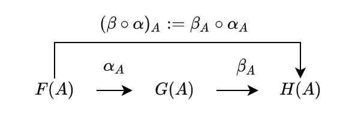

<!-- omit in toc -->
# 10. 自然変換

7章と8章で、関手が圏同士の対応であることを見ました。関手には List、Option、Writer、Reader などがあり、2つの圏の間には複数の関手が存在することを学びました。複数の関手が存在するとき、それらの等しさはどのように扱われるでしょうか？

ここでは、複数の関手の同等性について議論するために、自然変換を導入します。自然変換は、関手の性質を維持しながら関手間を対応させるものです。

本章ではまず、自然変換のイメージを掴むために、List 関手から Option 関手への自然変換という、具体例を見ていきます。

次に、自然変換の定義を与え、その定義と具体例とを照らし合わせます。

関手の変換である自然変換を導入すると、関手を対象として自然変換を射とするような圏を考えることができます。そのような圏は関手圏と呼ばれます。関手圏を導入するために、自然変換の合成、合成の結合律、単位律について議論します。

<!-- omit in toc -->
# 目次
- [10.1 自然変換とは](#101-自然変換とは)
  - [10.1.1 自然変換の例](#1011-自然変換の例)
  - [10.1.2 自然性](#1012-自然性)
  - [10.1.3 自然変換の定義](#1013-自然変換の定義)
  - [10.1.4 自然変換を表す型クラス](#1014-自然変換を表す型クラス)
- [10.2 関手圏](#102-関手圏)
  - [10.2.1 自然変換の合成](#1021-自然変換の合成)
  - [10.2.2 FunctionK の合成](#1022-functionk-の合成)
  - [10.2.3 関手圏は単位律を満たすか](#1023-関手圏は単位律を満たすか)
- [おまけ: 先取り！モナド](#おまけ-先取りモナド)
  - [モナドの定義](#モナドの定義)
  - [Option モナドをみてみよう](#option-モナドをみてみよう)
  - [モナドの型クラスを作る](#モナドの型クラスを作る)
  - [おわり](#おわり)
- [まとめ](#まとめ)

## 10.1 自然変換とは

### 10.1.1 自然変換の例

まずは自然変換の具体例を見ていきましょう。

自然変換は関手間の変換なので、List 関手と Option 関手の変換について考えてみましょう。

まずは対象関数の変換を考えます。Scala 圏のある対象 `A` に対して、List 関手と Option 関手は対象を `List[A]` と `Option[A]` に対応させます。対象関数の変換としては、 `List[A]` から `Option[A]` への関数を考えれば良い、ということになります。

`List[A]` から `Option[A]` への関数をいくつか考えてみましょう。先頭の要素を取得する関数、2番目の要素を取得する関数、末尾の要素を取得する関数、None を返す関数など、さまざまな関数を定義できます。

```scala mdoc
def headOption[A]: List[A] => Option[A] = _.headOption

def secondOption[A]: List[A] => Option[A] = _.slice(1, 2).headOption

def lastOption[A]: List[A] => Option[A] = _.lastOption

def listToNone[A]: List[A] => Option[A] = { case _ => None }

val list = List(1, 2, 3, 4, 5)

headOption(list)

secondOption(list)

lastOption(list)

listToNone(list)
```

Scala 圏から Scala 圏への関手 List, Option と、その間の対応 headOption を図式化すると以下のように書くことができます。


ここで注目したいのが、関手は圏を跨いだ変換ですが、headOption は同じ圏における変換であることです (自己関手なのが若干ややこしいですが)。つまり、headOption は関手によって変換された先の圏 (図では、右側の Scala 圏) における射であることがわかります。

任意の対象 `A` について、関手 `F[_]` と `G[_]` によって写された対象 `F[A]` と `G[A]` の間に射がないならば、自然変換にはならないと言えるでしょう。

```scala mdoc
// このような関数がなければ、自然変換はない
def component[A, F[_], G[_]]: F[A] => G[A] = ???

// 以下のような関数は、自然変換 headOption の "A における成分 (component)" と呼ばれる
def componentHeadOption[A]: List[A] => Option[A] = _.headOption
```

次に、射関数の変換について考えましょう。List 関手の射関数と Option 関手の射関数は以下の形をしていました。

```scala mdoc
def fmapList[A, B](f: A => B): List[A] => List[B] = _.map(f)

def fmapOption[A, B](f: A => B): Option[A] => Option[B] = _.map(f)
```

List 関手の射関数から Option 関手の射関数への関数は、以下のようなシグネチャを持ちます。

```scala mdoc
def signatureOfFmapListToFmapOption[A, B](f: A => B): List[A] => Option[B] = ???
```

このようなシグネチャを持つ関数を定義するにはもう少し制約が必要そうです。そこで、先ほどの `headOption` を自然変換として使用することを考えます。すると以下のような関数を定義できそうです。ただし、`fmapList` を使う関数と `fmapOption` を使う関数のバリエーションが存在します。

```scala mdoc
// List[A] → Option[A] → Option[B]
def headOptionFmap1[A, B](f: A => B): List[A] => Option[B] =
  listA => fmapOption(f)(listA.headOption)

// List[A] → List[B] → Option[B]
def headOptionFmap2[A, B](f: A => B): List[A] => Option[B] =
  listA => fmapList(f)(listA).headOption
```

先に headOption をして f を実行するのと、f を実行してから headOption をすることは、直感としては同じ関数のように思えます。この2つのバリエーションが等しい、という条件は**自然性** (naturality condition) と呼ばれます。

さて、`headOption` や `lastOption`、`listToNone` などのような関数は関手の性質を保存します。このような関数たちを List から Option への自然変換と呼びます。

### 10.1.2 自然性

では、自然変換の定義を考えていきましょう。自然変換は関手の構造を保つ必要があるので、対象関数と射関数を変換する必要があります。

圏 **C** から圏 **D** への関手を `F` と `G` とし、`F` から `G` への変換 `alpha` を考えます。


関手の対象関数は、圏 **C** の対象 `A` を `F[A]` および `G[A]` に対応させるものでした。この2つの対象 `F[A]` と `G[A]` は圏 **D** の対象であるため、対象関数の変換は `D` の射 `alpha[A]` として定義されます：

```scala mdoc
def alpha[F[_], G[_], A]: F[A] => G[A] = ???
```

ただし、`alpha[A]` は特定の対象 `A` に絞って変換しているので、自然変換 `alpha` の **A 成分**と呼ばれます。

次に射関数ですが、これは圏 `C` の射 `f: A => B` を圏 `D` の射 `fmapF(f): F[A] => F[B]` および `fmapG(f): G[A] => G[B]` に対応させるものでした。

```scala mdoc
def fmapF[F[_], A, B](f: A => B): F[A] => F[B] = ???
def fmapG[G[_], A, B](g: A => B): G[A] => G[B] = ???
```

これらの対応は、自然変換の各成分 `alpha[A]: F[A] => G[A]` と `alpha[B]: F[B] => G[B]` を用いて以下のように与えられます：

```scala mdoc
def fmapFAlpha[F[_], G[_], A, B](f: A => B): F[A] => G[B] = fmapG(f).compose(alpha[F, G, A])

def fmapGAlpha[F[_], G[_], A, B](f: A => B): F[A] => G[B] = alpha[F, G, B].compose(fmapF(f))
```

このように、射関数の変換には2通りの作り方があるため、整合性が保たれるようどちらの作り方でも結果が同じでなければいけません：

```scala mdoc
import hamcat.util.Eq.===

def assert[F[_], G[_], A, B] = fmapFAlpha[F, G, A, B] === fmapGAlpha[F, G, A, B]
```

圏 **C** の任意の射 `f` についての上記の条件を、**自然性** (naturality condition) と呼びます。

関手間の変換が自然変換であるためには、自然性を満たさなければいけません。


### 10.1.3 自然変換の定義

一般に、自然変換の定義は、以下のように与えられます：

---

圏 **C** から圏 **D** への関手 `F` と `G` に対して、`F` から `G` への対応 `alpha` が**自然変換** (natural transformation) であるとは、`alpha` が以下の条件を満たすことをいいます。

1. `alpha` は、圏 **C** の任意の対象 `A` に対して `alpha[A]: F[A] => G[A]` を対応させること。
2. 圏 **C** の任意の射 `f: A => B` に対して `fmapG(f) compose alpha[A]` と `alpha[B] compose fmapF(f)` が等しくなること。

またこのとき、`alpha[A]` を自然変換 `alpha` の A 成分といいます。

---

定義の1つ目の条件は、関手の対象関数の変換です。

定義の2つ目の条件は、関手の射関数の変換に関する条件で、自然性と呼ばれるものです。


### 10.1.4 自然変換を表す型クラス

自然変換を表す型クラスとして、以下のような `FunctionK` 型クラスを導入します。この型クラスは、型パラメータとして型構築子 `F[_]` と `G[_]` を持ち、抽象メソッドとして `F[A]` を受け取ったら `G[A]` を返すような `apply` メソッドを持ちます。すなわち、関手 `F` から `G` への変換を表します。

```scala mdoc
trait FunctionK[F[_], G[_]]:
  def apply[A](fa: F[A]): G[A]
```

例によって、この型クラスを実装するだけでは自然変換かどうかはわかりません。そのため、FunctionK は単に型構築子 `F[_]` から `G[_]` への関数の一般化となります。FunctionK の実装のうち、自然性を満たすような実装のみが自然変換です。

では先ほどの例から抜粋して、FunctionK のインスタンスを作ってみましょう。

`headOption` を `FunctionK` のインスタンスとして定義すると、以下のようになります。

```scala mdoc
val headOptionK: FunctionK[List, Option] = new FunctionK[List, Option]:
  def apply[A](fa: List[A]): Option[A] = fa.headOption

headOptionK(List(1, 2, 3))

headOptionK(Nil: List[Int])
```

## 10.2 関手圏

自然変換は関手間の対応であるので、関手を対象として自然変換を射とするような圏を考えることができます。そのような圏は関手圏と呼ばれます。

---

一般に、（小さい）圏 **C** から（局所的に小さい）圏 **D** への関手を対象とし、その間の自然変換を射とする圏を圏 **C** から圏 **D** への**関手圏** (functor category) と呼び、**Fun(C, D)** と書きます。

---

また、圏 **C** から圏 **D** への反変関手を対象とし、その間の自然変換を射とする圏は **Fun(oppC, D)** と書きます。

関手圏は、圏の圏についての Hom 集合 (圏の圏の射は関手であり、Hom 集合はその圏における全ての射の集まりです) に自然変換を与えたものです。

のちに、米田埋め込みによって任意の圏を関手圏に埋め込める (表現できる) ことを学びます。

### 10.2.1 自然変換の合成

関手圏が圏であるためには、射の合成と結合律、単位律が定義されている必要があります。まずは射の合成、すなわち自然変換の合成について考えてみましょう。

自然変換は単に自然性を満たす射であるので、自然変換を合成するには自然性を満たすように射を合成すれば良さそうです。

圏 **C** から圏 **D** への3つの関手を `F` と `G`、`H` とし、`F` から `G` への自然変換を `alpha`、`G` から `H` への自然変換を `beta` としましょう。

このとき、圏 **C** の対象 `A` に対して、各自然変換の A 成分は以下のようになるはずです。

```
alpha[A]: F[A] -> G[A]
beta[A]: G[A] -> H[A]
```


これらは圏 **D** の射であるので、合成することができます。

```
beta[A] compose alpha[A]: F[A] -> H[A]
```

そして、この射の合成を自然変換の A 成分に関する合成として以下のように定義します。

```
(beta compose alpha)[A] := beta[A] compose alpha[A]
```



この合成 `beta compose alpha` は自然性を満たすでしょうか？

満たされるべき自然性は

```
fmapH compose (beta compose alpha)[A] == (beta compose alpha)[B] compose fmapF
```

です。


まず、`alpha` と `beta` は自然変換であるので、以下の2つが成り立ちます：

```
1) fmapG compose alpha[A] == alpha[B] compose fmapF
2) fmapH compose beta[A] == beta[B] compose fmapG
```


射の合成により、1) の両辺に `beta[B]` を適用することができます：

```
3) beta[B] compose fmapG compose alpha[A] == beta[B] compose alpha[B] compose fmapF
```


2) と 3) より、以下が成り立ちます：

```
4) fmapH compose beta[A] compose alpha[A] == beta[B] compose alpha[B] compose fmapF
```


射の合成は結合律を満たすので、以下のように書け：

```
fmapH compose (beta[A] compose alpha[A]) == (beta[B] compose alpha[B]) compose fmapF
```

自然変換の各成分の合成の定義により、求めたい自然性が導かれます：

```
fmapH compose (beta compose alpha)[A] == (beta compose alpha)[B] compose fmapF
```

したがって、自然変換の合成は単にその射の合成であると言えます。

また、自然変換の合成は射の合成であるので、合成に関して結合律が成り立ちます。

### 10.2.2 FunctionK の合成

FunctionK に関する合成は、単に射の合成をするだけなので以下のように定義できます：

```scala
/** Composition of natural transformation */
def andThen[H[_]](v: FunctionK[G, H]): FunctionK[F, H] =
  new FunctionK[F, H] {
    def apply[A](fa: F[A]): H[A] = v(self(fa))
  }

/** Composition of natural transformation */
def compose[H[_]](v: FunctionK[H, F]): FunctionK[H, G] =
  v andThen self
```

例えば、`flattenK: ListList ~> List` と `headOptionK: List ~> Option` とを合成することができます。

```scala mdoc
type ListList[A] = List[List[A]]

def flattenK: ListList ~> List = new FunctionK[ListList, List] {
  def apply[A](fa: ListList[A]): List[A] = fa.flatten
}
def flattenThenHeadOption = headOptionK.compose(flattenK)
flattenThenHeadOption(List(List(1, 2, 3), List(4, 5), Nil, List(6)))
```

### 10.2.3 関手圏は単位律を満たすか

関手圏における恒等射について考えていきましょう。

恒等射 `identityK` は、関手の対象関数 `F[_]` を `F[_] ⇒ F[_]` に対応させ、この変換が自然性を満たすことを見ればよさそうです。

実際、この対応は自然性を満たします：

```
fmapF(f) compose identityK[A] == identityK[B] compose fmapF(f)
```

Scala においては、`FunctionK.identityK` として実装できます。

```scala
object FunctionK {
  def identityK[F[_]]: FunctionK[F, F] = new FunctionK[F, F] {
    def apply[A](fa: F[A]): F[A] = fa
  }
}
```

`FunctionK.identityK` は、恒等射の性質 `f . idA = idB . f` を満たします。

```scala mdoc
import hamcat.arrow.FunctionK.identityK

(headOptionK.compose(identityK[List]))(List(1, 2, 3)) == headOptionK(List(1, 2, 3))
(identityK[Option].compose(headOptionK))(List(1, 2, 3)) == headOptionK(List(1, 2, 3))
```

## おまけ: 先取り！モナド

実は、関手と自然変換さえ学べば、モナドの定義を読むことができます。

実際にモナドを使うのはだいぶ後になりますが、ここでモナドの定義をサクッと読んでみましょう！

### モナドの定義

モナドは、以下のように定義されます：

---

圏 **C** 上のモナドとは、自己関手 `T[_]`、自然変換 `eta: Id ~> T` と `mu: T[T] ~> T` の三つ組 `<T, eta, mu>` であって、以下が成り立つもののことです。

1. `mu[A] compose T[eta[A]] == identity[T[A]]`
2. `mu[A] compose eta[T[A]] == identity[T[A]]`
3. `mu[A] compose mu[T[A]] == mu[A] compose T[mu[A]]`

この3つの条件をモナドの公理と呼びます。

---

何言ってるかわからねーと思うので、Option モナドについて考えてみましょう。

### Option モナドをみてみよう

Scala 圏における Option モナドは、自己関手 `Option[_]`、自然変換 `eta: Id ~> Option`、`mu: Option[Option] ~> Option` の三つ組です。`eta` と `mu` はそれぞれ `Option.apply` メソッドおよび `flatten` メソッドとします。つまり、`eta` が `T` で型を包む操作で、`mu` が `T` のネストを平滑化する操作です。

```scala mdoc
type Id[A] = A
type OptionOption[A] = Option[Option[A]]

object eta extends (Id ~> Option) { def apply[A](fa: Id[A]): Option[A] = Option(fa) }
object mu extends (OptionOption ~> Option) { def apply[A](fa: Option[Option[A]]): Option[A] = fa.flatten }
```

これらがモナドの公理を満たすか確認してみます。

まず1つ目。

1. `mu[A] compose T[eta[A]] == identity[T[A]]`

```scala mdoc
(mu[Int] compose summon[Functor[Option]].fmap(eta[Int]))(Option(3)) == identity[Option[Int]](Option(3))
```

T[A] を T[T[A]] にしたあと flatten すると T[A] になる、という条件みたいですね。

次に2つ目。

2. `mu[A] compose eta[T[A]] == identity[T[A]]`

```scala mdoc
(mu[Int] compose eta[Option[Int]])(Option(3)) == identity[Option[Int]](Option(3))
```

これも T[A] ~> T[T[A]] ~> T[A] についての条件ですね。結合律みたいなもんでしょうか。

最後に3つ目。

3. `mu[A] compose mu[T[A]] == mu[A] compose T[mu[A]]`

```scala mdoc
(mu[Int] compose mu[Option[Int]])(Option(Option(Option(3)))) == (mu[Int] compose summon[Functor[Option]].fmap(mu[Int]))(Option(Option(Option(3))))
```

これは、どれだけネストされても平滑化できるという条件ですね。

Option はモナドの公理を満たすので、モナドであると言えます！

### モナドの型クラスを作る

さて、モナドは関手に加えて、平滑化のメソッドを備えたものであることがわかりました。モナドの型クラス `Monad` は、以下のように実装できます。自己関手 `T` に対して、平滑化の自然変換 `mu` を抽象メソッド `flatten` にし、自然変換 `eta` を抽象メソッド `pure` としています。

```scala
trait Monad[T[_]] {
  def flatten[A](tta: T[T[A]]): T[A]
  def pure[A](a: A): T[A]
}
```

なお、`flatten` があると `flatMap` メソッドを作ることができます。

```scala
def flatMap[A, B](f: A => T[B])(ta: T[A])(implicit functor: Functor[T]): T[B] =
  flatten(ta.fmap(f))
```

逆に、`flatMap` から `flatten` を作ることもできます。

```scala
def flatten[A](tta: T[T[A]]): T[A] = flatMap(identity[T[A]])(tta)
```

したがって、`Monad` 型クラスの抽象メソッド `flatMap` と `pure` でも良いです。

```scala
trait Monad[T[_]] {
  def flatMap[A, B](f: A => T[B])(ta: T[A]): T[B]
  def pure[A](a: A): T[A]
}
```

また、Writer 圏のところで学んだ fish 演算子 `>=>` と `pure` でも良いです。

### おわり

モナドの定義を見て、型クラスを定義してみました。関手と自然変換がわかれば、モナドを定義することができるのですね。

計算効果をラップするといった実用的な性質については、モナドを学ぶ章に改めて学んでいきましょう。

## まとめ

- 自然変換は、圏 `C` から圏 `D` への2つの関手 `F` と `G` の間の変換であって、`C` の各対象 `A` に対して `F[A] => G[A]` を対応させる。
  - Scala 圏においては、自己関手から自己関手への変換となり、自然変換は Scala 圏における射 `F[A] => G[A]` になる。
  - 例えば、List 関手から Option 関手への自然変換として headOption がある。
- 自然変換 `alpha` が満たすべき以下の性質を自然性と呼ぶ。
  - `(fmapG(f) compose alpha[A])(fa) == (alpha[B] compose fmapF(f))(fa)`
- 自然変換は Scala において、型クラス `FunctionK` によって表現される。
  - `FunctionK` が自然変換になるかは実装によるので、厳密には `FunctionK` は first-order-kinded 型間の関数を表現している。
  - `FunctionK[F, G]` は `F ~> G` とも書くことができる。こちらの記法の方が直感的である。
- 圏 `C` から圏 `D` への関手を対象とし、その間の自然変換を射とする圏を圏 `C` から圏 `D` への関手圏と呼び、`Fun(C, D)` と書く。
  - 自然変換の合成は、単に射の合成である。
  - 自然変換の合成は結合律を満たす。
- 圏 `C` から圏 `D` への反変関手を対象とし、その間の自然変換を射とする関手圏は `Fun(C^op, D)` と書かれる。
  - 反変関手間の自然変換は自然性を満たさないが、反自然性？ (opposite naturality condition) は満たす。
- 圏 `C` 上のモナドとは、型の引き上げと平滑化の機能を持つ関手のことを表す。Scala 圏においては、`pure` メソッドと `flatten` メソッドによって表現される。
