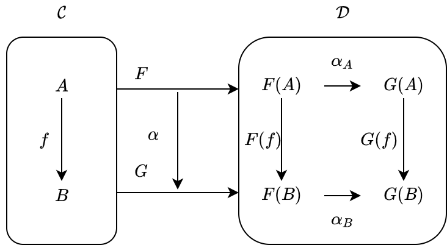

<!-- omit in toc -->
# 10. 自然変換

7章と8章で、関手が圏同士の対応であることを見ました。関手には List、Option、Writer、Reader などがあり、2つの圏の間には複数の関手が存在することを学びました。複数の関手が存在するとき、それらの等しさはどのように扱われるでしょうか？

ここでは、複数の関手の同等性について議論するために、自然変換を導入します。自然変換は、関手の性質を維持しながら関手間を対応させるものです。

本章ではまず、自然変換のイメージを掴むために、List 関手から Option 関手への自然変換という、具体例を見ていきます。

次に、自然変換の定義を与え、その定義と具体例とを照らし合わせます。

関手間の対応である自然変換を導入すると、関手を対象として自然変換を射とするような圏を考えることができます。そのような圏は関手圏と呼ばれます。関手圏を導入するために、自然変換の合成、合成の結合律、単位律について議論します。

<!-- omit in toc -->
# 目次
- [10.1 自然変換とは](#101-自然変換とは)
  - [10.1.1 自然変換の例](#1011-自然変換の例)
  - [10.1.2 自然性](#1012-自然性)
  - [10.1.3 自然変換の定義](#1013-自然変換の定義)
  - [10.1.4 自然変換を表す型クラス](#1014-自然変換を表す型クラス)
  - [10.1.5 自然変換の例: List 関手から Const Int 関手への自然変換](#1015-自然変換の例-list-関手から-const-int-関手への自然変換)
  - [10.1.6 自然変換の例: Reader 関手](#1016-自然変換の例-reader-関手)
- [10.2 関手圏](#102-関手圏)
  - [10.2.1 自然変換の合成](#1021-自然変換の合成)
  - [10.2.2 関手圏は単位律を満たすか](#1022-関手圏は単位律を満たすか)
- [終わりに](#終わりに)
- [まとめ](#まとめ)

## 10.1 自然変換とは

### 10.1.1 自然変換の例

まずは自然変換の具体例を見ていきましょう。

自然変換は関手間の対応なので、List 関手と Option 関手の対応について考えてみましょう。

まずは対象関数の対応を考えます。Scala 圏のある対象 `A` に対して、List 関手と Option 関手は対象を `List[A]` と `Option[A]` に対応させます。対象関数の対応としては、 `List[A]` から `Option[A]` への関数を考えれば良い、ということになります。

`List[A]` から `Option[A]` への関数をいくつか考えてみましょう。先頭の要素を取得する関数、2番目の要素を取得する関数、末尾の要素を取得する関数、None を返す関数など、さまざまな関数を定義できます。

```scala mdoc
def headOption[A]: List[A] => Option[A] = _.headOption

def secondOption[A]: List[A] => Option[A] = _.slice(1, 2).headOption

def lastOption[A]: List[A] => Option[A] = _.lastOption

def listToNone[A]: List[A] => Option[A] = { case _ => None }

val list = List(1, 2, 3, 4, 5)

headOption(list)

secondOption(list)

lastOption(list)

listToNone(list)
```

Scala 圏から Scala 圏への関手 List, Option と、その間の対応 headOption を図式化すると以下のように書くことができます。


ここで注目したいのが、関手は圏を跨いだ対応ですが、headOption は同じ圏における対応であることです (自己関手なのが若干ややこしいですが)。つまり、headOption は関手によって対応された先の圏 (図では、右側の Scala 圏) における射であることがわかります。

任意の対象 `A` について、関手 `F[_]` と `G[_]` によって写された対象 `F[A]` と `G[A]` の間に射がないならば、自然変換にはならないと言えるでしょう。

```scala mdoc
// このような関数がなければ、自然変換はない
def component[A, F[_], G[_]]: F[A] => G[A] = ???

// 以下のような関数は、自然変換 headOption の "A における成分 (component)" と呼ばれる
def componentHeadOption[A]: List[A] => Option[A] = _.headOption
```

次に、射関数の対応について考えましょう。List 関手の射関数と Option 関手の射関数は以下の形をしていました。

```scala mdoc
def fmapList[A, B](f: A => B): List[A] => List[B] = _.map(f)

def fmapOption[A, B](f: A => B): Option[A] => Option[B] = _.map(f)
```

List 関手の射関数から Option 関手の射関数への関数は、以下のようなシグネチャを持ちます。

```scala mdoc
def signatureOfFmapListToFmapOption[A, B](f: A => B): List[A] => Option[B] = ???
```

このようなシグネチャを持つ関数を定義するにはもう少し制約が必要そうです。そこで、先ほどの `headOption` を自然変換として使用することを考えます。すると以下のような関数を定義できそうです。ただし、`fmapList` を使う関数と `fmapOption` を使う関数のバリエーションが存在します。

```scala mdoc
// List[A] → Option[A] → Option[B]
def headOptionFmap1[A, B](f: A => B): List[A] => Option[B] =
  listA => fmapOption(f)(listA.headOption)

// List[A] → List[B] → Option[B]
def headOptionFmap2[A, B](f: A => B): List[A] => Option[B] =
  listA => fmapList(f)(listA).headOption
```

先に headOption をして f を実行するのと、f を実行してから headOption をすることは、直感としては同じ関数のように思えます。この2つのバリエーションが等しい、という条件は**自然性** (naturality condition) と呼ばれます。

さて、`headOption` や `lastOption`、`listToNone` などのような関数は関手の性質を保存します。このような関数たちを List から Option への自然変換と呼びます。

### 10.1.2 自然性

では、自然変換の定義を考えていきましょう。自然変換は関手の構造を保つ必要があるので、対象関数と射関数を変換する必要があります。

圏 **C** から圏 **D** への関手を `F` と `G` とし、`F` から `G` への対応 `alpha` を考えます。



関手の対象関数は、圏 **C** の対象 `A` を `F[A]` および `G[A]` に対応させるものでした。この2つの対象 `F[A]` と `G[A]` は圏 **D** の対象であるため、対象関数の対応は `D` の射 `alpha[A]` として定義されます：

```scala mdoc
def alpha[F[_], G[_], A]: F[A] => G[A] = ???
```

ただし、`alpha[A]` は特定の対象 `A` に絞って変換しているので、自然変換 `alpha` の **A 成分**と呼ばれます。

次に射関数ですが、これは圏 `C` の射 `f: A => B` を圏 `D` の射 `fmapF(f): F[A] => F[B]` および `fmapG(f): G[A] => G[B]` に対応させるものでした。

```scala mdoc
def fmapF[F[_], A, B](f: A => B): F[A] => F[B] = ???
def fmapG[G[_], A, B](g: A => B): G[A] => G[B] = ???
```

これらの対応は、自然変換の各成分 `alpha[A]: F[A] => G[A]` と `alpha[B]: F[B] => G[B]` を用いて以下のように与えられます：

```scala mdoc
def fmapFAlpha[F[_], G[_], A, B](f: A => B): F[A] => G[B] = fmapG(f).compose(alpha[F, G, A])

def fmapGAlpha[F[_], G[_], A, B](f: A => B): F[A] => G[B] = alpha[F, G, B].compose(fmapF(f))
```

このように、射関数の対応には2通りの作り方があるため、整合性が保たれるようどちらの作り方でも結果が同じでなければいけません：

```scala mdoc
import hamcat.util.Eq.===

def assert1[F[_], G[_], A, B] = fmapFAlpha[F, G, A, B] === fmapGAlpha[F, G, A, B]
```

圏 **C** の任意の射 `f` についての上記の条件を、**自然性** (naturality condition) と呼びます。

関手間の対応が自然変換であるためには、自然性を満たさなければいけません。


自然性が満たされるとは、**C** のすべての射 f に関して、上記の図式が成り立つような対応が存在することを意味します。このような図は可換であると言われます。

### 10.1.3 自然変換の定義

一般に、自然変換の定義は、以下のように与えられます：

---

圏 **C** から圏 **D** への関手 `F` と `G` に対して、`F` から `G` への対応 `alpha` が**自然変換** (natural transformation) であるとは、`alpha` が以下の条件を満たすことをいいます。

1. `alpha` は、圏 **C** の任意の対象 `A` に対して `alpha[A]: F[A] => G[A]` を対応させること。
2. 圏 **C** の任意の射 `f: A => B` に対して `fmapG(f) compose alpha[A]` と `alpha[B] compose fmapF(f)` が等しくなること。

またこのとき、`alpha[A]` を自然変換 `alpha` の A 成分といいます。

---

定義の1つ目の条件は、関手の対象関数の対応です。

定義の2つ目の条件は、関手の射関数の対応に関する条件で、自然性と呼ばれるものです。


### 10.1.4 自然変換を表す型クラス

自然変換を表す型クラスとして、以下のような `FunctionK` 型クラスを導入します。この型クラスは、型パラメータとして型構築子 `F[_]` と `G[_]` を持ち、抽象メソッドとして `F[A]` を受け取ったら `G[A]` を返すような `apply` メソッドを持ちます。すなわち、関手 `F` から `G` への変換を表します。

```scala mdoc
trait FunctionK[F[_], G[_]]:
  def apply[A](fa: F[A]): G[A]
```

`FunctionK` は Scala のパラメトリック多相 (parametric polymorphism) の性質から、F と G が `Functor` のインスタンスであれば自動的に自然性が成り立つことが知られています。

では先ほどの例から抜粋して、FunctionK のインスタンスを作ってみましょう。

`headOption` を `FunctionK` のインスタンスとして定義すると、以下のようになります。

```scala mdoc
val headOptionK: FunctionK[List, Option] = new FunctionK[List, Option]:
  def apply[A](fa: List[A]): Option[A] = fa.headOption

headOptionK(List(1, 2, 3))

headOptionK(Nil: List[Int])
```

### 10.1.5 自然変換の例: List 関手から Const Int 関手への自然変換

次に、リストの長さを返す `length` 関数について考えてみましょう。これは単に `List[_]` から `Int` への関数のように思えます。

```scala mdoc
def length[A]: List[A] => Int = _.length

length(List(1, 2, 3, 4, 5))
```

これは、対象 `A` を定数値 `value: C` に対応させる Const 関手への自然変換となります。

```scala mdoc
import hamcat.Functor

case class Const[C, +A](value: C)

given [C]: Functor[[X] =>> Const[C, X]] with
  def fmap[A, B](f: A => B): Const[C, A] => Const[C, B] = cnst =>
    Const[C, B](cnst.value)

val c1 = Const(12345)

val c2 = Const(4)

val intConstFunctor = summon[Functor[[X] =>> Const[Int, X]]]

intConstFunctor.fmap[List[Int], Boolean](_.nonEmpty)(c1)

intConstFunctor.fmap[List[Int], Boolean](_.nonEmpty)(c2)
```

```scala mdoc
val lengthK: FunctionK[List, [X] =>> Const[Int, X]] = new FunctionK[List, [X] =>> Const[Int, X]] {
  def apply[A](fa: List[A]): Const[Int, A] = Const[Int, A](length(fa))
}

lengthK(List(1, 2, 3, 4, 5))

lengthK(List.empty[String])
```

List と Const は Functor のインスタンスを持つので `lengthK` は List から Const への自然変換となります。

### 10.1.6 自然変換の例: Reader 関手

Reader 関手もまた自然変換において重要な役割を果たします。

```scala mdoc
case class Reader[R, A](run: (R => A))

given [R]: Functor[[X] =>> Reader[R, X]] with
  def fmap[A, B](f: A => B): Reader[R, A] => Reader[R, B] = ra =>
    Reader(f.compose(ra.run))
```

実は、任意の型 `R` について、 `[X] =>> Reader[R, X]` から他の任意の関手 `F` への自然変換の族を定義することができます。この族の要素が `F[R]` の要素と1対1で対応していることを「米田の補題」において説明します。

ここでは1つの例として、`[X] =>> Reader[Unit, X]` を考えてみましょう。この関手は、任意の型 `A` をとり、それを関数型 `Unit => A` に写すものです。このような関数は、型 `A` から1つの値を選択する関数です。

```scala mdoc
def readerUnit[A](a: A): Reader[Unit, A] = Reader(Unit => a)

val reader12345 = readerUnit(12345)

reader12345.run(())

val readerHogeHoge = readerUnit("hogehoge")

readerHogeHoge.run(())
```

この関手から Option 関手への自然変換を考えてみましょう。自然変換は2種類しかありません。

```scala mdoc
val readerUnitToSome: FunctionK[[X] =>> Reader[Unit, X], Option] = new FunctionK[[X] =>> Reader[Unit, X], Option] {
  def apply[A](fa: Reader[Unit, A]): Option[A] = Some(fa.run(()))
}

val readerUnitToNone: FunctionK[[X] =>> Reader[Unit, X], Option] = new FunctionK[[X] =>> Reader[Unit, X], Option] {
  def apply[A](fa: Reader[Unit, A]): Option[A] = None
}

readerUnitToSome(reader12345)

readerUnitToNone(reader12345)
```

## 10.2 関手圏

自然変換は関手間の対応であるので、関手を対象として自然変換を射とするような圏を考えることができます。そのような圏は**関手圏**と呼ばれます。

---

一般に、(小さい) 圏 **C** から (局所的に小さい) 圏 **D** への関手を対象とし、その間の自然変換を射とする圏を圏 **C** から圏 **D** への**関手圏** (functor category) と呼び、**Fun(C, D)** と書きます。

---

また、圏 **C** から圏 **D** への反変関手を対象とし、その間の自然変換を射とする圏は **Fun(oppC, D)** と書きます。

関手圏は、圏の圏についての Hom 集合 (圏の圏の射は関手であり、Hom 集合はその圏における全ての射の集まりです) に自然変換を与えたものです。

のちに、米田埋め込みによって任意の圏を関手圏に埋め込める (表現できる) ことを学びます。

### 10.2.1 自然変換の合成

関手圏が圏であるためには、射の合成と結合律、単位律が定義されている必要があります。まずは射の合成ですが、自然変換は単に射なので、自然変換の合成は簡単に行えます。

圏 **C** から圏 **D** への3つの関手を `F` と `G`、`H` とし、`F` から `G` への自然変換を `alpha`、`G` から `H` への自然変換を `beta` としましょう。

```scala mdoc
def alpha[F[_], G[_]]: FunctionK[F, G] = ???
def beta[G[_], H[_]]: FunctionK[G, H] = ???
```

このとき、圏 **C** の対象 `A` に対して、各自然変換の A 成分は以下のようなシグネチャを持ちます。

```scala mdoc
def alphaA[F[_], G[_], A]: F[A] => G[A] = ???
def betaA[G[_], H[_], A]: G[A] => H[A] = ???
```


これらは圏 **D** の射であるので、合成することができます。

```scala mdoc
extension [F[_], G[_]](fk: FunctionK[F, G])
  def compose[H[_]](hk: FunctionK[H, F]): FunctionK[H, G] =
    new FunctionK[H, G]:
      def apply[A](fa: H[A]): G[A] = fk(hk(fa))

def betaAfterAlpha[F[_], G[_], H[_]](alpha: FunctionK[F, G], beta: FunctionK[G, H]): FunctionK[F, H] =
  beta.compose(alpha)
```


この合成 `beta compose alpha` は自然性を満たすでしょうか？

満たされるべき自然性は

```scala mdoc
def assert2[F[_], G[_], H[_], A, B](alpha: FunctionK[F, G], beta: FunctionK[G, H], f: A => B)(using fh: Functor[H], ff: Functor[F]) =
  fh.fmap(f).compose((beta.compose(alpha))[A]) === ((beta.compose(alpha))[B]).compose(ff.fmap(f))
```

です。


まず、`alpha` と `beta` は自然変換であるので、以下の2つが成り立ちます：

```scala mdoc
// (1)
def assert3[F[_], G[_], A, B](alpha: FunctionK[F, G], f: A => B)(using ff: Functor[F], fg: Functor[G]) =
  fg.fmap(f).compose(alpha[A]) === alpha[B].compose(ff.fmap(f))

// (2)
def assert4[G[_], H[_], A, B](beta: FunctionK[G, H], f: A => B)(using fg: Functor[G], fh: Functor[H]) =
  fh.fmap(f).compose(beta[A]) === beta[B].compose(fg.fmap(f))
```


射の合成により、(1) の両辺に `beta[B]` を適用することができます：

```scala mdoc
// (3)
def assert5[F[_], G[_], H[_], A, B](alpha: FunctionK[F, G], beta: FunctionK[G, H], f: A => B)(using ff: Functor[F], fg: Functor[G]) =
  beta[B].compose(fg.fmap(f).compose(alpha[A])) === beta[B].compose(alpha[B].compose(ff.fmap(f)))
```


(2) と (3) より、以下が成り立ちます：

```scala mdoc
// (4)
def assert6[F[_], G[_], H[_], A, B](alpha: FunctionK[F, G], beta: FunctionK[G, H], f: A => B)(using ff: Functor[F], fh: Functor[H]) =
  fh.fmap(f).compose(beta[A]).compose(alpha[A]) === beta[B].compose(alpha[B].compose(ff.fmap(f)))
```


射の合成は結合律を満たすので、以下のように書け：

```scala mdoc
// (5)
def assert7[F[_], G[_], H[_], A, B](alpha: FunctionK[F, G], beta: FunctionK[G, H], f: A => B)(using ff: Functor[F], fh: Functor[H]) =
  fh.fmap(f).compose(beta[A].compose(alpha[A])) === (beta[B].compose(alpha[B])).compose(ff.fmap(f))
```

自然変換の各成分の合成の定義により、求めたい自然性が導かれます：

```scala mdoc
def assert8[F[_], G[_], H[_], A, B](alpha: FunctionK[F, G], beta: FunctionK[G, H], f: A => B)(using ff: Functor[F], fh: Functor[H]) =
  fh.fmap(f).compose((beta.compose(alpha))[A]) === (beta.compose(alpha))[B].compose(ff.fmap(f))
```

したがって、自然変換の合成は単にその射の合成であると言えます。

また、自然変換の合成は射の合成であるので、合成に関して結合律が成り立ちます。

実際に自然変換を合成してみましょう。`flattenK: FunctionK[[X] =>> List[List[X]], List]` と `headOptionK: FunctionK[List, Option]` とを合成することができます。

```scala mdoc
val flattenK = new FunctionK[[X] =>> List[List[X]], List]:
  def apply[A](fa: List[List[A]]): List[A] = fa.flatten

val headOptionKAfterFlattenK: FunctionK[[X] =>> List[List[X]], Option] = headOptionK.compose(flattenK)

headOptionKAfterFlattenK(List(List(1, 2, 3), Nil, List(4, 5)))
```

### 10.2.2 関手圏は単位律を満たすか

次に、関手圏における恒等射について考えていきましょう。

関手圏における恒等射は以下のように定義できます。

```scala mdoc
def identityK[F[_]] = new FunctionK[F, F]:
  def apply[A](fa: F[A]): F[A] = fa

identityK(List(1, 2, 3))

identityK(Option("hoge"))
```

恒等射 `identityK` は、関手の対象関数 `F[_]` を `F[_] => F[_]` に対応させ、射関数 `(A => B) => (F[A] => F[B])` をそれ自身に対応させれば良さそうです。

実際、この対応は自然性を満たします：

```scala mdoc
headOptionK.compose(identityK)(List(1, 2, 3, 4, 5))

identityK.compose(headOptionK)(List(1, 2, 3, 4, 5))
```

上記のことから、関手を対象として自然変換を射とするような関手圏は、圏の公理を満たすことを確認できました。

## 終わりに

この章で第1部を締めくくります。第1部において、圏論における基本的な概念を学びました。対象、圏、射、関手、自然変換を抑えて、次の2部に進みましょう。

## まとめ

- 自然変換は、圏 `C` から圏 `D` への2つの関手 `F` と `G` の間の変換であって、`C` の各対象 `A` に対して `F[A] => G[A]` を対応させる。
  - Scala 圏においては、自己関手から自己関手への変換となり、自然変換は Scala 圏における射 `F[A] => G[A]` になる。
  - 例えば、List 関手から Option 関手への自然変換として headOption がある。
- 自然変換 `alpha` が満たすべき以下の性質を自然性と呼ぶ。
  - `(fmapG(f) compose alpha[A])(fa) == (alpha[B] compose fmapF(f))(fa)`
- 自然変換は Scala において、型クラス `FunctionK` によって表現される。
- 圏 `C` から圏 `D` への関手を対象とし、その間の自然変換を射とする圏を圏 `C` から圏 `D` への関手圏と呼び、`Fun(C, D)` と書く。
  - 自然変換の合成は、単に射の合成である。
  - 自然変換の合成は結合律を満たす。
- 圏 `C` から圏 `D` への反変関手を対象とし、その間の自然変換を射とする関手圏は `Fun(C^op, D)` と書かれる。
  - 反変関手間の自然変換は自然性を満たさないが、反自然性？ (opposite naturality condition) は満たす。
