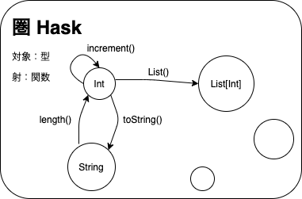
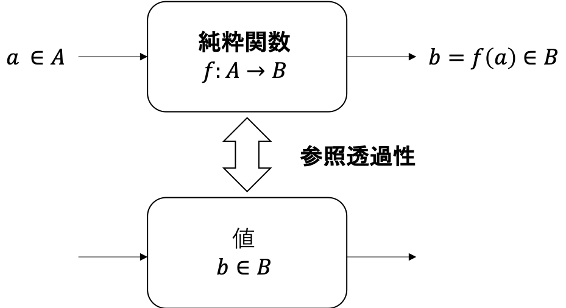
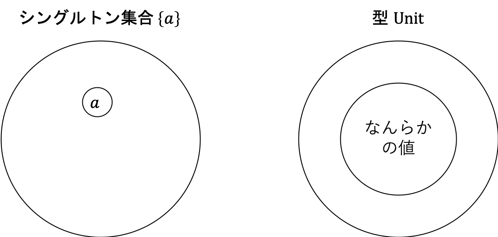
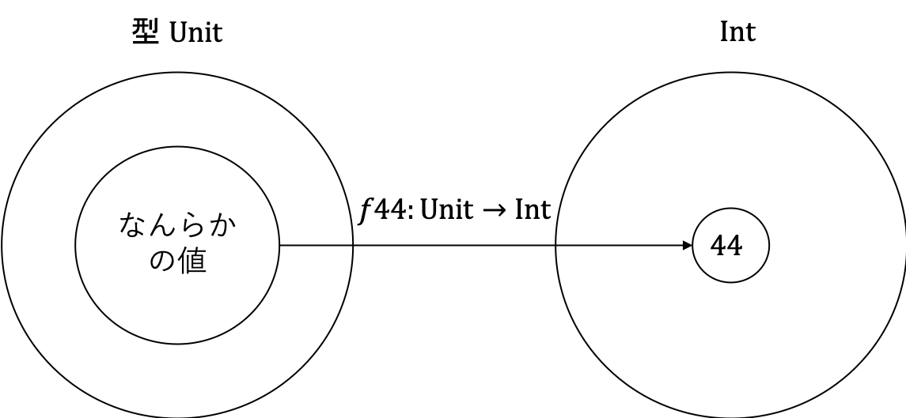

<!-- omit in toc -->
# 目次

<!-- vim-markdown-toc GFM -->

- [2. 型と関数](#2-型関数)
  - [2.1 なぜ型が必要なのか](#21-型必要)
  - [2.2 型を集合として解釈する](#22-型集合解釈)
    - [Tips1: ラッセルのパラドックス](#tips1-)
    - [Tips2: 停止問題](#tips2-停止問題)
  - [2.3 数学的モデルがなぜ必要なのか](#23-数学的必要)
  - [2.4 純粋関数](#24-純粋関数)
  - [2.5 型の例](#25-型例)
    - [2.5.1 空集合と Nothing 型](#251-空集合-nothing-型)
    - [2.5.2 シングルトン集合と Unit 型](#252-集合-unit-型)
    - [2.5.3 2要素集合と Boolean 型](#253-2要素集合-boolean-型)
- [まとめ](#)

<!-- vim-markdown-toc -->

# 2. 型と関数

本章では、Scala を構成する型と関数の圏である Scala 圏について紹介します。まず、なぜ型が必要なのかについて述べ、型と関数を圏として考えていきます。



## 2.1 なぜ型が必要なのか

型付けには、静的な型付けと動的な型付けがあります。静的型付けは、変数や関数の引数、返り値などの型がコンパイル時のような実行前に定められるシステムです。一方で、動的型付けは、実行時の実際の値によって型が定められるシステムです。

動的型付け言語では、型のミスマッチは実行時に発見されます。一方で、静的型付け言語では型のミスマッチはコンパイル時に発見され、実行前にプログラムが文法的に正しいかどうかチェックすることができます。

Scala や Haskell、C++ のような言語は静的型付け言語です。静的型付け言語を採用することによって、文法エラーや型ミスマッチに対応しやすくなります。

## 2.2 型を集合として解釈する

最も直感的な型の解釈は、型が値の集合であることです。例えば、型 `Boolean` は値 `true` と `false` の集合です。型 `Char` はすべての Unicode の文字の集合です。

型を集合として解釈すると、`x` が `Int` 型であることを宣言するとき

```scala
val x: Int
```

と書きますが、これは  `x` は整数集合の要素であると解釈できます。

しかし、型を集合として解釈するには微妙な点が少々あります。一般に、集合全体の集合を定義することはできません (Tips 1 参照)。そのため、循環定義を含む多相関数 (polymorphic function) を集合で表すことは難しくなります。

そこで、代わりに集合の圏 `Set` を用いて型を表現します。 `Set`  は、集合を対象とし、関数を射とする圏です。 `Set` を用いて型を表現すると、関数型プログラミングにおける関数は（数学的な）集合間の関数とみなせます。

とすると、またまた問題が生じます。集合間の関数は入力に対して値を出力するだけで、なんらかの処理を実行するわけではありません。一方で、プログラミングの関数は入力に対して出力値を計算するので、その内部で処理を実行します。出力を有限ステップで計算できるのであれば良いのですが、再帰を含む関数では実行が終了しない場合があります。したがって、関数の実行が終了しない場合の出力の型が未定義となってしまいます。

ある関数の実行が終了するかどうかは判定することができない (Tips 2 参照) ので、実行が終了しない場合の型をボトム型 (bottom type) `⊥` として定義します。scala では `???` で代替して表現できます。ボトム型の値は終了しない計算です。すなわちち、以下のように定義されている関数

```scala
val f: Boolean => Boolean
```

は `true`、 `false` を返すか、実行が終わらない場合は ⊥ を返します。

```scala
val f: Boolean => Boolean = x => ???
// f: Boolean => Boolean = <function1>
val fTrue: Boolean => Boolean = x => true
// fTrue: Boolean => Boolean = <function1>
val fFalse: Boolean => Boolean = x => false
// fFalse: Boolean => Boolean = <function1>
```

ボトム型を返す関数は**部分関数** (partial function) と呼ばれます。scala だと [PartialFunction](https://github.com/scala/scala/blob/2.13.x/src/library/scala/PartialFunction.scala) として定義されています。

---
### Tips1: ラッセルのパラドックス
集合全体の集合を定義できるとすると、ラッセル (Russell) のパラドックスという現象が生じます。

ラッセルのパラドックスでは「自分自身を持たない集合全体の集合」を考えます。そのような集合を `A` と置くことにしましょう。このとき、 `A` は `A` 自身を要素として持つでしょうか？

場合分けして考えてみます。

1. `A` が `A` 自身を要素として持つ場合：`A` の定義より、 `A` は自分自身を持たない集合です。一方で、`A` は `A` 自身を持っています。これは矛盾です。
2. `A` が `A` 自身を要素として持たない場合：`A` は `A` 自身を要素として持たないので、 `A` は `A` の要素です。これは矛盾です。

以上の通り、「自分自身を持たない集合全体の集合」というものを考えると矛盾が生じてしまいます。つまり、集合全体の集合というのは、 `A` のような集合を集合とみなす枠組みにおいて定義することができません。

循環定義の罠ですね。そのような集合は集合とみなさないようにルールを定めた公理的集合論というものが、今の集合論の主流になっています。

### Tips2: 停止問題
計算可能性理論において、停止問題 (halting problem) というものがあります。計算には、実行を終了する計算と実行が終了しない計算があります。停止問題は「理想的な計算機 (Turing 機械など) において、有限時間で計算が終了するかどうかを判定するアルゴリズムを構築できるか」という問題です。

結論から言えば、計算が有限時間で終了するかどうかを判定するアルゴリズムは構築できません。実際に考えてみましょう。

計算が有限時間で終了するかどうかを判定する仮想的な関数 `halt: Function => Boolean` を定義できるとします。ここで `Function` は任意の関数を表す仮想的な型です。なお、`halt` に渡す関数の引数も本来考える必要はありますが、ここでは省略します。

`halt` のような関数を定義できるとき、次のような関数 `m` を考えることができます。

```
m は、入力 f に対して halt(f) == true であれば終了しない。
m は、入力 f に対して halt(f) == false であれば 0 を出力して終了する。
```

このとき、 `m` に対して `m` を入力するとどうなるでしょうか？場合分けして考えてみます。

1. `m` が終了する場合：`halt(m) == true` です。このとき `m` は終了しないので、矛盾します。
2. `m` が終了しない場合：`halt(m) == false` です。このとき `m` は 0 を出力して終了するので、矛盾します。

`halt` のような関数を定義できると矛盾が生じることから、 `halt`  は定義できないことがわかります。

ここでは仮想的な関数を考えているので、上記は厳密な証明ではありません。厳密な証明には Turing 機械の概念が必要なのでここでは省略しますが、証明の方法は大体同じです。

---

## 2.3 数学的モデルがなぜ必要なのか

これまで、プログラミング言語を圏論の概念で表すために、型と関数を圏論の用語に翻訳しました。ここでは、なぜプログラミング言語を圏論の概念で表すのか、その必要性について述べていきます。

通常、プログラミング言語の構文や文法は、言語仕様に形式的表現で記述されます。しかしながら、言語のその意味を記述するのは難しく、記述したとしても言語仕様に書いてあるほとんどは完全ではありません。

言語の意味論を表現する方法として、主に以下の2つがあります。

- 操作的意味論
- 表示的意味論

**操作的意味論** (operational semantics) は、プログラムを計算のシーケンスとして表現する方法です。操作的意味論の与え方はいくつかあり、例えばプログラムを仮想的なコンピュータの機械語に翻訳するコンパイラを定義してもよいですし、理想的なインタプリタを使ってプログラムを動かしてもよいです。

操作的意味論がやろうとしていることは、我々がプログラミングしているときも似たようなことをしているはずです。プログラミングするとき、プログラムがどう動くか頭の中で検証しますよね。プログラマーにとっては、プログラミングするときに頭の中で検証するだけで十分です。

次に、**表示的意味論** (denotational semantics) は、プログラムを数学的なオブジェクトでモデル化することによってプログラムの意味を形式化する方法です。数学的モデルとして表現できれば、プログラムの正しさは数学的に証明することができます。1つ、例をあげてみましょう。

自然数 `n` に対して、`1` から `n` までの自然数全ての乗算を行う階乗関数 (factorial function) について考えます。この関数 `fact` は、数学的には

```
fact(n) := n! := n * (n - 1) * ... * 1
```

のように定義されます。これを Scala で書くと

```scala
val fact = (n: Int) => (1 to n).product
```

と書けます。この定義は数学的な関数の定義に従順であることがわかりますね。

階乗関数のように数学的な関数に従順な関数であれば困ることもないのですが、実際は副作用のある関数を扱わないといけない場面がほとんどです。データベース操作、キー入力やネットワークパケットの送信などです。副作用のある関数は、圏論のモナドという概念を使えば表現することができます。後の章でしっかり学んでいきましょう！

プログラムを圏論や数学的オブジェクト等で形式的に表現すると、ソフトウェアの正しさを形式的に証明できたり、プログラムの共通の構造を見出しやすくなります。以降の章でプログラムを圏論で表現する方法について深堀りするので、ここでの議論はここまでにしておきます。

## 2.4 純粋関数

一般的に、プログラミング言語における関数と数学的な関数は異なる意味を持ちます。プログラミング言語における関数は、入力に対して計算を実行し結果を出力しますが、データベースへの保存やグローバル変数の変更など、副作用を持つ場合があります。一方で、数学的な関数は、ただ値から値をマッピングするもので副作用は考慮されません。

プログラミング言語において、副作用を持たず、同じ入力に対して同じ出力を返す関数を**純粋関数** (pure function) と言います。このように同じ入力に対して必ず同じ出力を返す性質は、**参照透過性** (referential transparency) と呼ばれます。



例えば、与えられた整数に +1 した値を返す関数

```scala
val inc = (n: Int) => n + 1
// inc: Int => Int = <function1>
```

は、どんな整数 `n` に対しても `n+1` を返すので、純粋関数です。

Haskell の関数は全てが純粋関数です。そのため、Haskell は純粋関数型言語とも呼ばれます。純粋関数型言語であれば、言語の表示的意味論も与えやすくなり、圏論を使ってモデル化することもたやすくなります。

他の言語についても、純粋関数に制限して副作用を個別に推論することによって、純粋関数型言語と同様のものにできます。先ほども述べましたが、後の章で、純粋関数のみを使って全ての副作用をモデル化するモナドという概念を導入します。つまり、言語の関数を数学的な関数に制限しても、できなくなることはありません！ :)

## 2.5 型の例

型と集合の対応関係について、ここでは見ていきます。

### 2.5.1 空集合と Nothing 型

まずは空集合についてです。空集合は要素を1つも持たない集合のことですが、これは何の型に対応するのでしょうか？要素、つまり値を1つも持たない型は、Haskell においては `Void` 型、Scala においては `Nothing` 型にあたります。これらの型は値を持たないので、`Void` 型や `Nothing` 型を引数とする関数を呼び出すことはできません。

```scala
def g: Nothing => Int = _ => 1
```


### 2.5.2 シングルトン集合と Unit 型

次に、シングルトン集合についてです。シングルトン集合は、値を1つだけ持った集合です。値を1つだけ持つような型は、Haskell では `()` 型、Scala では `Unit` 型にあたります。`()` 型や `Unit` 型を引数として持つ関数は、引数としてダミーの値を受け取ります。つまり、`Void`、`Nothing` と異なり引数なしでいつでも呼び出すことができます。そのような関数が純粋関数である場合は、常に同じ値を出力します。




次のような関数 `f44` は、任意の入力に対して必ず `Int` 型の  `44` を返します。
```scala
val f44: Unit => Int = _ => 44
// f44: Unit => Int = <function1>

f44(())
// res0: Int = 44
```



`Unit` 型を返り値の型に指定すると、その関数は `Unit` 値を返します。純粋関数である場合は出力値を得られないので、引数をただ廃棄する関数になります。例えば、以下の関数はいかなる `Int` 型の値を受け取っても `Unit` を返します。

```scala
val fInt: Int => Unit = x => ()

fInt(1)

fInt(100)
```


任意の型に対して同じ式で実装できる関数は、パラメータ多相 (parametrically polymorphic) であるといいます。パラメータ多相な関数は、型変数をあらゆる具象型によって置換できるので、非常に便利です。

### 2.5.3 2要素集合と Boolean 型

最後は、2要素集合についてです。2要素集合は、値を2つだけ持った集合です。2要素集合は、Haskell では `Bool` 型に、Scala では `Boolean` 型にあたります。

```scala
sealed trait Boolean

case object True extends Boolean
case object False extends Boolean
```

# まとめ

- ボトム型を導入することによって、型を対象とし、関数を射とみなす圏を考えることができる。
- プログラミング言語を圏論や操作的意味論、表示的意味論として形式的に扱うことによって、プログラムの正当性を形式的に証明することができる。
- 純粋関数は、副作用を持たず、同じ入力に対して同じ出力を返す関数のことである。
- 純粋関数が持つ、同じ入力に対して同じ出力を返すような性質のことを参照透過性と呼ぶ。
- 集合と型の対応
  - 空集合は `Nothing` 型に対応する。
  - シングルトン集合は `Unit` 型に対応する。
  - 2要素集合は `Boolean` 型に対応する。
