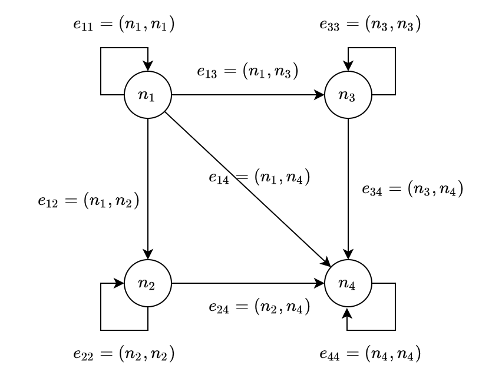
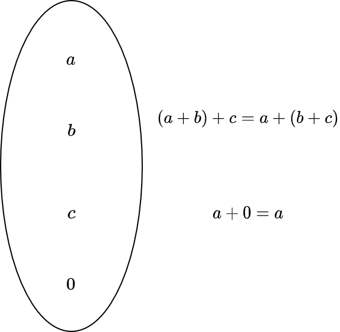
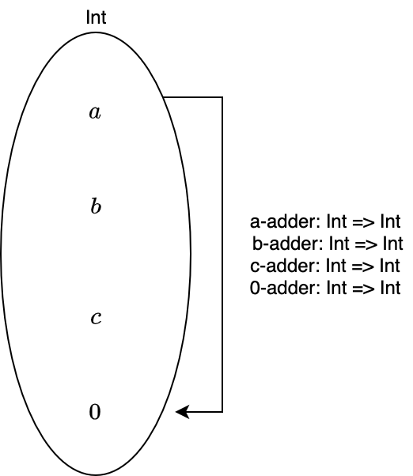

# 3. いろいろな圏

ここまで、圏とは何かについて述べ、Scala の型と関数を圏として捉えることができることを述べました。

しかし、まだ圏のイメージがつかない方が少なくないはず。本章では、具体的な圏の例を通して、圏への理解を深めていきます。

## 3.1 空圏

空圏は、対象が1つもない圏のことです。つまり、対象がないということは射もありません。

なぜ対象が1つもないものが圏と言えるのかについて、考えてみましょう。

まず、圏は対象の集まりと射の集まりからなります。この「集まり」は集合と捉えることもできますが、集合でない場合もあります。

対象が1つもない場合、対象の集まりは集合と捉えることができて、それは空集合になります。また、射の集まりも空集合です。

射の合成は任意の射について定義されていればよく、射が存在しない場合では射の結合律は満たされていると言えます。

そして、恒等射は任意の対象に対して存在していればよく、対象が存在しない場合では単位律が満たされていると言えます。

したがって、空圏は圏と言えます。

## 3.2 単純なグラフ

状態遷移図のように単純なグラフは、圏とみなすことができます。

一般に、そのような単純なグラフは頂点の集合 N と辺の集合 E とのペア (N, E) からなります。

グラフを圏と解釈すると、頂点を対象として、辺を射として捉えることができます。

<div align="center">



</div>

## 3.3 順序集合

ある集合 `A` とその集合上の関係 `R` とのペア `(A, R)` である順序集合もまた、圏の例です。

例えば、自然数全体の集合 `N = { 0, 1, ..., n, ... }` と関係 `<=` (〇〇以下である) の順序集合 `(N, <=)` は、圏として以下のように図式化されます。

<div align="center">


</div>

自然数全体の集合と関係 `<=` の順序集合では、自然数が対象、自然数間の関係、例えば `0 <= 1` `1 <= 3` などが射になります。

## 3.4 集合としてのモノイド 

**モノイド** (Monoid) は、単純な構造ではありますが、非常に強力な概念です。

加算と乗算のどちらの計算にも、このモノイドという概念が密接に関わっています。

モノイドは群論における概念ですが、圏の一例でもあります。コンピュータサイエンスでは、情報理論の分野にも現れることがあると思います。

プログラミングにおいても、文字列やリスト、畳み込み可能なデータ構造、Future などとして現れます。

さて、モノイドの定義についてですが、モノイドは、二項演算を備えた集合として定義されます。この二項演算が満たすべき性質は、結合律と、単位元が存在することのみです。

単位元は、加算における 0、乗算における 1 のことを表します。結合律は、加算の場合だと

```
(a + b) + c = a + (b + c)
```


が満たされることです。

<div align="center">



</div>

結合律と単位元を備えた型クラス `Monoid` は、以下のように定義できます。

```scala
trait Monoid[A] {
  def combine(v1: A, v2: A): A
  def empty: A
}
```

`combine` が結合律を満たす二項演算で、`empty` がその二項演算の単位元を表します。

ここで注意することは、この型クラスの定義だけでは二項演算の結合律と単位元の存在を保証できないことです。したがって、二項演算がモノイドの性質を満たすかどうかは、その実装によります。

`Int` の加算に関するモノイドのインスタンス `IntMonoid` は、以下のように定義できます。

```scala
implicit val IntMonoid: Monoid[Int] = new Monoid[Int] {
  def combine(a: Int, b: Int): Int = a + b
  def empty: Int = 0
}
```

```scala
import category.Implicits._

IntMonoid.combine(1, 3)
// res0: Int = 4
IntMonoid.empty
// res1: Int = 0
IntMonoid.combine(2, IntMonoid.empty)
// res2: Int = 2
```

## 3.5 圏としてのモノイド 

前節では、モノイドを集合と二項演算のペアとして考えました。

しかし、モノイドには圏論においてもう少し重要な側面があります。それは、対象がただ1つの圏をモノイドと言えることです。

先ほど見たモノイドの性質 - 二項演算の結合律と単位元の存在 - は、まさに圏の公理における射の結合律と単位律です。そして、モノイドは二項演算をただ1つの集合に対して定義しています。これは、ただ1つの対象からそれ自身への射を定義していることと同義です。

圏の特別な場合がモノイドであることから、モノイドの重要性が見えてきましたね。そして、モノイドが満たすなんらかの性質や構造を見ることができれば、それを一般化して圏が満たすなんらかの性質や構造として議論できることがわかります。

では、加算のモノイドを圏として捉えるとどのようになるか、考えてみましょう。

加算は二項演算なので、2つの入力があります。ここで、1つだけ入力 `n` を与えれば、`n` を足す演算 n-adder なるものを考えることができます。

この演算にもう一つの入力 `m` を与えれば、`m + n` が出力として得られます。これは `m` と `n` の加算です。

n-adder は、数を対象とする圏における射であるとみなせます。この射 n-adder は結合律を満たすでしょうか？

加算に関する結合律は

```
(a + b) + c = a + (b + c)
```

とかけます。これを n-adder で書くと

```
c-adder (b-adder (a)) = a-adder (c-adder (b))
```

関数をカリー化させることでもう少しわかりやすく書くと

```
add(add (b) (a)) (c) = add (add (c) (b)) (a)
```

となります。これは満たされそうですね。

次に単位律です。圏における単位律は、任意の対象について恒等射が存在する、というものでした。

任意の数 `n` に対する恒等射は 0-adder です。`n + 0 = n` であるからです。

以上のことから、モノイドは圏の公理における結合律と単位律を満たします。

<div align="center">



</div>

# まとめ

- 対象が1つもない圏も、また圏である。
- 単純なグラフは、圏とみなせる。
- 順序集合は圏の例である。
- モノイドとは、ある集合における関数の合成が結合律を満たし、関数に対する単位元が存在するような系のことである。
  - 例
    - モノイド (Int, add)
    - 加算 add(n1, n2) は結合律を満たす
    - 加算 add の単位元は 0
- 対象がただ1つの圏をモノイドという。
  - 例
    - 対象: Int
    - 射: add: Int => Int => Int
    - add (n) は結合律を満たす
    - 恒等射: add (0)
