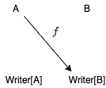
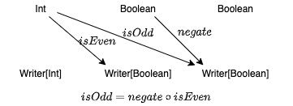
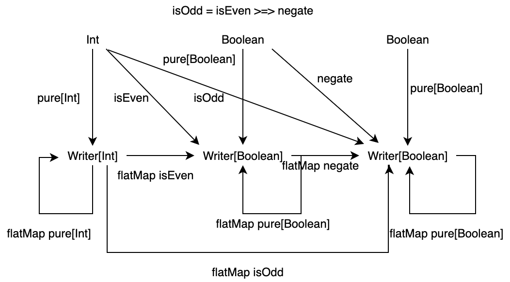

<!-- omit in toc -->
# 目次

`- [4. Kleisli 圏](#4-kleisli-圏)
  - [4.1 ロギング関数の合成](#41-ロギング関数の合成)
  - [4.2 Writer 圏](#42-writer-圏)
    - [4.2.1 Writer 圏の対象と射](#421-writer-圏の対象と射)
    - [4.2.2 Writer 圏における射の合成](#422-writer-圏における射の合成)
    - [4.2.3 Writer 圏は圏の公理を満たすか](#423-writer-圏は圏の公理を満たすか)
    - [4.2.4 Writer 圏のより一般的な定義](#424-writer-圏のより一般的な定義)
  - [4.3 Kleisli 圏](#43-kleisli-圏)
  - [4.4 Cats における Writer と Kleisli](#44-cats-における-writer-と-kleisli)
    - [4.4.1 Cats のインストール](#441-cats-のインストール)
    - [4.4.2 Writer](#442-writer)
    - [4.4.3 Kleisli](#443-kleisli)
  - [本章のまとめ](#本章のまとめ)

# 4. Kleisli 圏

ここまでで、型と純粋関数を圏としてモデル化する方法をみてきました。その際に計算効果を持つ非純粋な関数をモデル化するための概念として、モナドが出てきましたね。

ここでは、計算効果についてイメージを深めるため、計算効果の例をモナドの概念を出さない程度に考えていきます。

## 4.1 ロギング関数の合成

計算効果の例として、プログラムの実行をロギングする関数について考えます。

例えば、論理値の否定を返す関数 `negate` の実行と、整数が偶数であるかを判別する関数 `isEven` の実行のログをとりたいとします。 `negate` の処理自体は論理値を論理値に変換するものなので、型は `Boolean => Boolean` になりそうです。しかし、ここではログも一緒に出力したいので、返り値の型を `(String, Boolean)` として定義してみます。 `isEven` 関数も同様です。

```scala
def negate: Boolean => (String, Boolean) = n => ("negate ", !n)
def isEven: Int => (String, Boolean) = n => ("isEven ", n % 2 == 0)
```

ここで、 `negate` と `isEven` を合成して、整数が奇数であるかを判別する関数 `isOdd` を作ることを考えます。2つの関数 `f: A => B` と `g: B => C` を合成するには、一方の出力の型、つまり `f` の出力 `B`、ともう一方の入力の型、つまり `g` の入力 `B` が一致する必要がありました。ところが、 `negate` と `isEven` は型が一致せず、通常の方法では合成できません。代わりに、以下のように定義するとうまくいきそうです：

```scala
def isOdd: Int => (String, Boolean) = n => {
  val (log1, res1) = isEven(n)
  val (log2, res2) = negate(res1)
  (log1 + log2, res2)
}
```

実は、今考えたような構造は Writer 圏と呼ばれます。次の節では Writer 圏を定式化していきます。

## 4.2 Writer 圏

先ほど見たロギング関数の合成の例を圏論の言葉に落とし込むと、Writer 圏というものを考えることができます。

### 4.2.1 Writer 圏の対象と射

Writer 圏では、次のようなデータ型 `Writer` を導入します。

```scala
type Writer[A] = (String, A)
```

すなわち、型 `Writer[A]` はログを表現する型 `String` と計算の出力 `A` のタプルです。

この圏では、対象として型を採用し、対象 `A` から `B` への射として以下のようにラップされた関数を採用します：

```scala
f: A => Writer[B]
```

<div align="center">



</div>

2つの関数 `negate: Boolean => (String, Boolean)` と `isEven: Int => (String, Boolean)` は、以下のように書き換えれば Writer 圏における射とみなせます。

```scala
def negate: Boolean => Writer[Boolean] = n => ("negate ", !n)
def isEven: Int => Writer[Boolean] = n => ("isEven ", n % 2 == 0)
```

<div align="center">


</div>

### 4.2.2 Writer 圏における射の合成

Writer 圏における射の合成は、 `isOdd` 関数の定義を抽象化したものと考えることができます。関数 `f: A => Writer[B]`、関数 `g: B => Writer[C]` を合成した関数 `f >=> g: A => Writer[C]` を定義してみましょう。

```scala
implicit class WriterOps[A, B](f: A => Writer[B]) {
  def >=>[C](g: B => Writer[C]): A => Writer[C] =
    a => {
      val (log1, b) = f(a)
      val (log2, c) = g(b)
      (log1 + log2, c)
    }
}
```

`>=>` 演算は fish 演算子と呼ばれるもので、引数で受け取った2つの関数を合成した関数を返します。

```scala
val isOdd = isEven >=> negate
// isOdd: Int => (String, Boolean) = <function1>

isOdd(3)
// res0: (String, Boolean) = ("isEven negate ", true)
```

<div align="center">



</div>

これで、Writer 圏における関数合成は定義できました！

しかし、`>=>` はただ関数の合成を定義したものです。実際に Writer 型のインスタンスがあったときには `>=>` を使うことができず、不便です。つまり、関数 `f: A => Writer[B]` を型 `Writer[A]` に対して実行する方法は、別途定義する必要があります。

そのような方法を、Scala プログラマにはおなじみの `flatMap` として定義することができます。

```scala
implicit class WriterOps2[A](v: Writer[A]) {
  def flatMap[B](f: A => Writer[B]): Writer[B] = {
    val (log1, a) = v
    val (log2, b) = f(a)
    (log1 + log2, b)
  }
}
```

この `flatMap` メソッドを使うことによって、`isEven` メソッドを適用したあとに `negate` メソッドを適用する、のような書き方ができるようになります。これは `isOdd` メソッドと同じ結果を返します。

```scala
isEven(3).flatMap(negate(_))
// res1: (String, Boolean) = ("isEven negate ", true)
isOdd(3)
// res2: (String, Boolean) = ("isEven negate ", true)
```

### 4.2.3 Writer 圏は圏の公理を満たすか

ここで一度、圏が満たすべき性質に立ち戻ってみましょう。1つ目は関数の合成が結合律を満たすこと、2つ目は任意の対象に対して恒等射が存在することでした。

この合成 `>=>` は、結合律を満たすでしょうか？

タプルの各要素に分解して考えてみましょう。1つ目の要素の合成は、 `String` の連結です。これは自明に結合律を満たしますね。

```scala
// str1, str2, str3 はいずれも String 型とする
str1 ++ str2 ++ str3 == (str1 ++ str2) ++ str3 == str1 ++ (str2 ++ str3)
```

2つ目の要素の合成は、標準的な関数合成です。これも結合律を満たしますね。

```scala
h compose g compose f == (h compose g) compose f == h compose (g compose f)
```

`>=>` の内部では文字列の連結と標準的な関数合成をしているだけなので、`>=>` は結合律を満たします！

次に、恒等射の存在について考えてみましょう。これまでの議論に恒等射は出ていないので、新しく定義します。

Writer 圏における恒等射の性質として、1つ目の要素であるログ文字列をそのまま返し、2つ目の要素である計算結果もそのまま返す必要があります。すなわち、1つ目の要素に空文字列を渡し、2つ目の要素には引数と同じ値を渡せば良いです。したがって、恒等射 `pure` は以下のように定義できます。

```scala
def pure[A](a: A): Writer[A] = ("", a)
```

`Writer` 型の値 `("apply ", 3)` に `pure[Int]: Int => Writer[Int]` を適用すると元の値が返ってくるかどうか、確認します。

`Writer` 型の値に `pure` をそのまま適用することはできないので、`flatMap` メソッドを用います。

```scala
("apply ", 3).flatMap(pure(_))
// res3: (String, Int) = ("apply ", 3)
```

元の値が返ってくることを確認できました。`pure` は任意の型 `A` に対して存在するので、`pure` は恒等射です。したがって、Writer 圏は単位律を満たします。

以上のことから、ここで定義した Writer 圏は圏であるといえます。Writer 圏についてまとめると、次の図のようになります。

<div align="center">



</div>

### 4.2.4 Writer 圏のより一般的な定義

ここで定義した Writer 圏はもう少し抽象的にすることができます。Writer 圏が結合律と単位律を満たすためには、文字列の連結が結合律を満たし、文字列の連結に関する単位元 `""` が定義されている必要がありました。つまり、ログを表現する型がモノイド的な性質を満たしていれば、Writer 圏は圏として定義できるはずです。

したがって、型 `Writer` は、以下のように定義していたものを

```scala
type Writer[A] = (String, A)
```

以下のようにパラメータ化して定義できます。

```scala
type Writer[L, A] = (L, A)
```

ただし、型 `L` はモノイドであることが条件です。

これまでの議論を元に、[Writer](https://github.com/taretmch/hamcat/blob/master/src/main/scala/data/Writer.scala) というデータ型を以下のように定義できます。`Writer` のデータそのものはタプル `(L, A)` です。`Writer` 圏において関数を適用するための `flatMap` メソッド、関数合成のための `>=>` メソッド、恒等射の `pure` メソッドが定義されています。

```scala
case class Writer[L, A](run: (L, A)) {

  def flatMap[B](m2: A => Writer[L, B])(implicit logSemigroup: Semigroup[L]): Writer[L, B] = {
    val (log1, a) = run
    val (log2, b) = m2(a).run
    Writer((log1 |+| log2, b))
  }
}

object Writer {

  /** Identity */
  def pure[L, A](a: A)(implicit logMonoid: Monoid[L]): Writer[L, A] = Writer((logMonoid.empty, a))

  /** Morphism */
  implicit class WriterOps[L, A, B](m1: A => Writer[L, B])(implicit logGroup: Semigroup[L]) {
    def >=>[C](m2: B => Writer[L, C]): A => Writer[L, C] =
      a => m1(a).flatMap(m2(_))
  }
}
```

## 4.3 Kleisli 圏

前節で議論した Writer 圏は、実は Kleisli 圏 (Kleisli category) と呼ばれるものの例です。Kleisli 圏はモナドに基づく圏ですので、厳密な定義はモナドを学んでから見ていきます。

Kleisli 圏では、対象を型、型 `A` から型 `B` への射を型 `F` に対して `A => F[B]` である関数とします。ここで `F` は自己関手という概念に対応することを後の章で見ていきます。`F` の例としては `List` や `Option` などがあります。それぞれの Kleisli 圏において、射の合成は独自の方法で実装されます。これはまさに1つの自由度であり、ロギングやエラーなどの計算効果に対して表示的意味論を与えることができます。

## 4.4 Cats における Writer と Kleisli

Scala で関数型プログラミングを行うためのライブラリとして [Cats](https://github.com/typelevel/cats) というライブラリがあります。

Cats の有名なデータ型として `EitherT` や `Semigroup` などがありますが、 `Writer` や `Kleisli` についても定義されています。本節では、Cats の Writer と Kleiseli に触れて、Writer 圏と Kleisli 圏へのイメージを深めていきます。

### 4.4.1 Cats のインストール

2020年10月23日現在、Cats の最新バージョンは 2.2.0 です。sbt を用いて Cats を使えるようにするには、 `build.sbt` の libraryDependencies に以下を追加します。

```scala
libraryDependencies ++= Seq(
  "org.typelevel" %% "cats-kernel" % "2.2.0",
  "org.typelevel" %% "cats-core"   % "2.2.0"
)
```

### 4.4.2 Writer

Cats において、[Writer](https://github.com/typelevel/cats/blob/v2.2.0/core/src/main/scala/cats/data/package.scala#L34) は以下のように定義されています。

```scala
type Writer[L, V] = WriterT[Id, L, V]
object Writer {
  def apply[L, V](l: L, v: V): WriterT[Id, L, V] = WriterT[Id, L, V]((l, v))

  def value[L: Monoid, V](v: V): Writer[L, V] = WriterT.value(v)

  def tell[L](l: L): Writer[L, Unit] = WriterT.tell(l)

  def listen[L, V](writer: Writer[L, V]): Writer[L, (V, L)] =
    WriterT.listen(writer)
}
```

`Writer[L, V]` の実体は `WriterT[Id, L, V]` です。[WriterT](https://github.com/typelevel/cats/blob/v2.2.0/core/src/main/scala/cats/data/WriterT.scala#L7) のシグネチャは以下のようになっています。

```scala
final case class WriterT[F[_], L, V](run: F[(L, V)])`
```

ここで、`F` はタプル `(L, V)` をラップするような型を表します。例えば `List` や `Option` などがあります。 `Writer` の定義では `F` に `Id` を渡していました。 `Id[A]` は型パラメータ `A` に対して `A` そのものを表します。したがって、`Writer[L, V]` はタプル `(L, V)` そのものであると言えます。この結論は、前節で見た `Writer[L, A]` の定義と同じですね。

まず、`Writer` のインスタンスを作ってみましょう。

```scala
import cats._, cats.data._, cats.implicits._
// import cats._
// import cats.data._
// import cats.implicits._

val w1 = Writer("w1 ", 1)
// val w1: cats.data.WriterT[cats.Id,String,Int] = WriterT((w1 ,1))

w1.run
// val res1: cats.Id[(String, Int)] = ("w1 ",1)
```
おお！`Writer[String, Int]` のインスタンスを作って、そのタプルを取り出すことができました。

次に、`negate: Boolean => Writer[String, Boolean]` と `isEven: Int => Writer[String, Boolean]` を定義してみましょうか。

```scala
def negate(b: Boolean): Writer[String, Boolean] = Writer("negate ", !b)
// def negate(b: Boolean): cats.data.Writer[String,Boolean]

def isEven(n: Int): Writer[String, Boolean] = Writer("isEven ", n % 2 == 0)
// def isEven(n: Int): cats.data.Writer[String,Boolean]

isEven(3)
// val res2: cats.data.Writer[String,Boolean] = WriterT((isEven ,false))

negate(false)
// val res3: cats.data.Writer[String,Boolean] = WriterT((negate ,true))
```
`Writer` を使って、2つの関数 `negate` と `isEven` を定義することができましたね！

では、この2つの関数を合成して、 `isOdd` 関数を定義します。

```scala
def isOdd(n: Int): Writer[String, Boolean] = isEven(n).flatMap(negate)
// def isOdd(n: Int): cats.data.Writer[String,Boolean]

isOdd(3)
// val res6: cats.data.Writer[String,Boolean] = WriterT((isEven negate ,true))
```

おなじみ flatMap を使うことによって `Writer` は合成できました。[flatMap](https://github.com/typelevel/cats/blob/v2.2.0/core/src/main/scala/cats/data/WriterT.scala#L179) の定義も、前項で定義した `>=>` 演算子とほとんど変わらないように見えます。興味がある方はぜひ見てみてください。

以上のように、Cats における `Writer` 型は本章で議論した Writer 圏を表現していることがわかります。機会があれば使ってみてください。

### 4.4.3 Kleisli

Kleisli 圏についても見ておきましょう。Kleisli 圏の定義にはモナドの概念が必要なので定義していませんが、Writer 圏との共通点はあるはずです。Cats の [Kleisli](https://github.com/typelevel/cats/blob/v2.2.0/core/src/main/scala/cats/data/Kleisli.scala) を通してその性質を見ます。

`Kleisli` のシグネチャは以下のようになっています。

```scala
final case class Kleisli[F[_], -A, B](run: A => F[B])
```

なんとなく `Writer` と似ているのではないでしょうか。簡単に表現するならば、 `Kleisli[F[_], -A, B]` は関数 `f: A => F[B]` のラッパーです。なぜラップするのかというと、これまで見てきた通り、`f: A => F[B]` のようにラップされた関数を合成するには合成の方法を独自で定義する必要があるからです。例えば、関数 `f: A => F[B]` と関数 `g: B => F[C]` を合成することを考えると、単に `g compose f` とはできません。型が異なるので、`f` の出力を `g` の入力として渡せないからです。

実際に、`Kleisli` を使っていくつか関数を実装してみましょう。`negate: Boolean => Writer[String, Boolean]`  と `isEven: Int ~> Writer[String, Int]` は、 関数 `f: A => Writer[String, B]` の形をしています。これらを `Kleisli` を使って定義すると、以下のようになります。

```scala
val negate = Kleisli { (b: Boolean) => Writer("negate ", !b) }
// val negate: cats.data.Kleisli[[V]cats.data.WriterT[cats.Id,String,V],Boolean,Boolean] = Kleisli($Lambda$4552/511930924@2db3af55)

val isEven = Kleisli { (n: Int) => Writer("isEven ", n % 2 == 0) }
// val isEven: cats.data.Kleisli[[V]cats.data.WriterT[cats.Id,String,V],Int,Boolean] = Kleisli($Lambda$4557/1514049729@6542cb5f)
```
次に、これらの関数を合成して `isOdd` 関数を定義します。`Kleisli` の合成には [compose](https://github.com/typelevel/cats/blob/v2.2.0/core/src/main/scala/cats/data/Kleisli.scala#L77) メソッドや [andThen](https://github.com/typelevel/cats/blob/v2.2.0/core/src/main/scala/cats/data/Kleisli.scala#L60) メソッドを用います。

```scala
val isOdd1 = negate.compose(isEven)
// val isOdd1: cats.data.Kleisli[[V]cats.data.WriterT[cats.Id,String,V],Int,Boolean] = Kleisli(cats.data.Kleisli$$$Lambda$4598/167638236@701815d6)

val isOdd2 = isEven.andThen(negate)
// val isOdd2: cats.data.Kleisli[[V]cats.data.WriterT[cats.Id,String,V],Int,Boolean] = Kleisli(cats.data.Kleisli$$$Lambda$4598/167638236@7a81bba1)
```

さて、`Kleisli` は関数 `f: A => F[B]` に合成の構造を持たせたラッパーなので、関数に引数を適用して出力を得るには `run` を呼び出してラップしている関数を得る必要があります。

```scala
isEven.run(1)
// val res0: cats.data.WriterT[cats.Id,String,Boolean] = WriterT((isEven ,false))

isOdd1.run(1)
// val res2: cats.data.WriterT[cats.Id,String,Boolean] = WriterT((isEven negate ,true))

isOdd2.run(1)
// val res3: cats.data.WriterT[cats.Id,String,Boolean] = WriterT((isEven negate ,true))
```

Kleisli 圏は、Writer 圏が持つ射の合成をより抽象化して定義したものであることがわかりました。後の章で、モナドを使って Kleisli 圏を定義します。そのときにまた、本章で述べたことを思い出してもらえると幸いです。

## 本章のまとめ

- 関数 `f: A => F[B]` が圏の公理を満たすよう、射の合成を定義したものが Kleisli 圏である。
- Writer 圏は Kleisli 圏の例である。
- Writer 圏では、期待する出力 `B` の他にログ `L` を出力する関数 `f: A => Writer[L, B]` を射として考える。
  - `L` は、その射において結合律を満たし、射に関する単位元を持つ必要がある。すなわち、`L` はモノイドの性質を満たす必要がある。
- Writer 圏における射の合成は `>=>` 演算子として定義された。なお、Cats の `Writer` 型に関する射の合成は `flatMap` として定義されている。
