<!-- omit in toc -->
# 目次

- [5. 積と余積](#5-積と余積)
  - [5.1 始対象](#51-始対象)
    - [5.1.1 始対象の定義](#511-始対象の定義)
    - [5.1.2 始対象の例](#512-始対象の例)
    - [5.1.3 始対象の一意性](#513-始対象の一意性)
  - [5.2 終対象](#52-終対象)
  - [5.3 双対性](#53-双対性)
  - [5.4 積](#54-積)
    - [5.4.1 積の定義](#541-積の定義)
    - [5.4.2 積の例](#542-積の例)
    - [5.4.3 スパン圏](#543-スパン圏)
    - [5.4.4 モノイダル圏としての Scala 圏](#544-モノイダル圏としての-scala-圏)
  - [5.5 余積](#55-余積)
    - [5.5.1 余積の定義](#551-余積の定義)
    - [5.5.2 余積の例](#552-余積の例)
    - [5.5.3 余スパン圏](#553-余スパン圏)
    - [5.5.4 モノイダル圏としての Scala 圏](#554-モノイダル圏としての-scala-圏)
- [本章のまとめ](#本章のまとめ)
- [参考文献](#参考文献)

# 5. 積と余積

本章では、圏に関するいくつかの普遍的な構造について学んでいきます。

普遍的な構造として、順序集合における最小値に対応する始対象、最大値に対応する終対象、始対象と終対象との関連性である双対性、直積集合に対応する積、そして積と対をなす余積について定式化します。

始対象・終対象や積は、モナドなどのプログラミングにおいて重要な構造を定義するために必要な概念を、定義するために必要です。

積や余積は特に、代数的データ型と呼ばれるタプル、ケースクラス、トレイトの一般化です。

具体的な例を通して学んでいきましょう！

## 5.1 始対象

始対象は、順序集合における最小値に対応する構造です。例えば、自然数の集合 `{ 0, 1, 2, ..., n, ... }` に対して、順序 `<=` における最小値は 0 です。自然数の集合の圏において、この 0 を始対象と言えるように始対象を定式化していきます。

### 5.1.1 始対象の定義

まず、自然数の集合に対して、順序 `<=` を以下のように定義してみます。ただし、`(a, b)` とは「a が b 以下である」を意味し、対象 a から対象 b への射が存在することを表すこととします。

```
<= := {
  (0, 0), (0, 1), (0, 2), (0, 3), ..., (0, n), ...
          (1, 1), (1, 2), (1, 3), ..., (1, n), ...
                  (2, 2), (2, 3), ..., (2, n), ...
                          ...
}
```

これを図式で書くと、以下のような圏とみなせます。

<div align="center">

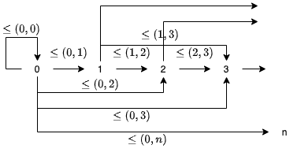

</div>

図式を見る通り、0 から任意の自然数 (対象) への順序 (射) が定義されており、一方で 0 への順序は `(0, 0)` のみであることがわかります。自然数の集合における 0 の性質を一般化すると、始対象を以下のように定義できます。

---

**始対象** (initial object) とは、圏において任意の対象への射をただ1つ持つような対象のことです。

---

### 5.1.2 始対象の例

自然数の集合において、0 から任意の自然数への射 `<=` はただ1つ存在します。0 から 0 への射は恒等射 `(0, 0)` ですし、0 以外の任意の自然数 `n` についても `(0, n)` が一意に存在します。

集合の圏 `Set` における始対象は、空集合です。任意の集合 `A` と空集合 `φ` に対して、 `φ` から `A` への射がただ1つ存在します。一般に、集合 `A` から `B` への関数は、`A` の任意の要素 `a` に対して、その出力 `b` (`B` の要素) が一意に定まるような関係の集合として定義されます。例えば、集合 `A = { 1, 3 }` から集合 `B = { 2, 4, 6}` への関数の例として「入力の値に +1 したものを出力する」ような関数 `f: A => B` を考えます。この関数は、Scala では

```scala
f: A => B = a => a + 1
```

と書くことができますが、集合として書くと

```
{ (1, 2), (3, 4) }
```

と書くことができます。このように考えれば、空集合から任意の集合への関数は空集合であると言うことができ、これは明らかにただ1つだけ存在します。

では、Scala 圏 (前回までは Hask 圏と言っていました) における始対象は何でしょうか。Scala 圏とは、型を対象とし、型間の関数を射とするような圏です。`Set` の空集合に対応する型は、`Nothing` でした。ある1つの型から任意の型 `A` への射で一意なものは、`Nothing` から `A` への関数 `absurd` です。

```scala
def absurd[A]: Nothing => A = { case _ => ??? }
```

<div align="center">

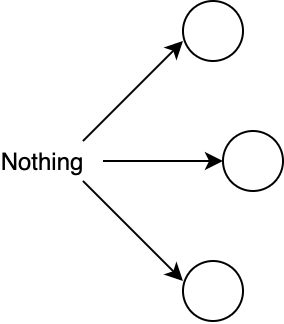

</div>

ちなみに、 `Set` 圏においてシングルトン集合は始対象ではありません。というのも、`{ a }` (a は任意の値) から空集合への射は存在しないからです。空集合は、(入力 a に対しての出力が定義されないので) シングルトン集合から空集合への関数ではありません。また、`{ a }` から `{ true, false }` への射は1つには限りません。

```scala
def f: Unit => Boolean = _ => true
def g: Unit => Boolean = _ => false
```

### 5.1.3 始対象の一意性

そして、始対象には、存在するなら**同型を除いて一意である** (unique up to isomorphism) という性質があります。これは、ただ始対象が一意に存在するというわけではなく、始対象と同型の対象を除いて一意に存在するという性質です。

同型については1章で少し話しましたが、一度思い出してみましょう。対象 `A` から対象 `B` への射 `f` に逆射 `fInv` が存在するとき、またそのときに限って `A` と `B` は同型であると言われます。つまり、同型な対象の間は相互に変換可能であることを意味します。

始対象が同型を除いて一意であるとは、任意の2つの始対象が同型であることを意味します。具体的に、2つの始対象を I1 と I2 として考えてみましょう。I1 は始対象なので、定義より任意の対象への射をただ1つ持っていて、I1 から I2 への一意の射 `f` が存在します。一方で、I2 は始対象なので、定義より I2 から I1 への一意の射 `g` が存在します。この2つの射を合成して `g compose f` を考えます。`g compose f` は I1 から I1 への射です。しかし、I1 から I1 への射はただ1つであり、圏の公理よりそれは恒等射です。すなわち

```
g compose f = id[I1]
```

が成り立ちます。同様に `f compose g` を考えると、これは I2 から I2 への射です。I2 から I2 への射もただ1つであって、圏の公理よりそれは恒等射になります。

```
f compose g = id[I2]
```

したがって、2つの始対象 I1 と I2 は同型です。このような性質を同型を除いて一意であると言います。

始対象が複数存在するような圏をパッと思いつきませんが、始対象が複数存在するのであれば、それらは同型であると示せます。

## 5.2 終対象

次に、終対象についてです。

終対象は始対象と対をなす概念で、順序集合における最大値に対応する構造です。始対象の定義と同じように、終対象は以下のように定義されます。

---

**終対象** (terminal object) とは、圏において任意の対象からの射がただ1つ存在するような対象のことです。

---

集合の圏 `Set` における終対象は、シングルトン集合です。任意の集合 `A` とシングルトン集合 `{ a }` に対して、`A` から `{ a }` への射がただ1つ存在します。

シングルトン集合は `Unit` 型に対応するので、Scala 圏における終対象は `Unit` 型です。任意の型 `A` から `Unit` への関数 `unit` がただ1つ存在します。

```scala
def unit[A]: A => Unit = _ => ()
```

<div align="center">

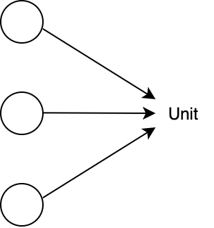

</div>

終対象も始対象同様、同型を除いて一意です。

2つの終対象を T1 と T2 とします。T1 は終対象なので、定義より任意の対象からの射がただ1つ存在して、T2 から T1 への一意の射 `f` が一意に存在します。一方で、T2 は終対象なので、定義より T1 から T2 への一意の射 `g` が存在します。この2つの射を合成して `f compose g` を考えます。`f compose g` は T1 から T1 への射です。しかし、T1 から T1 への射はただ1つであり、圏の公理よりそれは恒等射です。すなわち

```
f compose g = id[T2]
```

が成り立ちます。同様に `g compose f` を考えると、これは T2 から T2 への射です。T2 から T2 への射もただ1つであって、圏の公理よりそれは恒等射になります。

```
g compose f = id[T1]
```

したがって、2つの終対象 T1 と T2 は同型です。

## 5.3 双対性

終対象について考えるとき、終対象は始対象の対をなす概念であると言いました。

実際、終対象の定義は、始対象の定義の射の向きを変えたようなものであると思ったのではないでしょうか。

一般に、任意の圏 `C` に対して、対象はそのままで、全ての射の矢印を反転させ射の合成を再定義することによって**双対圏** (opposite category) `Cop` を定義することができます。

例として、自然数の順序集合を考えます。自然数間の射 `<=` は a が b 以下であるとき `a -> b` であるとします。この順序集合の双対圏を考えてみると、全ての矢印が反転するので、射 `<=op` は a が b 以下であるとき `a <- b` となります。言い換えると、a が b 以上であるとき `a -> b` となりますね。

ある圏の双対圏を考えることによって、圏の普遍的な構造を1つ構成したときその双対の構造も構成することができます。例えば、ある圏における始対象はその双対圏における終対象です。これから見る積の双対は余積です。

双対圏における構成には接頭辞 "余" ("co") がつけられることが多いです。積 (product) には余積 (coproduct) があり、モナド (monad) には余モナド (comonad) があり、極限 (limit) には余極限 (colimit) があります。ただし、矢印を2回反転させると元に戻るので、余余モナドなるものはありません。

## 5.4 積

さて、もう1つの普遍的な構造として、積 (product) について見ていきましょう。

簡単に言えば、積は2つの対象のタプルを表します。Scala において、積はタプルやケースクラスとして組み込まれています。

```scala
val pairTuple: (Int, Boolean) = (44, true)
// pairTuple: (Int, Boolean) = (44, true)
```

```scala
case class Pair(a: Int, b: Boolean)

val pairCaseClass = Pair(44, true)
// pairCaseClass: Pair = Pair(a = 44, b = true)
```

Scala には [Product](https://github.com/scala/scala/blob/v2.13.3/src/library/scala/Product.scala) というトレイトがあり、これが積を表します。タプルやケースクラスはすべて `Product` を継承しています。

```scala
final case class Tuple2[@specialized(Int, Long, Double, Char, Boolean/*, AnyRef*/) +T1, @specialized(Int, Long, Double, Char, Boolean/*, AnyRef*/) +T2](_1: T1, _2: T2)
  extends Product2[T1, T2]
```

ケースクラスは、コンパイル時に自動的に `Product` をミックスインします [1]。

### 5.4.1 積の定義

積は、圏論において以下のように定義されます。

---

圏の2つの対象 `A` と `B` に対して、対象 `C` とその射 `projA: C => A`、`projB: C => B` の三つ組 `<C, projA, projB>` が `A` と `B` の**積** (product) であるとは、任意の対象 `X` とその射 `xA: X => A`、`xB: X => B` の三つ組 `<X, xA, xB>` に対して `X` から `C` への一意の射 `m` が存在して

```
projA compose m == xA
projB compose m == xB
```

が成り立つことを言います。このとき対象 `C` を `A×B` と書きます。

<div align="center">

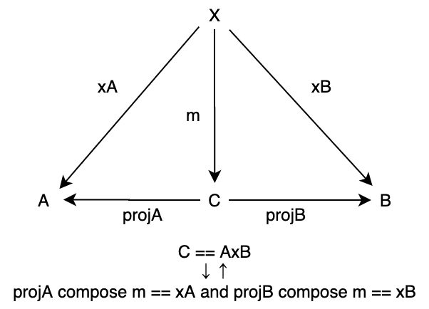

</div>

---

なお、積は存在するなら、同型を除いて一意です。

### 5.4.2 積の例

全くわからないと思うので、もう少し説明させてください。

対象 `C` が `A` と `B` の積であるための前提条件として、`C` の `A` への射 `projA: C => A` と `B` への射 `projB: C => B` が存在することを仮定しています。このような射 `projA` と `projB` を射影 (projection) と呼びます。タプル `(Int, Boolean)` の射影は以下のように定義できます。

```scala
def projInt: ((Int, Boolean)) => Int = _._1
def projBoolean: ((Int, Boolean)) => Boolean = _._2

projInt((44, true))
// res0: Int = 44
projBoolean((44, true))
// res1: Boolean = true
```

この射影関数は、多相関数 `fst` と `snd` として一般化できます。

```scala
def fst[A, B]: ((A, B)) => A = _._1
def snd[A, B]: ((A, B)) => B = _._2

fst((44, true))
// res2: Int = 44
snd((44, true))
// res3: Boolean = true
```

そして、もう1つ `A` と `B` への射影 `xA`、`xB` が存在する対象 `X` を考えます。この `X` について、`X` から `C` への射 `m` を考えます。例えば、`C` が `(Int, Boolean)` で `X` が `String` であったとしましょう。`X` の射影は以下のようになっているとします。

```scala
def xInt: String => Int = _.length
def xBoolean: String => Boolean = _.startsWith("a")

xInt("abcdefg")
// res4: Int = 7
xBoolean("abcdefg")
// res5: Boolean = true
```

この射影に対して、射 `m: X => C` すなわち `m: String => (Int, Boolean)` は

```scala
def m: String => ((Int, Boolean)) = x => (xInt(x), xBoolean(x))

m("abcdefg")
// res6: (Int, Boolean) = (7, true)
```

と定義できます。もちろん、射 `m` は適当に `(1, false)` などと返すよう定義することも可能なのですが、もう1つ制約があるために、`m` は一意に定義されることになります。`C` が `A` と `B` の積であるためには、`m` に対して以下が成り立つ必要があります。

```
projInt compose m == xInt
projBoolean compose m == xBoolean
```

先ほどの `m` の定義は、これを満たします。

```scala
(projInt compose m)("abcdefg") == xInt("abcdefg")
// res7: Boolean = true
(projBoolean compose m)("abcdefg") == xBoolean("abcdefg")
// res8: Boolean = true
```

すなわち、`C` が `A` と `B` の積であるための条件は、`A` の成分と `B` の成分で分解して計算できることだとわかります。

<div align="center">

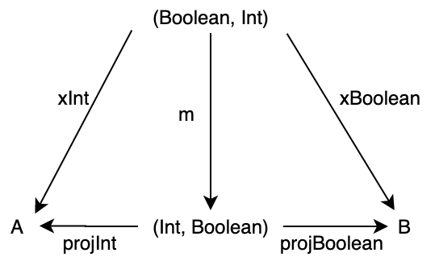

</div>

もう一つ、集合圏における積の例を見てみます [2]。集合 `A = { 7, 8, 9 }`、`B = { a, b, c }`、`X = { 1, 2, 3, 4 }` として、`X` から `A` および `B` への射影 `xA` と `xB` を以下のようにします。

```
xA = { (1, 7), (2, 8), (3, 9), (4, 7) }
xB = { (1, a), (2, b), (3, c), (4, c) }
```

そして、積 `AxB` から `A` および `B` への射影 `pA` と `pB` をそれぞれ、第1要素を取得する関数と第2要素を取得する関数として考えます。このとき、上の射影 `xA` と `xB` のペアは `X` から `AxB` への関数 `f` に一意に読み替えることができます。

```
f = { (1, (7, a)), (2, (8, b)), (3, (9, c)), (4, (7, c)) }
```

この例について、以下の図式は可換になります。

<div align="center">

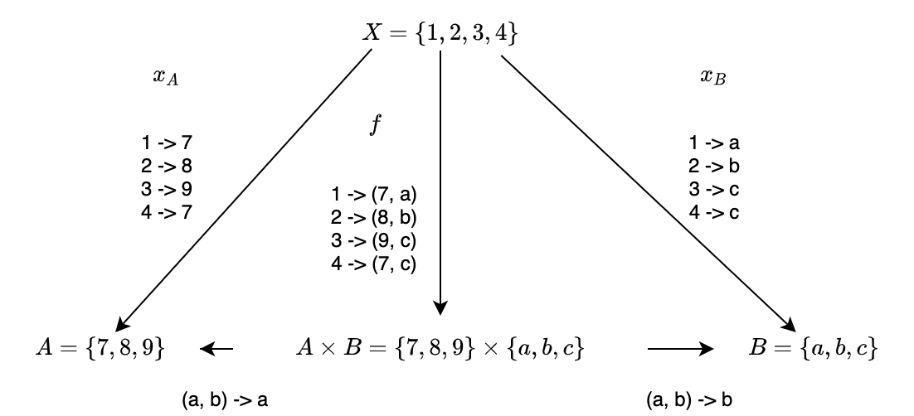

</div>

積の定義において対象から `X` から `AxB` への射 `m` は、以下のように定義することができます。

```scala
def factorize[X, A, B](xA: X => A)(xB: X => B)(x: X): (A, B) = (xA(x), xB(x))

factorize{ s: String => s.length }{ s: String => s.startsWith("a") }("abcdefg")
// res9: (Int, Boolean) = (7, true)
```

### 5.4.3 スパン圏

積は、同じ形式を持つ圏における終対象であると考えることもできます。積における「同じ形式」とは、2つの対象 `A` と `B` に対して対象 `X` が `A` と `B` への射影 `xA`、`xB` を持つこと、すなわち三つ組 `<X, xA, xB>` で表されることを言います。

そのような三つ組はスパン (span) と呼ばれます。スパンを対象とするスパン圏について考えてみましょう。

スパン圏の対象 `<X, xA, xB>` と `<Y, yA, yB>` に対して、その間の射 `f: X -> Y` を考えます。このスパン圏において対象 `A` と `B` は固定されるので、図式は以下のようになります。

<div align="center">

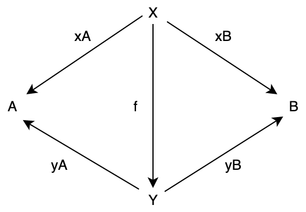

</div>

ただし、射 `f` は、図式において2つの三角形を可換にしなければいけません。すなわち

```
yA compose f == xA
yB compose f == xB
```

が成り立つ必要があります。

そして、積は任意の対象 `X` に対して一意の `f` が存在して、上の図式を満たす `Y` であると定義しました。これは、スパン圏における終対象に他なりません。

スパン圏の例としては、射影が定義されていて、図式が可換であればなんでも良いと考えられます。

例えば `Int` と `Boolean` のスパン圏における対象として `<String, length, isEmpty>`、`<Int, increment, isOdd>`、`<(Int, Boolean), fst, snd>` などを考えることができます。1つ目は `String` に `Int` および `Boolean` への射影を持たせたもの、2つ目は `Int` に `Int` および `Boolean` への射影を持たせたもの、3つ目は `Int` と `Boolean` の積 `(Int, Boolean)` であってこの圏の終対象になるもの、です。

<div align="center">

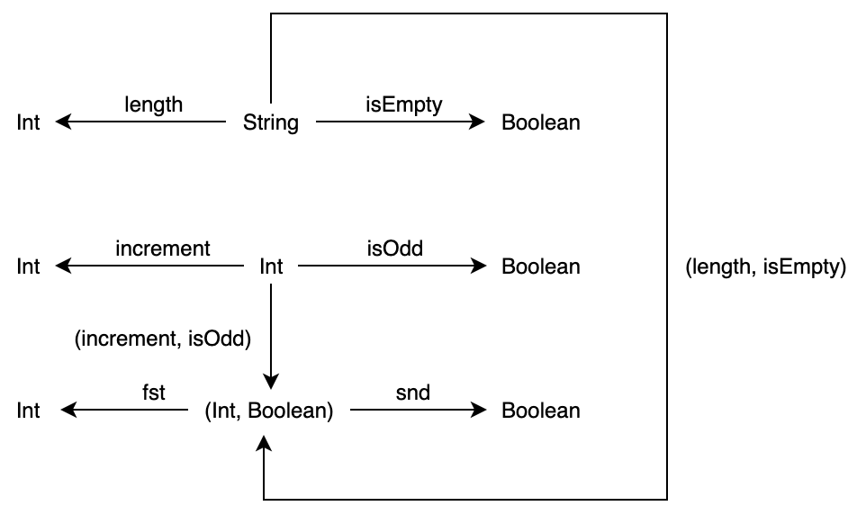

</div>

### 5.4.4 モノイダル圏としての Scala 圏

2つの対象 `A` と `B` の積 `AxB` は、見方を変えれば二項演算と考えることができます。

Scala 圏における積は二項演算として、数の乗算に対応します。二項演算としての性質を少し見ていきましょう。

まず、結合律について。3つの対象 `A` `B` `C` の積は、タプルをネストさせることによって定義できます。

```
((A, B), C)
(A, (B, C))
```

<div align="center">

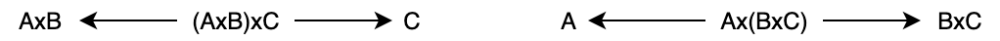

</div>

これら2つのタプルは、同型です。同型射 (つまり、逆射を持つ射) は、以下のように定義できます。

```scala
def isomorTuple[A, B, C]: (((A, B), C)) => ((A, (B, C))) = {
  case ((a, b), c) => (a, (b, c))
}

def isomorTupleInv[A, B, C]: ((A, (B, C))) => (((A, B), C)) = {
  case (a, (b, c)) => ((a, b), c)
}

isomorTuple(((44, "hoge"), true))
// res10: (Int, (String, Boolean)) = (44, ("hoge", true))
isomorTupleInv((44, ("hoge", true)))
// res11: ((Int, String), Boolean) = ((44, "hoge"), true)
```

なお、これらと同型である3-タプル `(A, B, C)` も積です。

```scala
def isomorTuple3[A, B, C]: (((A, B), C)) => ((A, B, C)) = {
  case ((a, b), c) => (a, b, c)
}

def isomorTuple3Inv[A, B, C]: ((A, B, C)) => (((A, B), C)) = {
  case (a, b, c) => ((a, b), c)
}
```

以上のように、積について結合律が満たされることを確認できました。

では次に、単位律について考えてみます。

二項演算としての積における単位律とは、ある対象 `X` に対して対象 `A` と `X` の積 `AxX` および `XxA` が、`A` と同型になることを言います。つまり、`X` は単位元です。

積における単位元は、`Unit` 型です。

```scala
def isomorProduct[A]: A => ((A, Unit)) = a => (a, ())
def isomorProductInv[A]: ((A, Unit)) => A = {
  case (a, ()) => a
}

isomorProduct(44)
// res12: (Int, Unit) = (44, ())
isomorProductInv((44, ()))
// res13: Int = 44
```

以上のことから、積はモノイドの性質を満たしていることがわかります。

したがって、Scala 圏はモノイダル圏であると言われます。

## 5.5 余積

最後に、積の双対概念である余積についてです。

### 5.5.1 余積の定義

余積は、積の定義において射を反転させたものです。すなわち、以下のように定義されます。

---

圏の2つの対象 `A` と `B` に対して、対象 `C` と射 `injA: A => C`、`injB: B => C` の三つ組 `<C, injA, injB>` が `A` と `B` の**余積** (coproduct) であるとは、他の同様の三つ組、すなわち任意の対象 `X` と射 `xA: A => X`、`xB: B => X` の三つ組 `<X, xA, xB>` に対して `C` から `X` への一意の射 `x` が存在して

```
x compose injA == xA
x compose injB == xB
```

が成り立つことを言います。このとき対象 `C` を `A+B` と書きます。また、`injA: A => C` および `injB: B => C` を入射 (injection) と呼びます。

<div align="center">

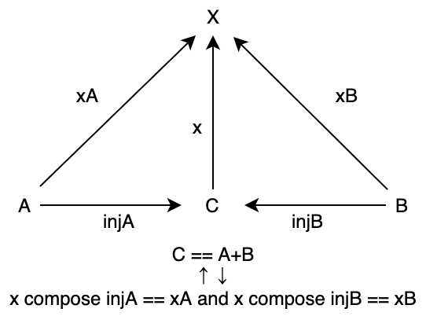

</div>

---

積は Scala においてタプルやケースクラスとして表すことができますが、余積は Scala において Either によって表すことができます。

```scala
sealed trait Either[+A, +B]
case class Left[A](v: A) extends Either[A, Nothing]
case class Right[B](v: B) extends Either[Nothing, B]
```

`Either[+A, +B]` の具象型として `Left[A]` と `Right[B]` があり、これら2つの型が Either を構成しています。

### 5.5.2 余積の例

では、具体例を考えることによって、余積の定義と Either の定義を照らし合わせてみましょう。

対象 `A` を型 `String` とし、対象 `B` を型 `Int` とし、対象 `C` を `Either[String, Int]` とします。そして、`String` および `Int` から `Either[String, Int]` への射が以下のようなものであるとします。

```scala
def injStringToC: String => Either[String, Int] = s => Left(s)
def injIntToC: Int => Either[String, Int] = i => Right(i)

injStringToC("Some exceptions occur")
// res14: Either[String, Int] = Left(v = "Some exceptions occur")
injIntToC(44)
// res15: Either[String, Int] = Right(v = 44)
```

つまり、`C` において文字列は `Left` に包まれ、整数値は `Right` に包まれます。

同様な構造を持つ対象 `X` として型 `Int` を考え、`X` への入射が以下のようになっているとします。これらの射は、文字列を整数値 `-1` に変換し、整数値をそのまま渡します。

```scala
def injStringToX: String => Int = _ => -1
def injIntToX: Int => Int = i => i

injStringToX("Some exceptions occur")
// res16: Int = -1
injIntToX(44)
// res17: Int = 44
```

このとき、`Either[String, Int]` を `X` すなわち `Int` に変換する関数 `x` を以下のように定義してみます。この射 `x` は `Either` に包まれた文字列あるいは整数値を抽出し `X` への入射に渡しています。

```scala
def x: Either[String, Int] => Int = {
  case Left(a)  => injStringToX(a)
  case Right(b) => injIntToX(b)
}
```

この関数は、`Left[A]` の値を `A` から `X` への入射に渡し、`Right[B]` の値を `B` から `X` への入射に渡しているだけのものです。つまり、余積では、複数の可能性 (`A` と `B`) が存在する型に対して射の合成を定義しています。この `x` に対して

```
x compose injStringToC == injStringToX
x compose injIntToC == injIntToX
```

が成り立ちます。

```scala
(x compose injStringToC)("Some exceptions occur") == injStringToX("Some exceptions occur")
// res18: Boolean = true
(x compose injIntToC)(44)                         == injIntToX(44)
// res19: Boolean = true
```

したがって、`Either[String, Int]` は余積の性質を満たしていると言えます。

<div align="center">

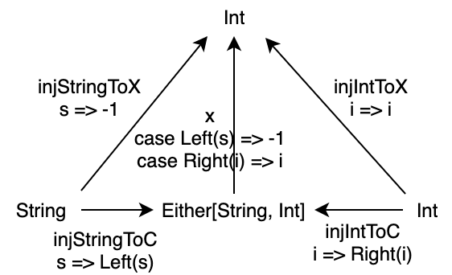

</div>

### 5.5.3 余スパン圏

余積は積の双対概念です。

射の向きが反転しているので、余積においてはスパン圏ではなく余スパン圏を考えます。

積がスパン圏における終対象であったのと同様に、余積は余スパン圏における始対象になります。


<div align="center">

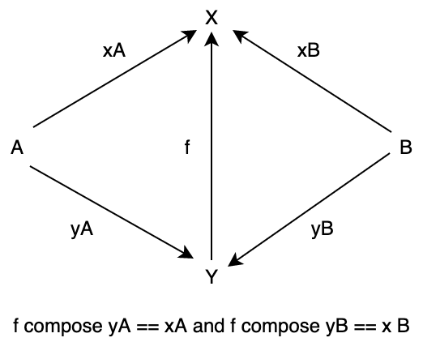

</div>

### 5.5.4 モノイダル圏としての Scala 圏

積は、乗算に対応する二項演算と考えることができました。

Scala 圏において、余積 `A+B` は加算に対応する二項演算と考えることができます。

余積における単位元は `Nothing` 型です。

```scala
def isomorCoproductLeft[A]: A => Either[A, Nothing] = a => Left(a)
def isomorCoproductLeftInv[A]: Either[A, Nothing] => A = {
  case Left(a)  => a
  case Right(_) => ??? // Right は Nothing なので来ない
}

isomorCoproductLeft("Oh my god!")
// res20: Either[String, Nothing] = Left(v = "Oh my god!")
isomorCoproductLeftInv(Left("Oh my god!"))
// res21: String = "Oh my god!"
```

```scala
def isomorCoproductRight[B]: B => Either[Nothing, B] = b => Right(b)
def isomorCoproductRightInv[B]: Either[Nothing, B] => B = {
  case Right(b) => b
  case Left(_)  => ??? // Left は Nothing なので来ない
}
isomorCoproductRight("Good")
// res22: Either[Nothing, String] = Right(v = "Good")
isomorCoproductRightInv(Right("Good"))
// res23: String = "Good"
```

# 本章のまとめ

- 始対象とは、圏において任意の対象への射をただ1つ持つような対象のことである。
  - 集合圏における始対象は空集合、Scala 圏における始対象は Nothing である。
  - 始対象は同型を除いて一意である。
- 終対象とは、圏において任意の対象からの射がただ1つ存在するような対象のことである。
  - 集合圏における終対象はシングルトン集合、Scala 圏における終対象は Unit である。
  - 終対象は同型を除いて一意である。
- ある圏の双対圏とは、その圏の対象はそのままに、射の向きを反転させた圏のことである。
  - ある圏の始対象はその双対圏の終対象であり、ある圏の終対象はその双対圏の始対象である。
- 2つの対象 `A` と `B` の積 `A x B` とは、`A` と `B` への射影を持つような対象を対象とするスパン圏における終対象である。
  - タプルやケースクラスが積の例である。
  - Unit を単位元する積について、Scala 圏はモノイダル圏となる。
- 2つの対象 `A` と `B` の余積 `A + B` とは、`A` と `B` からの入射を持つような対象を対象とする余スパン圏における始対象である。
  - Either が余積の例である。
  - 余積は積の双対概念である。

# 参考文献

[1] Scalaクラスメモ, http://www.ne.jp/asahi/hishidama/home/tech/scala/class.html , 2020年11月13日閲覧.

[2] 雪田修一, 圏論入門 Haskell で計算する具体例から, 日本評論社, 2020.
