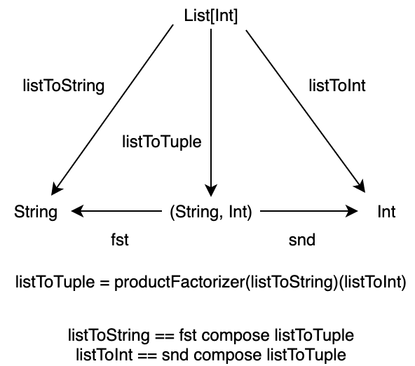

<!-- omit in toc -->
# 目次

<!-- vim-markdown-toc GFM -->

- [5. 積と余積](#5-積余積)
  - [5.1 始対象](#51-始対象)
  - [5.2 終対象](#52-終対象)
  - [5.3 双対性](#53-双対性)
  - [5.4 積](#54-積)
  - [5.5 余積](#55-余積)
  - [5.6 非対象](#56-非対象)

<!-- vim-markdown-toc -->

# 5. 積と余積

本章では、圏に関するいくつかの普遍的な構造について学んでいきます。

普遍的な構造として、順序集合における最小値に対応する始対象、最大値に対応する終対象、始対象と終対象との関連性である双対性、直積集合に対応する積、そして積と対をなす余積について定式化します。

始対象・終対象や積は、モナドなどのプログラミングにおいて重要な構造を定義するために必要な概念を、定義するために必要です。

積や余積は特に、代数的データ型と呼ばれるタプル、ケースクラス、トレイトの一般化です。

具体的な例を通して学んでいきましょう！

## 5.1 始対象

始対象は、順序集合における最小値に対応する構造です。例えば、自然数の集合 `{ 0, 1, 2, ..., n, ... }` に対して、順序 `<=` における最小値は 0 です。自然数の集合の圏において、この 0 を始対象と言えるように始対象を定式化していきます。

まず、自然数の集合に対して、順序 `<=` を以下のように定義してみます。ただし、`(a, b)` とは「a が b 以下である」を意味し、対象 a から対象 b への射が存在することを表すこととします。

```
<= := {
  (0, 0), (0, 1), (0, 2), (0, 3), ..., (0, n), ...
          (1, 1), (1, 2), (1, 3), ..., (1, n), ...
                  (2, 2), (2, 3), ..., (2, n), ...
                          ...
}
```

これを図式で書くと、以下のような圏とみなせます。

<div align="center">


</div>

図式を見る通り、0 から任意の自然数 (対象) への順序 (射) が定義されており、一方で 0 への順序は `(0, 0)` のみであることがわかります。自然数の集合における 0 の性質を一般化すると、始対象を以下のように定義できます。

**始対象** (initial object) とは、圏において任意の対象への射をただ1つ持つような対象のことである。

自然数の集合において、0 から任意の射 `<=` はただ1つ存在します。0 から 0 への射は恒等射 `(0, 0)` ですし、0 以外の任意の自然数 `n` についても `(0, n)` が一意に存在します。

集合の圏 `Set` における始対象は、空集合です。任意の集合 `A` と空集合 `φ` に対して、 `φ` から `A` への射がただ1つ存在します。

では、Scala 圏 (前回までは Hask 圏と言っていました) における始対象は何でしょうか。Scala 圏とは、型を対象とし、型間の関数を射とするような圏です。ある1つの型から任意の型 `A` への射で一意なものは、`Nothing` から `A` への関数 `absurd` です。

```scala
def absurd[A]: Nothing => A = { case _ => ??? }
```

<div align="center">


</div>

ちなみに、 `Set` 圏においてシングルトン集合は始対象ではありません。というのも、`{ a }` (a は任意の値) から空集合への射は存在しないからです。また、`{ a }` から `{ true, false }` への射は1つには限りません。

```scala
def f: Unit => Boolean = _ => true
def g: Unit => Boolean = _ => false
```

そして、始対象には、存在するなら同型を除いて一意である (unique up to isomorphism) という性質があります。これは、ただ始対象が一意に存在するというわけではなく、始対象と同型の対象を除いて一意に存在するという性質です。

同型については1章で少し話しましたが、一度思い出してみましょう。対象 `A` から対象 `B` への射 `f` に逆射 `g` が存在するとき、またそのときに限って `A` と `B` は同型であると言われます。つまり、同型な対象の間は相互に変換可能であることを意味します。

始対象が同型を除いて一意であるとは、任意の2つの始対象が同型であることを意味します。具体的に、2つの始対象を i1 と i2 として考えてみましょう。i1 は始対象なので、定義より任意の対象への射をただ1つ持っていて、i1 から i2 への一意の射 `f` が存在します。一方で、i2 は始対象なので、定義より i2 から i1 への一意の射 `g` が存在します。この2つの射を合成して `g compose f` を考えます。`g compose f` は i1 から i1 への射です。しかし、i1 から i1 への射はただ1つであり、圏の公理よりそれは恒等射です。すなわち

```
g compose f = id[i1]
```

が成り立ちます。同様に `f compose g` を考えると、これは i2 から i2 への射です。i2 から i2 への射もただ1つであって、圏の公理よりそれは恒等射になります。

```
f compose g = id[i2]
```

したがって、2つの始対象 i1 と i2 は同型です。このような性質を同型を除いて一意であると言います。

## 5.2 終対象

次に、終対象についてです。

終対象は始対象と対をなす概念で、順序集合における最大値に対応する構造です。始対象の定義と同じように、終対象は以下のように定義されます。

**終対象** (terminal object) とは、圏において任意の対象からの射がただ1つ存在するような対象のことである。

集合の圏 `Set` における終対象は、シングルトン集合です。任意の集合 `A` とシングルトン集合 `{ a }` に対して、`A` から `{ a }` への射がただ1つ存在します。

シングルトン集合は `Unit` 型に対応するので、Scala 圏における終対象は `Unit` 型です。任意の型 `A` から `Unit` への関数 `unit` がただ1つ存在します。

```scala
def unit[A]: A => Unit = _ => ()
```

<div align="center">


</div>

終対象も始対象同様、同型を除いて一意です。

## 5.3 双対性

終対象について考えるとき、終対象は始対象の対をなす概念であると言いました。

実際、終対象の定義は、始対象の定義の射の向きを変えたようなものであると思ったのではないでしょうか。

一般に、任意の圏 `C` に対して、対象はそのままで、全ての射の矢印を反転させ射の合成を再定義することによって双対圏 (opposite category) `Cop` を定義することができます。

例として、自然数の順序集合を考えます。自然数間の射 `<=` は a が b 以下であるとき `a -> b` であるとします。この順序集合の双対圏を考えてみると、全ての矢印が反転するので、射 `<=op` は a が b 以下であるとき `a <- b` となります。言い換えると、a が b 以上であるとき `a -> b` となりますね。

ある圏の双対圏を考えることによって、圏の普遍的な構造を1つ構成したときその双対の構造も構成することができます。例えば、ある圏における始対象はその双対圏における終対象です。これから見る積の双対は余積です。

双対圏における構成には接頭辞 "余" ("co") がつけられることが多いです。積 (product) には余積 (coproduct) があり、モナド (monad) には余モナド (comonad) があり、極限 (limit) には余極限 (colimit) があります。ただし、矢印を2回反転させると元に戻るので、余余モナドなるものはありません。

## 5.4 積

さて、もう1つの普遍的な構造として、積 (product) について見ていきましょう。

簡単に言えば、積は2つの対象のタプルを表します。Scala において、積はタプルやケースクラスとして組み込まれています。

```scala
// product as tuple
val pairTuple: (Int, Boolean) = (44, true)
// pairTuple: (Int, Boolean) = (44, true)
```

```scala
// product as case class
case class Pair(a: Int, b: Boolean)
val pairCaseClass = Pair(44, true)
// pairCaseClass: Pair = Pair(a = 44, b = true)
```

積は、圏論において以下のように定義されます。

圏の2つの対象 `A` と `B` に対して、対象 `C` とその射 `projA: C => A`、`projB: C => B` の三つ組 `<C, projA, projB>` が `A` と `B` の**積** (product) であるとは、ある対象 `X` とその射 `xA': X => A`、`xB: X => B` の三つ組 `<X, xA, xB>` に対して `X` から `C` への一意の射 `m` が存在して

```
projA compose m == xA
projB compose m == xB
```

が成り立つことを言います。このとき対象 `C` を `A×B` と書きます。

<div align="center">


</div>

全くわからないと思うので、もう少し説明させてください。

対象 `C` が `A` と `B` の積であるための前提条件として、`C` の `A` への射 `projA: C => A` と `B` への射 `projB: C => B` が存在することを仮定しています。このような射 `projA` と `projB` を射影 (projection) と呼びます。タプル `(Int, Boolean)` の射影は以下のように定義できます。

```scala
def projInt: ((Int, Boolean)) => Int = _._1
def projBoolean: ((Int, Boolean)) => Boolean = _._2

projInt((44, true))
// res0: Int = 44
projBoolean((44, true))
// res1: Boolean = true
```

この射影関数は、多相関数 `fst` と `snd` として一般化できます。

```scala
def fst[A, B]: ((A, B)) => A = _._1
def snd[A, B]: ((A, B)) => B = _._2
fst((44, true))
// res2: Int = 44
snd((44, true))
// res3: Boolean = true
```

そして、もう1つ `A` と `B` への射影 `xA`、`xB` が存在する対象 `X` を考えます。この `X` について、`X` から `C` への射 `m` を考えます。例えば、`C` が `(Int, Boolean)` で `X` が `(Boolean, Int)` であったとしましょう。`X` の射影は以下のようになっているとします。

```scala
def xInt: ((Boolean, Int)) => Int = _._2
def xBoolean: ((Boolean, Int)) => Boolean = _._1
xInt((true, 44))
// res4: Int = 44
xBoolean((true, 44))
// res5: Boolean = true
```

この射影に対して、射 `m: X => C` すなわち `m: (Boolean, Int) => (Int, Boolean)` は

```scala
def m: ((Boolean, Int)) => ((Int, Boolean)) = x => (xInt(x), xBoolean(x))
m((true, 44))
// res6: (Int, Boolean) = (44, true)
```

と定義できます。もちろん、射 `m` は適当に `(1, false)` などと返すよう定義することも可能なのですが、もう1つ制約があるために、`m` は一意に定義されることになります。`C` が `A` と `B` の積であるためには、`m` に対して以下が成り立つ必要があります。

```
projInt compose m == xInt
projBoolean compose m == xBoolean
```

先ほどの `m` の定義は、これを満たします。

```scala
(projInt compose m)((true, 44)) == xInt((true, 44))
// res7: Boolean = true
(projBoolean compose m)((true, 44)) == xBoolean((true, 44))
// res8: Boolean = true
```

すなわち、`C` が `A` と `B` の積であるための条件は、`A` の成分と `B` の成分で分解して計算できることだとわかります。

<div align="center">



</div>

## 5.5 余積

## 5.6 非対象

