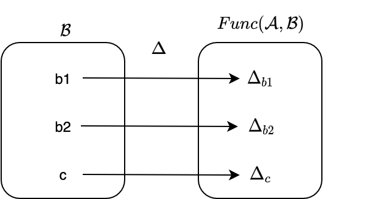
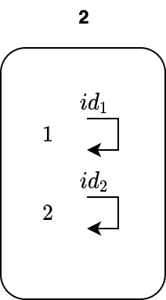
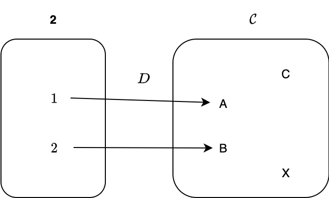
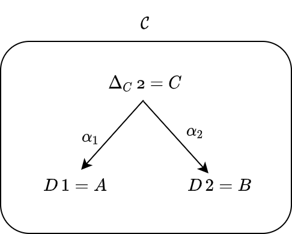

# 12. 極限と余極限

前章までに、積や関手、自然変換といった圏論における基本概念について学びました。

本章からは、関手と自然変換を使って得られる諸概念について一つ一つ学んでいきます。まず極限と余極限について学び、その次に自由モノイド、表現可能関手について学びます。最後に圏論における最初の登竜門と呼ばれている米田の補題を学びます。

本章では、普遍性の一つである極限と余極限について、学んでいきます。一言で説明すると、極限は積の一般化、余極限は余積の一般化になります。5章で、2つの対象 A と B の積 AxB と余積 A+B を定義しました。積 AxB の候補となるような対象 C を考えて、C から A および B への射影 projA と projB を前提としていましたね。実はこの「対象を選択する」という操作は、関手によって表現できます。そして、C から A および B への射影を選択するという操作は、自然変換によって表現されます。具体的には本章で見ていきましょう！

まず、極限を定義するために必要な準備をします。具体的には、定関手を定義して、積を関手と自然変換を使って表現し直します。定関手は、全ての対象をある1つの対象に対応させ、全ての射をその対象の恒等射に対応させるものです。そのあと、極限とは何か定義し、いくつかの極限の例を見ていきます。最後に、余極限を定義します。

## 12.1 準備

本節では、極限を定義するために必要な概念を導入します。

### 12.1.1 定関手

定関手は、これまで何度か出てきましたね。

自然変換の章では、List の長さを取得する関数 `length` が List 関手から Const 関手への自然変換であることを学びました:

```scala
def length = Lambda[List ~> Const[Int, ?]](fa => Const(fa.length))
```

`Const` というデータ構造そのものが関手になっているのではなく、`Const[Int, ?]` のように定数の型 `Int` を与えると関手になるのでした。例えば

```scala
import hamcat.Implicits._
import hamcat.data.Const

val const1 = Const[Int, String](3)
// const1: Const[Int, String] = Const(v = 3)
val const2 = const1.fmap(str => str.startsWith("a"))
// const2: Const[Int, Boolean] = Const(v = 3)
```

のように、定数 `3` を保持しながら型の変換 `String => Boolean` をするような処理を書くことができます。

定関手は一般的に、以下のように定義されます：

---

2つの任意の圏を A と B とします。圏 B の任意の対象 c に対して、圏 A から c への **定関手** (constant functor) とは、A の任意の対象を c に写し、A の任意の射を c の恒等射に写すもののことをいいます。

また、B の対象 c に対して c への定関手を対応させるものを**対角関手** (diagonal functor) Δ と呼びます。

---

圏 A から圏 B の対象 c への定関手 Δc は A から B への関手です。一方で、対角関手 Δ は、圏 B から関手圏 Func(A, B) への関手です。

<div align="center">




</div>

定関手を使うと何が嬉しいかと言いますと、任意の圏から対象を1つだけとってくるような操作を表現することができます。上記画像の例だと、c という対象そのものを表現する関手であるとみなすこともできます。`Const[Int, String]` が `Int` 型の定数を表すことができるように、定関手は関手でありながら1つの対象そのものを表すことができるのです。

### 12.1.2 関手と自然変換を使って積を定義する

ここでは、関手と自然変換の概念を使って、積の定義を言い換えていきます。

早速ですが、圏 C における対象 A と B の積 AxB を定義するとき、まず対象 A と B を選択するという操作が行われます。この2つの対象を選択するという操作は、シンプルな圏 **2** を用いることによって表現できます。圏 **2** は、対象を2つだけ持ち、射を恒等射しか持たないような圏とします：

<div align="center">



</div>

この圏 **2** から圏 C への関手 D を考えてみましょう。圏 **2** における対象 1 と 2 が、関手 D によって圏 C の対象 A と B に写されるとすると

```
D 1 = A
D 2 = B
```

となります。

<div align="center">



</div>

この関手 D によって、積をとりたい対象 A と B を選択できるようになりました。

では次に、A と B の積 AxB の候補となる対象 C を選択することを考えます。1つの対象を選択するには定関手を使えばいいので、対象 C への定関手 Δc を考えます。Δc は任意の対象を対象 C に写し、任意の射を C の恒等射に写します。

```
Δc 1 = C
Δc 2 = C
```

<div align="center">


</div>

これで、2つの関手を得られました。これら2つはどちらも圏 **2** から圏 C への関手なので、自然変換を考えることができます。対象 C への定関手から関手 D への自然変換 α を考えると、これは圏 C における射になります：

```
α1: Δc 1 -> D 1 <=> α1: C -> A
α2: Δc 2 -> D 2 <=> α2: C -> B
```

圏 **2** における射は恒等射のみなので、この変換が自然性を満たすことは自明です。

<div align="center">



</div>

よく見てみると、この自然変換は C から A への射と、C から B への射を選ぶことに等しいです。すなわち、積における A と B への射影を表します。


さて、ここで積の定義を振り返ってみましょう。

> 圏の2つの対象 `A` と `B` に対して、対象 `C` とその射 `projA: C => A`、`projB: C => B` の三つ組 `<C, projA, projB>` が `A` と `B` の**積** (product) であるとは、任意の対象 `X` とその射 `xA: X => A`、`xB: X => B` の三つ組 `<X, xA, xB>` に対して `X` から `C` への一意の射 `m` が存在して
> 
> ```
> projA compose m == xA
> projB compose m == xB
> ```
> 
> が成り立つことを言います。このとき対象 `C` を `A x B` と書きます。

## 12.2 極限

### 12.2.1 極限の定義

### 12.2.2 極限の例

## 12.3 余極限

### 12.3.1 余極限の定義

### 12.3.2 余極限を定義すると何が嬉しいか

# まとめ

