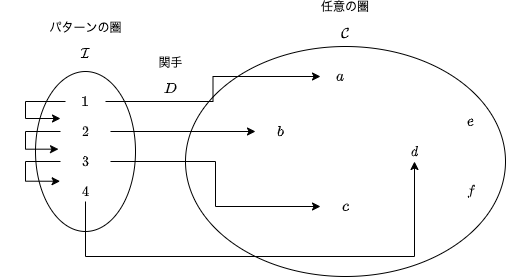
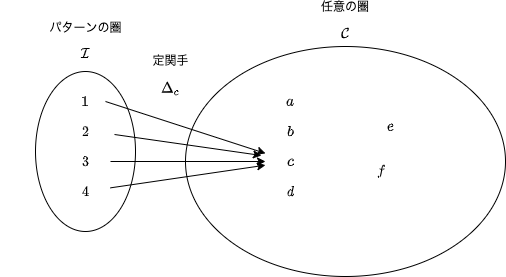

# 12. 極限と余極限

前章までに、積や関手、自然変換といった圏論における基本概念について学びました。

本章からは、関手と自然変換を使って得られる諸概念について一つ一つ学んでいきます。まず極限と余極限について学び、その次に自由モノイド、表現可能関手について学びます。最後に圏論における最初の登竜門と呼ばれている米田の補題を学びます。

本章では、普遍性の一つである極限と余極限について、学んでいきます。一言で説明すると、極限は積の一般化、余極限は余積の一般化になります。5章で、2つの対象 A と B の積 AxB と余積 A+B を定義しました。積 AxB の候補となるような対象 C を考えて、C から A および B への射影 projA と projB を前提としていましたね。実はこの「対象を選択する」という操作は、関手によって表現できます。そして、C から A および B への射影を選択するという操作は、自然変換によって表現されます。具体的には本章で見ていきましょう！

まず、極限を定義するために必要な準備をします。具体的には、定関手を定義して、積を関手と自然変換を使って表現し直します。定関手は、全ての対象をある1つの対象に対応させ、全ての射をその対象の恒等射に対応させるものです。そのあと、極限とは何か定義し、いくつかの極限の例を見ていきます。最後に、余極限を定義します。

## 12.1 準備

本節では、極限を定義するために必要な概念を導入します。

### 12.1.1 定関手

定関手は、これまで何度か出てきましたね。

自然変換の章では、List の長さを取得する関数 `length` が List 関手から Const 関手への自然変換であることを学びました:

```scala
def length = Lambda[List ~> Const[Int, ?]](fa => Const(fa.length))
```

`Const` というデータ構造そのものが関手になっているのではなく、`Const[Int, ?]` のように定数の型 `Int` を与えると関手になるのでした。例えば

```scala
import hamcat.Implicits._
import hamcat.data.Const

val const1 = Const[Int, String](3)
// const1: Const[Int, String] = Const(v = 3)
val const2 = const1.fmap(str => str.startsWith("a"))
// const2: Const[Int, Boolean] = Const(v = 3)
```

のように、定数 `3` を保持しながら型の変換 `String => Boolean` をするような処理を書くことができます。

定関手は一般的に、以下のように定義されます：

---

2つの任意の圏を A と B とします。圏 **B** の任意の対象 c に対して、圏 **A** から c への **定関手** (constant functor) とは、**A** の任意の対象を c に写し、**A** の任意の射を c の恒等射に写すもののことをいいます。

また、**B** の対象 c に対して c への定関手を対応させるものを**対角関手** (diagonal functor) Δ と呼びます。

---

圏 **A** から圏 **B** の対象 c への定関手 Δc は **A** から **B** への関手です。一方で、対角関手 Δ は、圏 **B** から関手圏 **Func(A, B)** への関手です。

<div align="center">


</div>

定関手を使うと何が嬉しいかと言いますと、任意の圏から対象を1つだけとってくるような操作を表現することができます。上記画像の例だと、c という対象そのものを表現する関手であるとみなすこともできます。`Const[Int, String]` が `Int` 型の定数を表すことができるように、定関手は関手でありながら1つの対象そのものを表すことができるのです。

### 12.1.2 関手と自然変換を使って積を定義する

次に、関手と自然変換の概念を使って、積の定義を言い換えていきます。

早速ですが、圏 **C** における対象 A と B の積 AxB を定義するとき、まず対象 A と B を選択するという操作が行われます。この2つの対象を選択するという操作は、シンプルな圏 **2** を用いることによって表現できます。圏 **2** は、対象を2つだけ持ち、射を恒等射しか持たないような圏とします：

<div align="center">


</div>

この圏 **2** から圏 **C** への関手 D を考えてみましょう。圏 **2** における対象 1 と 2 が、関手 D によって圏 **C** の対象 A と B に写されるとすると

```
D 1 = A
D 2 = B
```

となります。

<div align="center">


</div>

この関手 D によって、積をとりたい対象 A と B を選択できるようになりました。

では次に、A と B の積 AxB の候補となる対象 C を選択することを考えます。1つの対象を選択するには定関手を使えばいいので、対象 C への定関手 Δc を考えます。Δc は任意の対象を対象 C に写し、任意の射を C の恒等射に写します。

```
Δc 1 = C
Δc 2 = C
```

<div align="center">


</div>

これで、2つの関手 D と Δc を得られました。これら2つはどちらも圏 **2** から圏 **C** への関手なので、自然変換を考えることができます。定関手 Δc から関手 D への自然変換 α を考えると、これは圏 **C** における射になります。

すなわち、α の 1 成分は C (Δc 1) を A (D 1) に写し、2 成分は C (Δc 2) を B (D 2) に写します：

```
α1: Δc 1 -> D 1 すなわち α1: C -> A
α2: Δc 2 -> D 2 すなわち α2: C -> B
```

圏 **2** における射は恒等射のみなので、この変換が自然性を満たすことは自明です。

<div align="center">


</div>

さて、自然変換とは、ただの射でした。よく見てみると、この自然変換は C から A への (圏 **C** における) 射と、C から B への (圏 **C** における) 射を選ぶことに等しいです。すなわち、積における A と B への射影を表します。

ここで積の定義を振り返ってみましょう。

> 圏の2つの対象 `A` と `B` に対して、対象 `C` とその射 `projA: C => A`、`projB: C => B` の三つ組 `<C, projA, projB>` が `A` と `B` の**積** (product) であるとは、任意の対象 `X` とその射 `xA: X => A`、`xB: X => B` の三つ組 `<X, xA, xB>` に対して `X` から `C` への一意の射 `m` が存在して
> 
> ```
> projA compose m == xA
> projB compose m == xB
> ```
> 
> が成り立つことを言います。このとき対象 `C` を `A x B` と書きます。

今、2つの関手 D、Δc とその間の自然変換を定義することによって、圏の対象 A、B、C と C から A、B への射影が得られました。上記の定義でいうと、三つ組  `<C, projA, projB>` が得られました。C が定関手による像であり、projA と projB が自然変換 α1 と α2 に対応します。そして、そのような三つ組の圏 (重要な部分ではないので、射の定義は省きます) における終対象が積なのでした。

実は、この三つ組を一般化すると、錐と呼ばれる構造が考えられ、錐の圏における終対象が極限であると定義されます。三つ組の一般化とは、2つの対象のみからなる圏 **2** を恒等射以外の射を持つ一般的な圏に置き換えることです。恒等射以外の射があると、関手 Δc から関手 D への変換 (つまり射影) が自然性を満たすことは自明ではありません。自然性が満たされるとき、その自然変換は錐のような形を形成します。

次の節では、錐の構造について深掘りし、錐の圏について考えていきます。

## 12.2 極限

積の定義における三つ組を一般化すると、錐という構造が作られます。ここでは、錐の構造を定義し、その普遍構造である極限について定義します。

### 12.2.1 錐とは

では、圏 **2** を一般化して、恒等射以外の射を持ち、対象も2つとは限らないようなパターンの圏 **I** を考えます。**I** は小さく (つまり、対象の集まりや Hom 集合が集合として表される)、有限な圏とします。例として、以下のような集合を考えます:

```
I = { 1, 2, 3, 4 }
```

圏 **2** から任意の圏 **C** への関手 D と Δc を考えたように、圏 **I** から圏 **C** への2つの関手を考えます。

まず、関手 D は、圏 **I** から圏 **C** への関手です。この関手 (あるいはその像) を図式 (diagram) と呼びます。

```
例)
D 1 = a
D 2 = b
D 3 = c
D 4 = d
```

<div align="center">



</div>

次に、錐の頂点として **C** の対象 c を選びます。この c への定関手 Δc を考えましょう。定関手の定義より、この関手は圏 **I** の任意の対象を c に写し、任意の射を c の恒等射に写します。

```
例)
Δc 1 = c
Δc 2 = c
Δc 3 = c
Δc 4 = c
```

<div align="center">



</div>

そして、圏 **I** から圏 **C** への関手 D と Δc の間の自然変換 α を考えます。Δc から D への自然変換の各成分は、圏 **C** における射になります。

```
例)
α1: c -> a
α2: c -> b
α3: c -> c
α4: c -> d
```

<div align="center">


</div>

α が自然性を満たすのであれば、上図の図式は可換図式になります。自然変換 α は、対象 c を図式 (D による **I** の像) に繋げる射の束になります。これはまさに、c を頂点とするような錐を形成しています。


積を定義したときのように、この錐についても普遍的な錐を考えることができます。次に普遍的な錐である極限について、定義していきます。

### 12.2.2 極限の定義

### 12.2.3 極限の例

## 12.3 余極限

### 12.3.1 余極限の定義

### 12.3.2 余極限を定義すると何が嬉しいか

# まとめ

