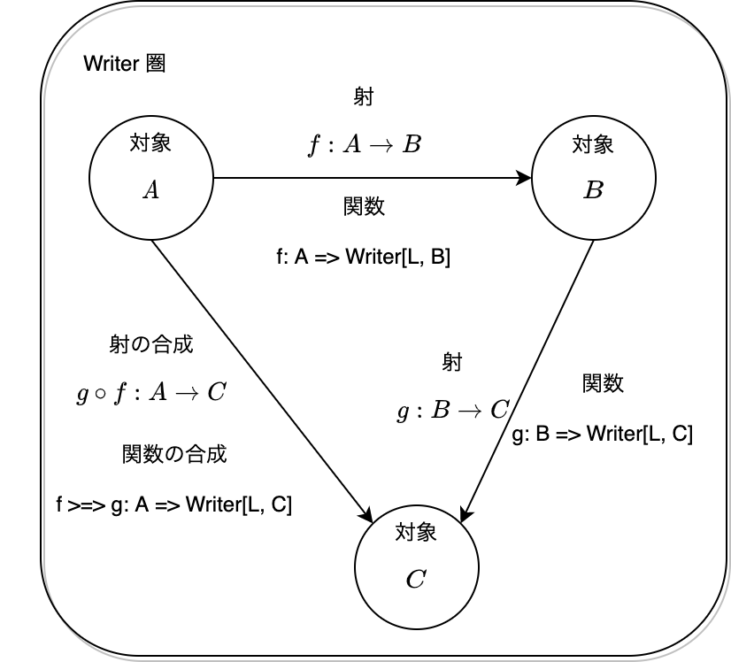

# Writer 圏における射の合成と、恒等射と、関手について

8章 関手性では、Writer 圏の射の合成と恒等射からWriter 関手を構成することができると説明しました。

本 Tips は、Writer 圏についての補足です。

# まず、Writer 圏とは？

ざっくりと説明しますと、Writer 圏は、あらゆる関数の適用に際してロギングをとるような圏のことをいいます。

まず、`Writer` のデータ構造は `L` と `A` のタプルです：

```scala
case class Writer[L, A](run: (L, A))
```

Writer 圏における対象は型 `A` で、対象 `A` から対象 `B` への射は関数 `A => Writer[L, B]` と定義されます。ここで、`L` はロギングのデータ型で、モノイドである必要があります。

この系が圏であるためには射の合成が定義されている必要があって、これは `>=>` 演算子によって与えられます：

```scala
/** Composition of morphism */
implicit class WriterOps[L, A, B](m1: A => Writer[L, B])(implicit sg: Semigroup[L]) {
  def >=>[C](m2: B => Writer[L, C]): A => Writer[L, C] = a => {
    val (logB, b) = m1(a).run
    val (logC, c) = m2(b).run
    Writer((logB |+| logC, c))
  }
}
```

射の合成は、ログを結合し、射 `A => B`, `B => C` を合成するものだとわかります。なお、`|+|` は独自の二項演算子で、`Semigroup#combine` メソッドのエイリアスです。

また、恒等射は以下のように与えられます：

```scala
/** Identity */
def pure[L, A](a: A)(implicit mn: Monoid[L]): Writer[L, A] = Writer((mn.empty, a))
```

ログについてはモノイドの単位元を渡しており、対象 `A` についてはその値をそのまま返します。モノイドの単位元を渡すことによって、既存のログをそのまま返せるようになります。

Writer 圏における射、型と関数、射の合成を図式で書くと、以下のようになります。



Scala 圏において、対象は型であって、射は関数でした。そのため射と関数は全く同一になるというイメージがありますが、Writer 圏の場合はそうではありません。

Writer 圏において、対象は Scala 圏と同じく型ですが、射は関数の中でも、`A => Writer[L, B]` と、返り値の型が `Writer[L, _]` によってラップされている関数になります。なお、関数 `A => Writer[L, B]` は型 `A` から `Writer[L, B]` への射なのではなく、これは**対象 A から対象 B への射**になります。

勉強会にて議論が白熱したのが、射と関数が上の図のように異なることです。射と関数が混同してわけわからなくなると思うので、射と関数は別物！と意識してみてください。

# Writer 圏における射の合成と恒等射を用いて、関手を構成する

さて、Writer 圏の定義に基づいて、射の合成と恒等射を定義しました。

これらを用いて、データ型 `Writer` の `Functor` のインスタンスを実装することができます。`Functor` は Scala 圏における自己関手の型クラスであって、その抽象メソッドとして射関数 `fmap` を持ちます：

```scala
// Functor
trait Functor[F[_]] {
  def fmap[A, B](f: A => B): F[A] => F[B]
}
```

`Writer` の `fmap` メソッドは、Writer 圏の射の合成 `>=>` と恒等射 `pure` によって実装できます。以下がその実装です。

```scala
/** Writer */
case class Writer[L, A](run: (L, A)) {

  /** Functor mapping */
  def fmap[B](f: A => B)(implicit mn: Monoid[L]): Writer[L, B] =
    (identity[Writer[L, A]] >=> (a => Writer.pure[L, B](f(a))))(this)
}
```

`fmap` によって関数 `f: A => B` を Writer 上の関数 `Writer[L, A] => Writer[L, B]` に引き上げたいとします。そのためには、`identity[Writer[L, A]]: Writer[L, A] => Writer[L, A]` によって Writer 圏における射 `Writer[L, A]` -> `A` を作り、この射と関数 `a => Writer.pure[L, B](f(a)): A => Writer[L, B]` （これは A から B への射）を合成させれば、結果として `Writer[L, A]` から `Writer[L, B]` への関数が得られます。

`fmap` の実装を関数の型のみに着目して考えると、以下のようになります。

```scala
(Writer[L, A] => Writer[L, A]) >=> (A => Writer[L, B]): Writer[L, A] => Writer[L, B]
```

一方で、Writer 圏における射のみに着目して考えると、以下のようにシンプルになります。

```
(A -> B) compose (Writer[L, A] -> A)
```

上記2つの表現は見た目は違えど、同じ意味を表します。

以上のことから、Writer 圏における射の合成と恒等射によって `Writer` 型の関手を実装できるので、`Writer` クラスは Writer 関手であると言えます。

## おわりに

Writer 関手というと、Scala 圏から Writer 圏の関手だと勘違いしていたのですが、Writer というデータ型に関しての Scala 圏における自己関手、であるんですね。

Writer 圏って見かけによらず複雑で難しいですね。

CTFP は、どうしてこれを4章に持ってきたんだろう...大きな疑問。
